# GAARD windows of interest

[Avrankou\_*coluzzii*\_Delta](#avrankou_coluzzii_delta)  
[Baguida\_*gambiae*\_Delta](#baguida_gambiae_delta)  
[Korle-Bu\_*coluzzii*\_Delta](#korle-bu_coluzzii_delta)  
[Madina\_*gambiae*\_Delta](#madina_gambiae_delta)  
[Obuasi\_*gambiae*\_Delta](#obuasi_gambiae_delta)  
[Baguida\_*gambiae*\_PM](#baguida_gambiae_pm)  
[Korle-Bu\_*coluzzii*\_PM](#korle-bu_coluzzii_pm)  
[Madina\_*gambiae*\_PM](#madina_gambiae_pm)  
[Obuasi\_*gambiae*\_PM](#obuasi_gambiae_pm)  

___

## Avrankou\_*coluzzii*\_Delta

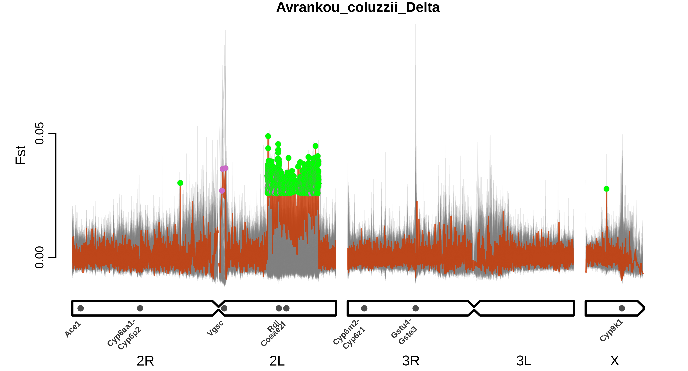

&nbsp;

[Avrankou_coluzzii_Delta_X:8742864-8775262](#avrankou_coluzzii_delta_x_8742864-8775262)  
### Avrankou_coluzzii_Delta_X_8742864-8775262

&nbsp;

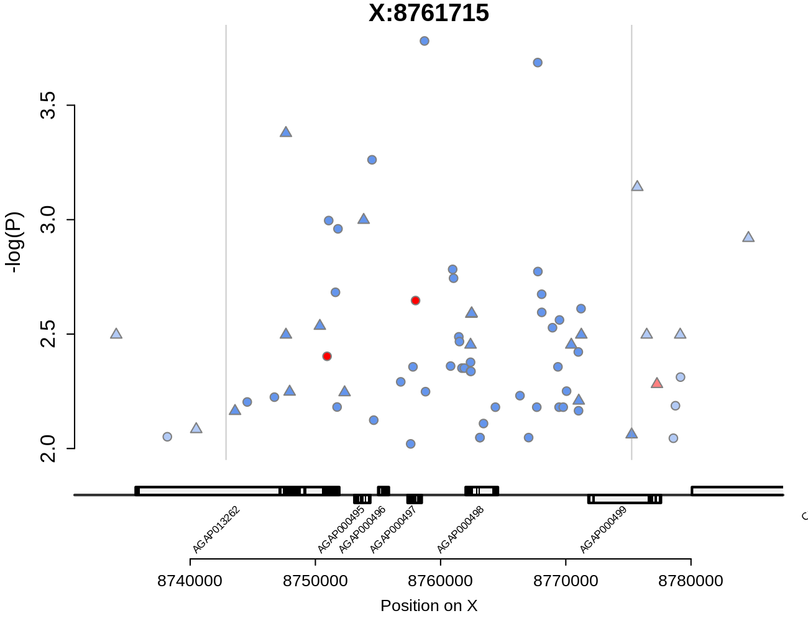

&nbsp;

&nbsp;

&nbsp;

#### Contingency table for cluster_1:

| &nbsp;&nbsp;&nbsp;  phenotype  &nbsp;&nbsp;&nbsp; |  &nbsp;&nbsp;&nbsp;  wt  &nbsp;&nbsp;&nbsp;  |  &nbsp;&nbsp;&nbsp;  het  &nbsp;&nbsp;&nbsp;  |  &nbsp;&nbsp;&nbsp;  hom  &nbsp;&nbsp;&nbsp;  |
| :---:     | :---: | :---: | :---: |
|  alive    | 11 | 23 | 11 |
|  dead     | 17 | 14 | 4 |

&nbsp;

___

## Baguida\_*gambiae*\_Delta

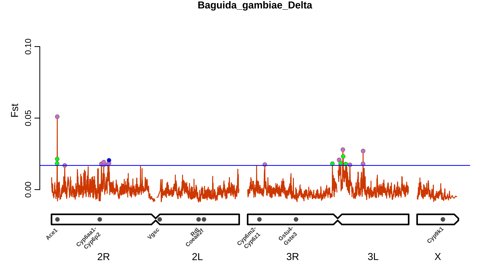

&nbsp;

[Baguida_gambiae_Delta_2R:33967209-33981960](#baguida_gambiae_delta_2r_33967209-33981960)  
[Baguida_gambiae_Delta_3L:3059554-3112922](#baguida_gambiae_delta_3l_3059554-3112922)  
### Baguida_gambiae_Delta_2R_33967209-33981960

&nbsp;

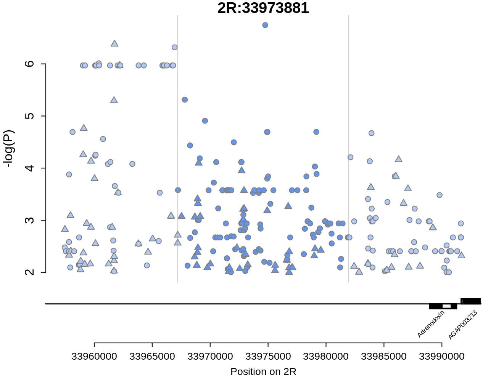

&nbsp;

&nbsp;

&nbsp;

#### Contingency table for cluster_1:

| &nbsp;&nbsp;&nbsp;  phenotype  &nbsp;&nbsp;&nbsp; |  &nbsp;&nbsp;&nbsp;  wt  &nbsp;&nbsp;&nbsp;  |  &nbsp;&nbsp;&nbsp;  het  &nbsp;&nbsp;&nbsp;  |  &nbsp;&nbsp;&nbsp;  hom  &nbsp;&nbsp;&nbsp;  |
| :---:     | :---: | :---: | :---: |
|  alive    | 31 | 21 | 2 |
|  dead     | 31 | 3 | 0 |

&nbsp;

### Baguida_gambiae_Delta_3L_3059554-3112922

&nbsp;

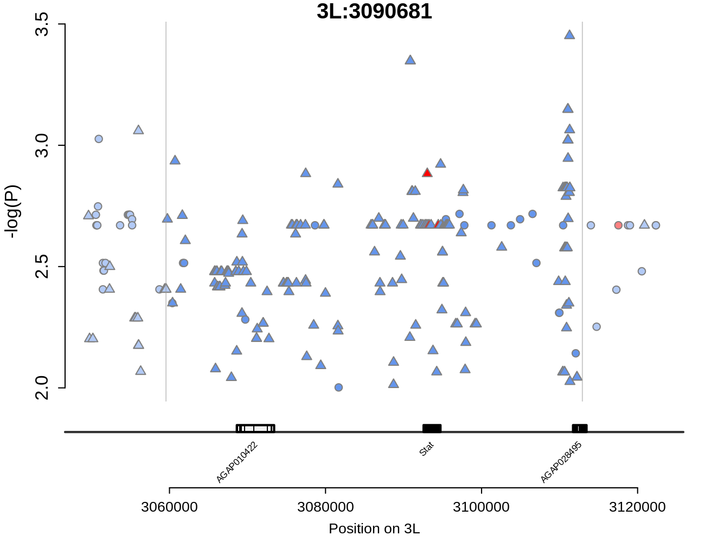

&nbsp;

&nbsp;

&nbsp;

#### Contingency table for cluster_1:

| &nbsp;&nbsp;&nbsp;  phenotype  &nbsp;&nbsp;&nbsp; |  &nbsp;&nbsp;&nbsp;  wt  &nbsp;&nbsp;&nbsp;  |  &nbsp;&nbsp;&nbsp;  het  &nbsp;&nbsp;&nbsp;  |  &nbsp;&nbsp;&nbsp;  hom  &nbsp;&nbsp;&nbsp;  |
| :---:     | :---: | :---: | :---: |
|  alive    | 37 | 8 | 9 |
|  dead     | 11 | 21 | 2 |

&nbsp;

#### Contingency table for cluster_2:

| &nbsp;&nbsp;&nbsp;  phenotype  &nbsp;&nbsp;&nbsp; |  &nbsp;&nbsp;&nbsp;  wt  &nbsp;&nbsp;&nbsp;  |  &nbsp;&nbsp;&nbsp;  het  &nbsp;&nbsp;&nbsp;  |  &nbsp;&nbsp;&nbsp;  hom  &nbsp;&nbsp;&nbsp;  |
| :---:     | :---: | :---: | :---: |
|  alive    | 39 | 14 | 1 |
|  dead     | 28 | 6 | 0 |

&nbsp;

___

## Korle-Bu\_*coluzzii*\_Delta

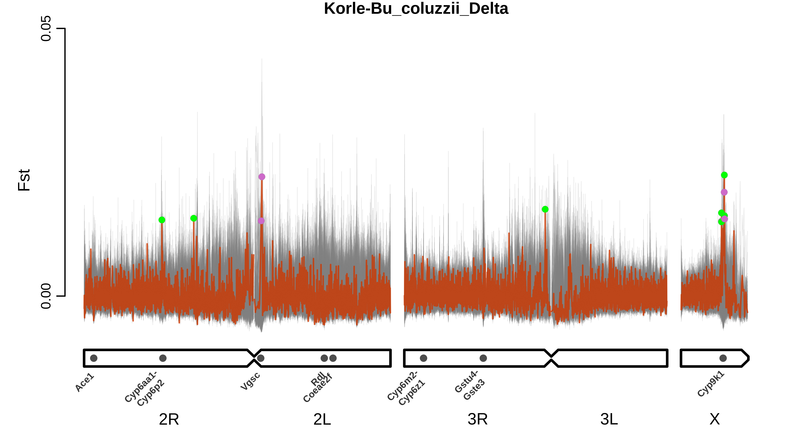

&nbsp;

[Korle-Bu_coluzzii_Delta_2R:39682393-39697973](#korle-bu_coluzzii_delta_2r_39682393-39697973)  
[Korle-Bu_coluzzii_Delta_3R:50969310-51019562](#korle-bu_coluzzii_delta_3r_50969310-51019562)  
[Korle-Bu_coluzzii_Delta_X:14635817-14653444](#korle-bu_coluzzii_delta_x_14635817-14653444)  
[Korle-Bu_coluzzii_Delta_X:14653443-14668614](#korle-bu_coluzzii_delta_x_14653443-14668614)  
[Korle-Bu_coluzzii_Delta_X:14668614-14683957](#korle-bu_coluzzii_delta_x_14668614-14683957)  
[Korle-Bu_coluzzii_Delta_X:14683957-14701067](#korle-bu_coluzzii_delta_x_14683957-14701067)  
[Korle-Bu_coluzzii_Delta_X:15615595-15668856](#korle-bu_coluzzii_delta_x_15615595-15668856)  
[Korle-Bu_coluzzii_Delta_X:15668855-15701561](#korle-bu_coluzzii_delta_x_15668855-15701561)  
[Korle-Bu_coluzzii_Delta_X:15701560-15753994](#korle-bu_coluzzii_delta_x_15701560-15753994)  
### Korle-Bu_coluzzii_Delta_2R_39682393-39697973

&nbsp;

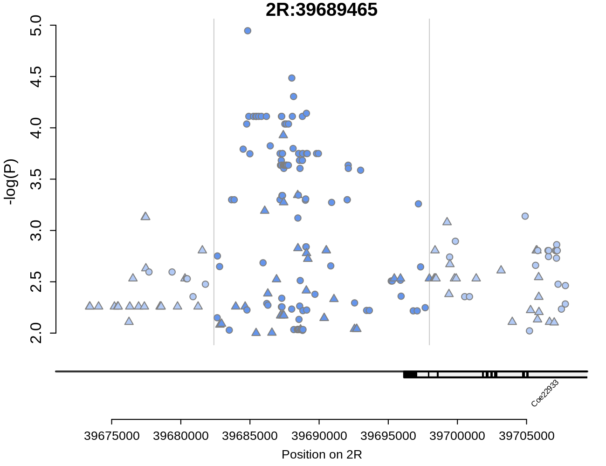

&nbsp;

&nbsp;

&nbsp;

#### Contingency table for cluster_1:

| &nbsp;&nbsp;&nbsp;  phenotype  &nbsp;&nbsp;&nbsp; |  &nbsp;&nbsp;&nbsp;  wt  &nbsp;&nbsp;&nbsp;  |  &nbsp;&nbsp;&nbsp;  het  &nbsp;&nbsp;&nbsp;  |  &nbsp;&nbsp;&nbsp;  hom  &nbsp;&nbsp;&nbsp;  |
| :---:     | :---: | :---: | :---: |
|  alive    | 47 | 12 | 0 |
|  dead     | 66 | 16 | 2 |

&nbsp;

#### Contingency table for cluster_2:

| &nbsp;&nbsp;&nbsp;  phenotype  &nbsp;&nbsp;&nbsp; |  &nbsp;&nbsp;&nbsp;  wt  &nbsp;&nbsp;&nbsp;  |  &nbsp;&nbsp;&nbsp;  het  &nbsp;&nbsp;&nbsp;  |  &nbsp;&nbsp;&nbsp;  hom  &nbsp;&nbsp;&nbsp;  |
| :---:     | :---: | :---: | :---: |
|  alive    | 42 | 16 | 1 |
|  dead     | 78 | 6 | 0 |

&nbsp;

### Korle-Bu_coluzzii_Delta_3R_50969310-51019562

&nbsp;

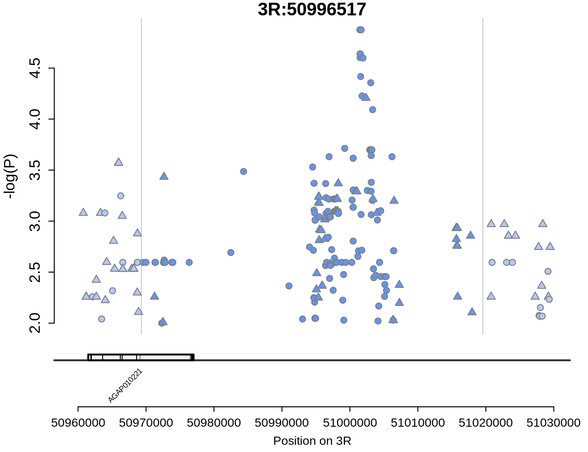

&nbsp;

&nbsp;

&nbsp;

#### Contingency table for cluster_1:

| &nbsp;&nbsp;&nbsp;  phenotype  &nbsp;&nbsp;&nbsp; |  &nbsp;&nbsp;&nbsp;  wt  &nbsp;&nbsp;&nbsp;  |  &nbsp;&nbsp;&nbsp;  het  &nbsp;&nbsp;&nbsp;  |  &nbsp;&nbsp;&nbsp;  hom  &nbsp;&nbsp;&nbsp;  |
| :---:     | :---: | :---: | :---: |
|  alive    | 44 | 13 | 2 |
|  dead     | 54 | 26 | 4 |

&nbsp;

#### Contingency table for cluster_2:

| &nbsp;&nbsp;&nbsp;  phenotype  &nbsp;&nbsp;&nbsp; |  &nbsp;&nbsp;&nbsp;  wt  &nbsp;&nbsp;&nbsp;  |  &nbsp;&nbsp;&nbsp;  het  &nbsp;&nbsp;&nbsp;  |  &nbsp;&nbsp;&nbsp;  hom  &nbsp;&nbsp;&nbsp;  |
| :---:     | :---: | :---: | :---: |
|  alive    | 45 | 14 | 0 |
|  dead     | 76 | 7 | 1 |

&nbsp;

#### Contingency table for cluster_3:

| &nbsp;&nbsp;&nbsp;  phenotype  &nbsp;&nbsp;&nbsp; |  &nbsp;&nbsp;&nbsp;  wt  &nbsp;&nbsp;&nbsp;  |  &nbsp;&nbsp;&nbsp;  het  &nbsp;&nbsp;&nbsp;  |  &nbsp;&nbsp;&nbsp;  hom  &nbsp;&nbsp;&nbsp;  |
| :---:     | :---: | :---: | :---: |
|  alive    | 49 | 10 | 0 |
|  dead     | 73 | 10 | 1 |

&nbsp;

### Korle-Bu_coluzzii_Delta_X_14635817-14653444

&nbsp;

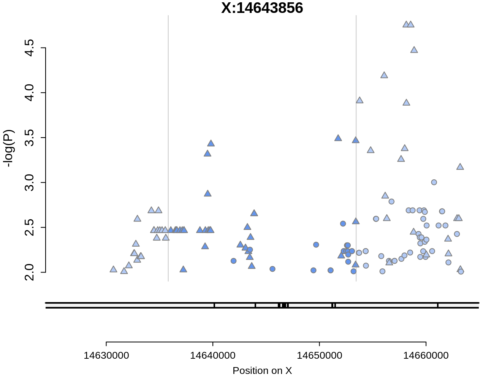

&nbsp;

&nbsp;

&nbsp;

#### Contingency table for cluster_1:

| &nbsp;&nbsp;&nbsp;  phenotype  &nbsp;&nbsp;&nbsp; |  &nbsp;&nbsp;&nbsp;  wt  &nbsp;&nbsp;&nbsp;  |  &nbsp;&nbsp;&nbsp;  het  &nbsp;&nbsp;&nbsp;  |  &nbsp;&nbsp;&nbsp;  hom  &nbsp;&nbsp;&nbsp;  |
| :---:     | :---: | :---: | :---: |
|  alive    | 31 | 25 | 3 |
|  dead     | 59 | 24 | 1 |

&nbsp;

#### Contingency table for cluster_2:

| &nbsp;&nbsp;&nbsp;  phenotype  &nbsp;&nbsp;&nbsp; |  &nbsp;&nbsp;&nbsp;  wt  &nbsp;&nbsp;&nbsp;  |  &nbsp;&nbsp;&nbsp;  het  &nbsp;&nbsp;&nbsp;  |  &nbsp;&nbsp;&nbsp;  hom  &nbsp;&nbsp;&nbsp;  |
| :---:     | :---: | :---: | :---: |
|  alive    | 50 | 9 | 0 |
|  dead     | 70 | 11 | 3 |

&nbsp;

#### Contingency table for cluster_3:

| &nbsp;&nbsp;&nbsp;  phenotype  &nbsp;&nbsp;&nbsp; |  &nbsp;&nbsp;&nbsp;  wt  &nbsp;&nbsp;&nbsp;  |  &nbsp;&nbsp;&nbsp;  het  &nbsp;&nbsp;&nbsp;  |  &nbsp;&nbsp;&nbsp;  hom  &nbsp;&nbsp;&nbsp;  |
| :---:     | :---: | :---: | :---: |
|  alive    | 51 | 7 | 1 |
|  dead     | 70 | 13 | 1 |

&nbsp;

#### Contingency table for cluster_4:

| &nbsp;&nbsp;&nbsp;  phenotype  &nbsp;&nbsp;&nbsp; |  &nbsp;&nbsp;&nbsp;  wt  &nbsp;&nbsp;&nbsp;  |  &nbsp;&nbsp;&nbsp;  het  &nbsp;&nbsp;&nbsp;  |  &nbsp;&nbsp;&nbsp;  hom  &nbsp;&nbsp;&nbsp;  |
| :---:     | :---: | :---: | :---: |
|  alive    | 55 | 3 | 1 |
|  dead     | 67 | 17 | 0 |

&nbsp;

### Korle-Bu_coluzzii_Delta_X_14653443-14668614

&nbsp;

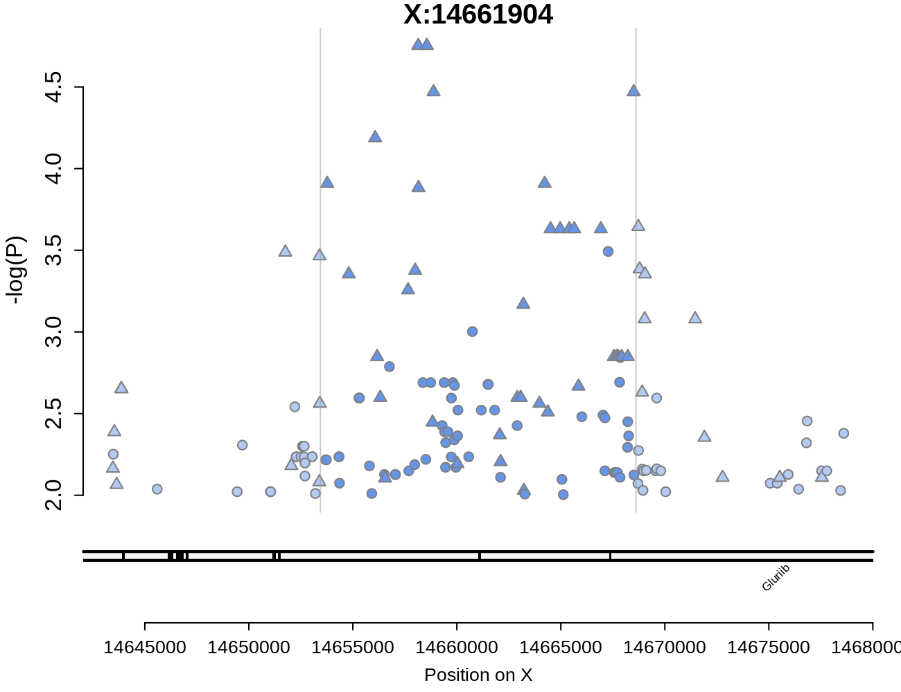

&nbsp;

&nbsp;

&nbsp;

#### Contingency table for cluster_1:

| &nbsp;&nbsp;&nbsp;  phenotype  &nbsp;&nbsp;&nbsp; |  &nbsp;&nbsp;&nbsp;  wt  &nbsp;&nbsp;&nbsp;  |  &nbsp;&nbsp;&nbsp;  het  &nbsp;&nbsp;&nbsp;  |  &nbsp;&nbsp;&nbsp;  hom  &nbsp;&nbsp;&nbsp;  |
| :---:     | :---: | :---: | :---: |
|  alive    | 30 | 26 | 3 |
|  dead     | 59 | 24 | 1 |

&nbsp;

#### Contingency table for cluster_2:

| &nbsp;&nbsp;&nbsp;  phenotype  &nbsp;&nbsp;&nbsp; |  &nbsp;&nbsp;&nbsp;  wt  &nbsp;&nbsp;&nbsp;  |  &nbsp;&nbsp;&nbsp;  het  &nbsp;&nbsp;&nbsp;  |  &nbsp;&nbsp;&nbsp;  hom  &nbsp;&nbsp;&nbsp;  |
| :---:     | :---: | :---: | :---: |
|  alive    | 49 | 9 | 1 |
|  dead     | 70 | 12 | 2 |

&nbsp;

#### Contingency table for cluster_3:

| &nbsp;&nbsp;&nbsp;  phenotype  &nbsp;&nbsp;&nbsp; |  &nbsp;&nbsp;&nbsp;  wt  &nbsp;&nbsp;&nbsp;  |  &nbsp;&nbsp;&nbsp;  het  &nbsp;&nbsp;&nbsp;  |  &nbsp;&nbsp;&nbsp;  hom  &nbsp;&nbsp;&nbsp;  |
| :---:     | :---: | :---: | :---: |
|  alive    | 51 | 8 | 0 |
|  dead     | 70 | 13 | 1 |

&nbsp;

### Korle-Bu_coluzzii_Delta_X_14668614-14683957

&nbsp;

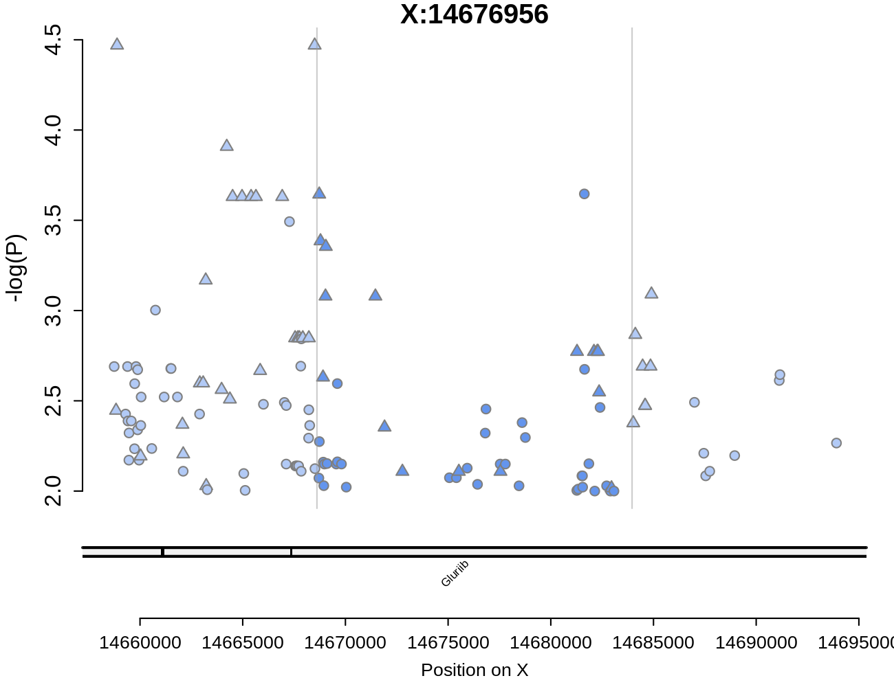

&nbsp;

&nbsp;

&nbsp;

#### Contingency table for cluster_1:

| &nbsp;&nbsp;&nbsp;  phenotype  &nbsp;&nbsp;&nbsp; |  &nbsp;&nbsp;&nbsp;  wt  &nbsp;&nbsp;&nbsp;  |  &nbsp;&nbsp;&nbsp;  het  &nbsp;&nbsp;&nbsp;  |  &nbsp;&nbsp;&nbsp;  hom  &nbsp;&nbsp;&nbsp;  |
| :---:     | :---: | :---: | :---: |
|  alive    | 31 | 25 | 3 |
|  dead     | 59 | 24 | 1 |

&nbsp;

#### Contingency table for cluster_2:

| &nbsp;&nbsp;&nbsp;  phenotype  &nbsp;&nbsp;&nbsp; |  &nbsp;&nbsp;&nbsp;  wt  &nbsp;&nbsp;&nbsp;  |  &nbsp;&nbsp;&nbsp;  het  &nbsp;&nbsp;&nbsp;  |  &nbsp;&nbsp;&nbsp;  hom  &nbsp;&nbsp;&nbsp;  |
| :---:     | :---: | :---: | :---: |
|  alive    | 47 | 11 | 1 |
|  dead     | 70 | 12 | 2 |

&nbsp;

#### Contingency table for cluster_3:

| &nbsp;&nbsp;&nbsp;  phenotype  &nbsp;&nbsp;&nbsp; |  &nbsp;&nbsp;&nbsp;  wt  &nbsp;&nbsp;&nbsp;  |  &nbsp;&nbsp;&nbsp;  het  &nbsp;&nbsp;&nbsp;  |  &nbsp;&nbsp;&nbsp;  hom  &nbsp;&nbsp;&nbsp;  |
| :---:     | :---: | :---: | :---: |
|  alive    | 51 | 8 | 0 |
|  dead     | 70 | 13 | 1 |

&nbsp;

### Korle-Bu_coluzzii_Delta_X_14683957-14701067

&nbsp;

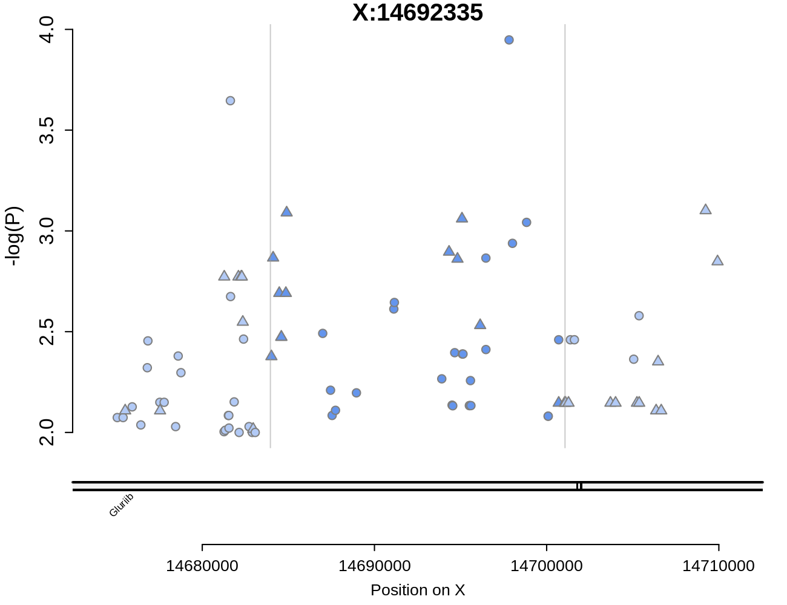

&nbsp;

&nbsp;

&nbsp;

#### Contingency table for cluster_1:

| &nbsp;&nbsp;&nbsp;  phenotype  &nbsp;&nbsp;&nbsp; |  &nbsp;&nbsp;&nbsp;  wt  &nbsp;&nbsp;&nbsp;  |  &nbsp;&nbsp;&nbsp;  het  &nbsp;&nbsp;&nbsp;  |  &nbsp;&nbsp;&nbsp;  hom  &nbsp;&nbsp;&nbsp;  |
| :---:     | :---: | :---: | :---: |
|  alive    | 30 | 26 | 3 |
|  dead     | 59 | 24 | 1 |

&nbsp;

#### Contingency table for cluster_2:

| &nbsp;&nbsp;&nbsp;  phenotype  &nbsp;&nbsp;&nbsp; |  &nbsp;&nbsp;&nbsp;  wt  &nbsp;&nbsp;&nbsp;  |  &nbsp;&nbsp;&nbsp;  het  &nbsp;&nbsp;&nbsp;  |  &nbsp;&nbsp;&nbsp;  hom  &nbsp;&nbsp;&nbsp;  |
| :---:     | :---: | :---: | :---: |
|  alive    | 49 | 10 | 0 |
|  dead     | 71 | 11 | 2 |

&nbsp;

#### Contingency table for cluster_3:

| &nbsp;&nbsp;&nbsp;  phenotype  &nbsp;&nbsp;&nbsp; |  &nbsp;&nbsp;&nbsp;  wt  &nbsp;&nbsp;&nbsp;  |  &nbsp;&nbsp;&nbsp;  het  &nbsp;&nbsp;&nbsp;  |  &nbsp;&nbsp;&nbsp;  hom  &nbsp;&nbsp;&nbsp;  |
| :---:     | :---: | :---: | :---: |
|  alive    | 51 | 8 | 0 |
|  dead     | 70 | 13 | 1 |

&nbsp;

### Korle-Bu_coluzzii_Delta_X_15615595-15668856

&nbsp;

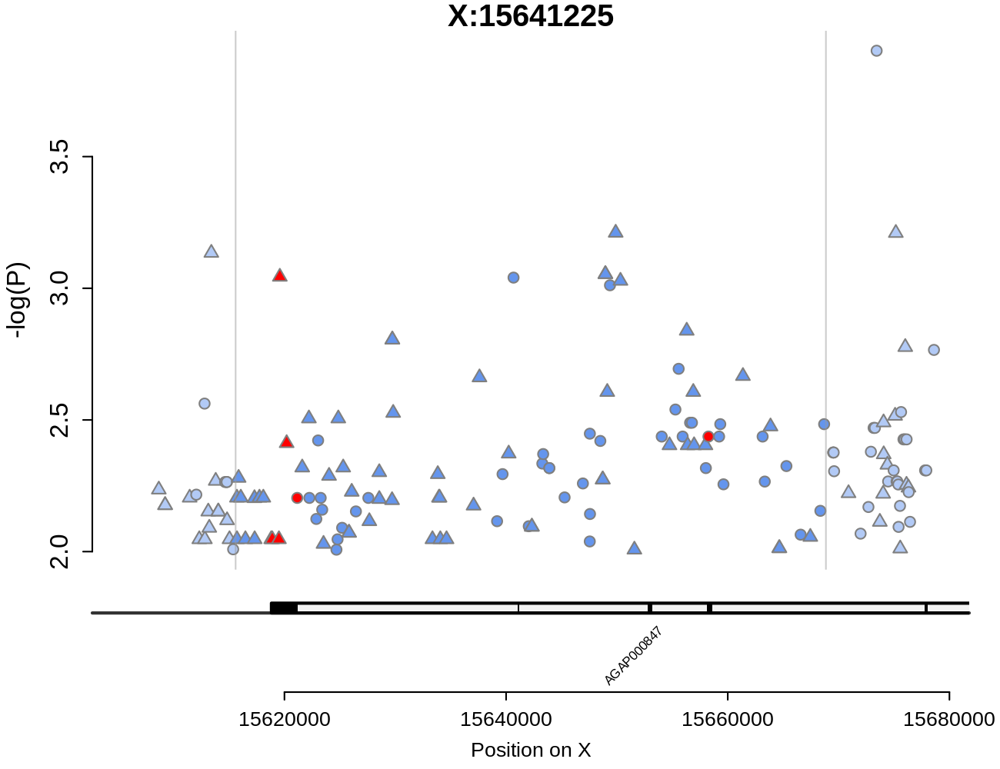

&nbsp;

&nbsp;

&nbsp;

#### Contingency table for cluster_1:

| &nbsp;&nbsp;&nbsp;  phenotype  &nbsp;&nbsp;&nbsp; |  &nbsp;&nbsp;&nbsp;  wt  &nbsp;&nbsp;&nbsp;  |  &nbsp;&nbsp;&nbsp;  het  &nbsp;&nbsp;&nbsp;  |  &nbsp;&nbsp;&nbsp;  hom  &nbsp;&nbsp;&nbsp;  |
| :---:     | :---: | :---: | :---: |
|  alive    | 9 | 33 | 17 |
|  dead     | 31 | 38 | 15 |

&nbsp;

#### Contingency table for cluster_2:

| &nbsp;&nbsp;&nbsp;  phenotype  &nbsp;&nbsp;&nbsp; |  &nbsp;&nbsp;&nbsp;  wt  &nbsp;&nbsp;&nbsp;  |  &nbsp;&nbsp;&nbsp;  het  &nbsp;&nbsp;&nbsp;  |  &nbsp;&nbsp;&nbsp;  hom  &nbsp;&nbsp;&nbsp;  |
| :---:     | :---: | :---: | :---: |
|  alive    | 50 | 9 | 0 |
|  dead     | 61 | 21 | 2 |

&nbsp;

#### Contingency table for cluster_3:

| &nbsp;&nbsp;&nbsp;  phenotype  &nbsp;&nbsp;&nbsp; |  &nbsp;&nbsp;&nbsp;  wt  &nbsp;&nbsp;&nbsp;  |  &nbsp;&nbsp;&nbsp;  het  &nbsp;&nbsp;&nbsp;  |  &nbsp;&nbsp;&nbsp;  hom  &nbsp;&nbsp;&nbsp;  |
| :---:     | :---: | :---: | :---: |
|  alive    | 51 | 8 | 0 |
|  dead     | 68 | 16 | 0 |

&nbsp;

#### Contingency table for cluster_4:

| &nbsp;&nbsp;&nbsp;  phenotype  &nbsp;&nbsp;&nbsp; |  &nbsp;&nbsp;&nbsp;  wt  &nbsp;&nbsp;&nbsp;  |  &nbsp;&nbsp;&nbsp;  het  &nbsp;&nbsp;&nbsp;  |  &nbsp;&nbsp;&nbsp;  hom  &nbsp;&nbsp;&nbsp;  |
| :---:     | :---: | :---: | :---: |
|  alive    | 52 | 7 | 0 |
|  dead     | 70 | 14 | 0 |

&nbsp;

### Korle-Bu_coluzzii_Delta_X_15668855-15701561

&nbsp;

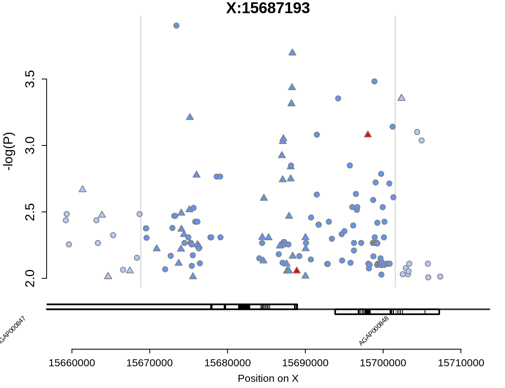

&nbsp;

&nbsp;

&nbsp;

#### Contingency table for cluster_1:

| &nbsp;&nbsp;&nbsp;  phenotype  &nbsp;&nbsp;&nbsp; |  &nbsp;&nbsp;&nbsp;  wt  &nbsp;&nbsp;&nbsp;  |  &nbsp;&nbsp;&nbsp;  het  &nbsp;&nbsp;&nbsp;  |  &nbsp;&nbsp;&nbsp;  hom  &nbsp;&nbsp;&nbsp;  |
| :---:     | :---: | :---: | :---: |
|  alive    | 13 | 32 | 14 |
|  dead     | 37 | 35 | 12 |

&nbsp;

#### Contingency table for cluster_2:

| &nbsp;&nbsp;&nbsp;  phenotype  &nbsp;&nbsp;&nbsp; |  &nbsp;&nbsp;&nbsp;  wt  &nbsp;&nbsp;&nbsp;  |  &nbsp;&nbsp;&nbsp;  het  &nbsp;&nbsp;&nbsp;  |  &nbsp;&nbsp;&nbsp;  hom  &nbsp;&nbsp;&nbsp;  |
| :---:     | :---: | :---: | :---: |
|  alive    | 52 | 7 | 0 |
|  dead     | 70 | 14 | 0 |

&nbsp;

#### Contingency table for cluster_3:

| &nbsp;&nbsp;&nbsp;  phenotype  &nbsp;&nbsp;&nbsp; |  &nbsp;&nbsp;&nbsp;  wt  &nbsp;&nbsp;&nbsp;  |  &nbsp;&nbsp;&nbsp;  het  &nbsp;&nbsp;&nbsp;  |  &nbsp;&nbsp;&nbsp;  hom  &nbsp;&nbsp;&nbsp;  |
| :---:     | :---: | :---: | :---: |
|  alive    | 53 | 6 | 0 |
|  dead     | 69 | 15 | 0 |

&nbsp;

### Korle-Bu_coluzzii_Delta_X_15701560-15753994

&nbsp;

&nbsp;

&nbsp;

&nbsp;

#### Contingency table for cluster_1:

| &nbsp;&nbsp;&nbsp;  phenotype  &nbsp;&nbsp;&nbsp; |  &nbsp;&nbsp;&nbsp;  wt  &nbsp;&nbsp;&nbsp;  |  &nbsp;&nbsp;&nbsp;  het  &nbsp;&nbsp;&nbsp;  |  &nbsp;&nbsp;&nbsp;  hom  &nbsp;&nbsp;&nbsp;  |
| :---:     | :---: | :---: | :---: |
|  alive    | 12 | 38 | 9 |
|  dead     | 38 | 35 | 11 |

&nbsp;

#### Contingency table for cluster_2:

| &nbsp;&nbsp;&nbsp;  phenotype  &nbsp;&nbsp;&nbsp; |  &nbsp;&nbsp;&nbsp;  wt  &nbsp;&nbsp;&nbsp;  |  &nbsp;&nbsp;&nbsp;  het  &nbsp;&nbsp;&nbsp;  |  &nbsp;&nbsp;&nbsp;  hom  &nbsp;&nbsp;&nbsp;  |
| :---:     | :---: | :---: | :---: |
|  alive    | 52 | 7 | 0 |
|  dead     | 70 | 13 | 1 |

&nbsp;

#### Contingency table for cluster_3:

| &nbsp;&nbsp;&nbsp;  phenotype  &nbsp;&nbsp;&nbsp; |  &nbsp;&nbsp;&nbsp;  wt  &nbsp;&nbsp;&nbsp;  |  &nbsp;&nbsp;&nbsp;  het  &nbsp;&nbsp;&nbsp;  |  &nbsp;&nbsp;&nbsp;  hom  &nbsp;&nbsp;&nbsp;  |
| :---:     | :---: | :---: | :---: |
|  alive    | 52 | 7 | 0 |
|  dead     | 70 | 14 | 0 |

&nbsp;

___

## Madina\_*gambiae*\_Delta

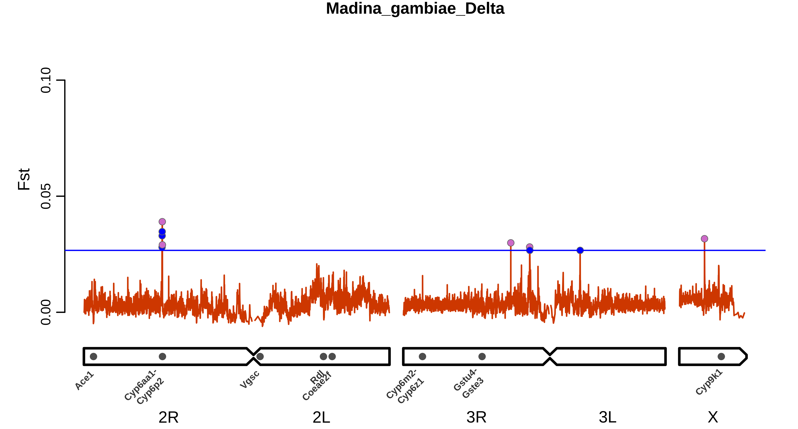

&nbsp;

[Madina_gambiae_Delta_2R:28401363-28416200](#madina_gambiae_delta_2r_28401363-28416200)  
[Madina_gambiae_Delta_2R:28454838-28474602](#madina_gambiae_delta_2r_28454838-28474602)  
### Madina_gambiae_Delta_2R_28401363-28416200

&nbsp;

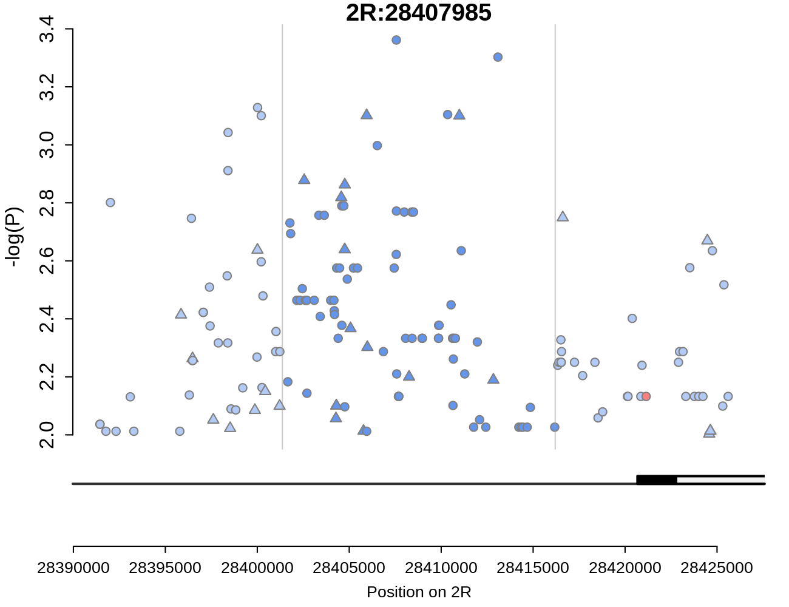

&nbsp;

&nbsp;

&nbsp;

#### Contingency table for cluster_1:

| &nbsp;&nbsp;&nbsp;  phenotype  &nbsp;&nbsp;&nbsp; |  &nbsp;&nbsp;&nbsp;  wt  &nbsp;&nbsp;&nbsp;  |  &nbsp;&nbsp;&nbsp;  het  &nbsp;&nbsp;&nbsp;  |  &nbsp;&nbsp;&nbsp;  hom  &nbsp;&nbsp;&nbsp;  |
| :---:     | :---: | :---: | :---: |
|  alive    | 13 | 33 | 18 |
|  dead     | 14 | 21 | 2 |

&nbsp;

### Madina_gambiae_Delta_2R_28454838-28474602

&nbsp;

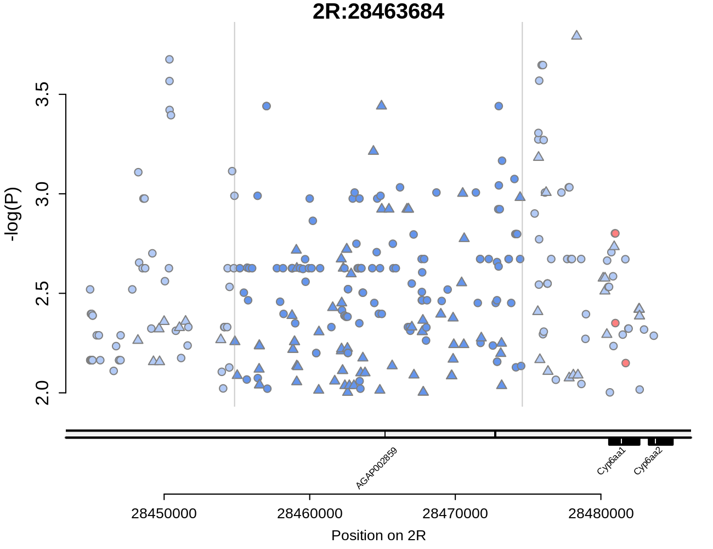

&nbsp;

&nbsp;

&nbsp;

#### Contingency table for cluster_1:

| &nbsp;&nbsp;&nbsp;  phenotype  &nbsp;&nbsp;&nbsp; |  &nbsp;&nbsp;&nbsp;  wt  &nbsp;&nbsp;&nbsp;  |  &nbsp;&nbsp;&nbsp;  het  &nbsp;&nbsp;&nbsp;  |  &nbsp;&nbsp;&nbsp;  hom  &nbsp;&nbsp;&nbsp;  |
| :---:     | :---: | :---: | :---: |
|  alive    | 8 | 33 | 23 |
|  dead     | 12 | 20 | 5 |

&nbsp;

#### Contingency table for cluster_2:

| &nbsp;&nbsp;&nbsp;  phenotype  &nbsp;&nbsp;&nbsp; |  &nbsp;&nbsp;&nbsp;  wt  &nbsp;&nbsp;&nbsp;  |  &nbsp;&nbsp;&nbsp;  het  &nbsp;&nbsp;&nbsp;  |  &nbsp;&nbsp;&nbsp;  hom  &nbsp;&nbsp;&nbsp;  |
| :---:     | :---: | :---: | :---: |
|  alive    | 50 | 13 | 1 |
|  dead     | 26 | 10 | 1 |

&nbsp;

___

## Obuasi\_*gambiae*\_Delta

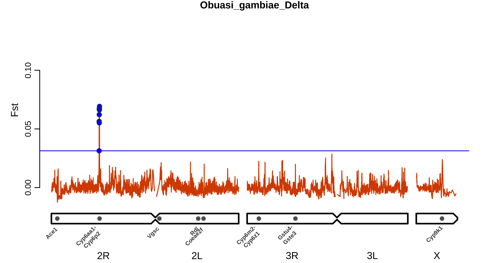

&nbsp;

[Obuasi_gambiae_Delta_2R:28250033-28262588](#obuasi_gambiae_delta_2r_28250033-28262588)  
[Obuasi_gambiae_Delta_2R:28262588-28274893](#obuasi_gambiae_delta_2r_28262588-28274893)  
[Obuasi_gambiae_Delta_2R:28274893-28289873](#obuasi_gambiae_delta_2r_28274893-28289873)  
[Obuasi_gambiae_Delta_2R:28289873-28306606](#obuasi_gambiae_delta_2r_28289873-28306606)  
[Obuasi_gambiae_Delta_2R:28306605-28322681](#obuasi_gambiae_delta_2r_28306605-28322681)  
[Obuasi_gambiae_Delta_2R:28322681-28337951](#obuasi_gambiae_delta_2r_28322681-28337951)  
[Obuasi_gambiae_Delta_2R:28337951-28354693](#obuasi_gambiae_delta_2r_28337951-28354693)  
[Obuasi_gambiae_Delta_2R:28354692-28369784](#obuasi_gambiae_delta_2r_28354692-28369784)  
[Obuasi_gambiae_Delta_2R:28369784-28391434](#obuasi_gambiae_delta_2r_28369784-28391434)  
[Obuasi_gambiae_Delta_2R:28391433-28405240](#obuasi_gambiae_delta_2r_28391433-28405240)  
[Obuasi_gambiae_Delta_2R:28405239-28421116](#obuasi_gambiae_delta_2r_28405239-28421116)  
[Obuasi_gambiae_Delta_2R:28421116-28439220](#obuasi_gambiae_delta_2r_28421116-28439220)  
[Obuasi_gambiae_Delta_2R:28439219-28456407](#obuasi_gambiae_delta_2r_28439219-28456407)  
[Obuasi_gambiae_Delta_2R:28456407-28475225](#obuasi_gambiae_delta_2r_28456407-28475225)  
[Obuasi_gambiae_Delta_2R:28475225-28496115](#obuasi_gambiae_delta_2r_28475225-28496115)  
[Obuasi_gambiae_Delta_2R:28496114-28515482](#obuasi_gambiae_delta_2r_28496114-28515482)  
[Obuasi_gambiae_Delta_2R:28515481-28531112](#obuasi_gambiae_delta_2r_28515481-28531112)  
### Obuasi_gambiae_Delta_2R_28250033-28262588

&nbsp;

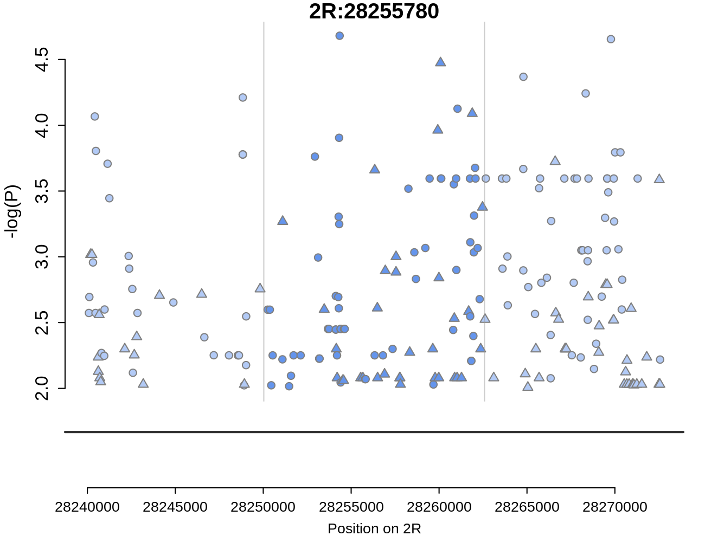

&nbsp;

&nbsp;

&nbsp;

#### Contingency table for cluster_1:

| &nbsp;&nbsp;&nbsp;  phenotype  &nbsp;&nbsp;&nbsp; |  &nbsp;&nbsp;&nbsp;  wt  &nbsp;&nbsp;&nbsp;  |  &nbsp;&nbsp;&nbsp;  het  &nbsp;&nbsp;&nbsp;  |  &nbsp;&nbsp;&nbsp;  hom  &nbsp;&nbsp;&nbsp;  |
| :---:     | :---: | :---: | :---: |
|  alive    | 11 | 16 | 0 |
|  dead     | 39 | 12 | 0 |

&nbsp;

#### Contingency table for cluster_2:

| &nbsp;&nbsp;&nbsp;  phenotype  &nbsp;&nbsp;&nbsp; |  &nbsp;&nbsp;&nbsp;  wt  &nbsp;&nbsp;&nbsp;  |  &nbsp;&nbsp;&nbsp;  het  &nbsp;&nbsp;&nbsp;  |  &nbsp;&nbsp;&nbsp;  hom  &nbsp;&nbsp;&nbsp;  |
| :---:     | :---: | :---: | :---: |
|  alive    | 23 | 4 | 0 |
|  dead     | 33 | 16 | 2 |

&nbsp;

### Obuasi_gambiae_Delta_2R_28262588-28274893

&nbsp;

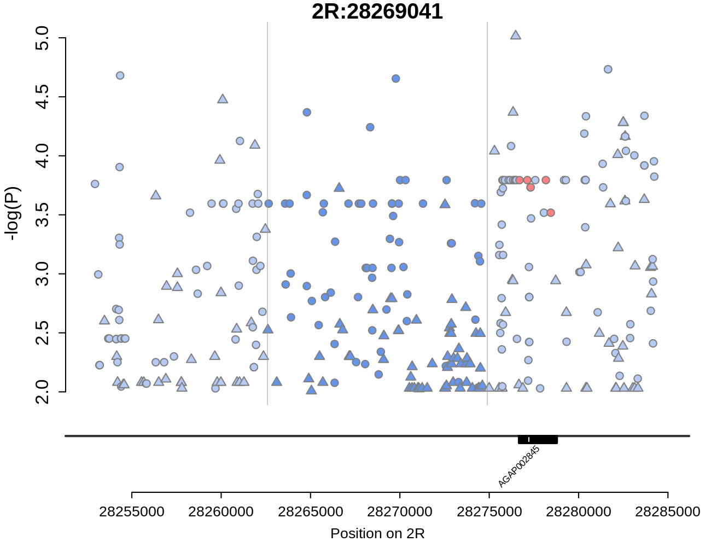

&nbsp;

&nbsp;

&nbsp;

#### Contingency table for cluster_1:

| &nbsp;&nbsp;&nbsp;  phenotype  &nbsp;&nbsp;&nbsp; |  &nbsp;&nbsp;&nbsp;  wt  &nbsp;&nbsp;&nbsp;  |  &nbsp;&nbsp;&nbsp;  het  &nbsp;&nbsp;&nbsp;  |  &nbsp;&nbsp;&nbsp;  hom  &nbsp;&nbsp;&nbsp;  |
| :---:     | :---: | :---: | :---: |
|  alive    | 10 | 15 | 2 |
|  dead     | 39 | 12 | 0 |

&nbsp;

#### Contingency table for cluster_2:

| &nbsp;&nbsp;&nbsp;  phenotype  &nbsp;&nbsp;&nbsp; |  &nbsp;&nbsp;&nbsp;  wt  &nbsp;&nbsp;&nbsp;  |  &nbsp;&nbsp;&nbsp;  het  &nbsp;&nbsp;&nbsp;  |  &nbsp;&nbsp;&nbsp;  hom  &nbsp;&nbsp;&nbsp;  |
| :---:     | :---: | :---: | :---: |
|  alive    | 23 | 4 | 0 |
|  dead     | 33 | 16 | 2 |

&nbsp;

### Obuasi_gambiae_Delta_2R_28274893-28289873

&nbsp;

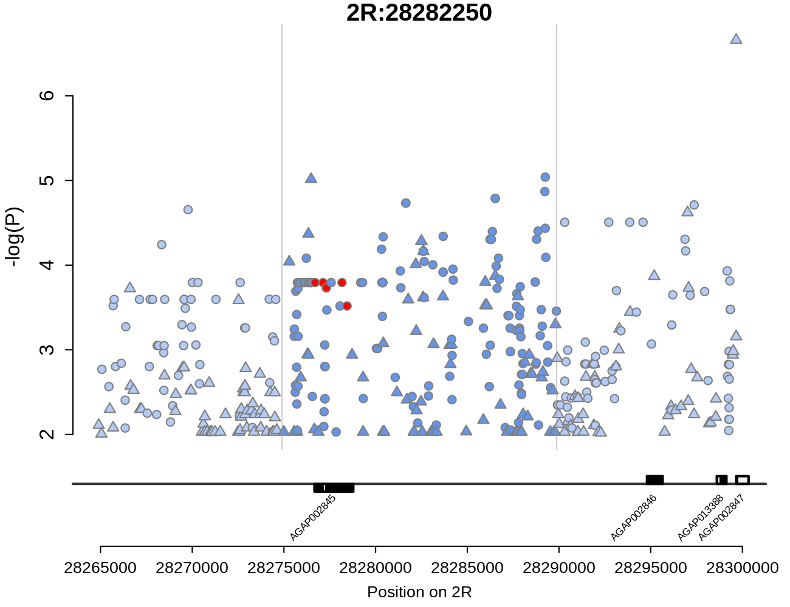

&nbsp;

&nbsp;

&nbsp;

#### Contingency table for cluster_1:

| &nbsp;&nbsp;&nbsp;  phenotype  &nbsp;&nbsp;&nbsp; |  &nbsp;&nbsp;&nbsp;  wt  &nbsp;&nbsp;&nbsp;  |  &nbsp;&nbsp;&nbsp;  het  &nbsp;&nbsp;&nbsp;  |  &nbsp;&nbsp;&nbsp;  hom  &nbsp;&nbsp;&nbsp;  |
| :---:     | :---: | :---: | :---: |
|  alive    | 10 | 14 | 3 |
|  dead     | 39 | 12 | 0 |

&nbsp;

#### Contingency table for cluster_2:

| &nbsp;&nbsp;&nbsp;  phenotype  &nbsp;&nbsp;&nbsp; |  &nbsp;&nbsp;&nbsp;  wt  &nbsp;&nbsp;&nbsp;  |  &nbsp;&nbsp;&nbsp;  het  &nbsp;&nbsp;&nbsp;  |  &nbsp;&nbsp;&nbsp;  hom  &nbsp;&nbsp;&nbsp;  |
| :---:     | :---: | :---: | :---: |
|  alive    | 23 | 4 | 0 |
|  dead     | 33 | 16 | 2 |

&nbsp;

### Obuasi_gambiae_Delta_2R_28289873-28306606

&nbsp;

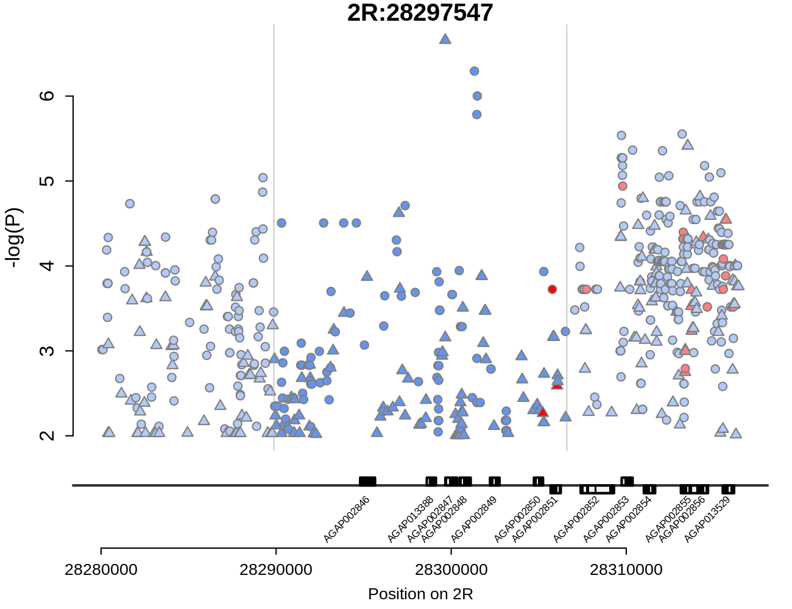

&nbsp;

&nbsp;

&nbsp;

#### Contingency table for cluster_1:

| &nbsp;&nbsp;&nbsp;  phenotype  &nbsp;&nbsp;&nbsp; |  &nbsp;&nbsp;&nbsp;  wt  &nbsp;&nbsp;&nbsp;  |  &nbsp;&nbsp;&nbsp;  het  &nbsp;&nbsp;&nbsp;  |  &nbsp;&nbsp;&nbsp;  hom  &nbsp;&nbsp;&nbsp;  |
| :---:     | :---: | :---: | :---: |
|  alive    | 9 | 14 | 4 |
|  dead     | 39 | 12 | 0 |

&nbsp;

#### Contingency table for cluster_2:

| &nbsp;&nbsp;&nbsp;  phenotype  &nbsp;&nbsp;&nbsp; |  &nbsp;&nbsp;&nbsp;  wt  &nbsp;&nbsp;&nbsp;  |  &nbsp;&nbsp;&nbsp;  het  &nbsp;&nbsp;&nbsp;  |  &nbsp;&nbsp;&nbsp;  hom  &nbsp;&nbsp;&nbsp;  |
| :---:     | :---: | :---: | :---: |
|  alive    | 23 | 4 | 0 |
|  dead     | 33 | 17 | 1 |

&nbsp;

### Obuasi_gambiae_Delta_2R_28306605-28322681

&nbsp;

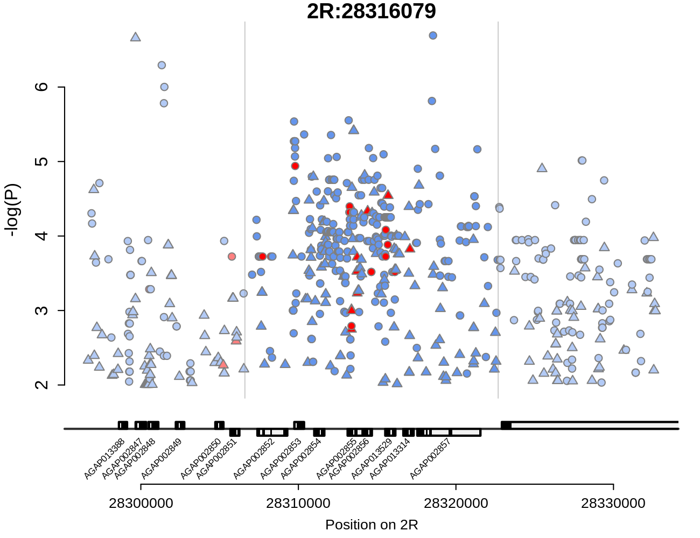

&nbsp;

&nbsp;

&nbsp;

#### Contingency table for cluster_1:

| &nbsp;&nbsp;&nbsp;  phenotype  &nbsp;&nbsp;&nbsp; |  &nbsp;&nbsp;&nbsp;  wt  &nbsp;&nbsp;&nbsp;  |  &nbsp;&nbsp;&nbsp;  het  &nbsp;&nbsp;&nbsp;  |  &nbsp;&nbsp;&nbsp;  hom  &nbsp;&nbsp;&nbsp;  |
| :---:     | :---: | :---: | :---: |
|  alive    | 10 | 14 | 3 |
|  dead     | 38 | 13 | 0 |

&nbsp;

#### Contingency table for cluster_2:

| &nbsp;&nbsp;&nbsp;  phenotype  &nbsp;&nbsp;&nbsp; |  &nbsp;&nbsp;&nbsp;  wt  &nbsp;&nbsp;&nbsp;  |  &nbsp;&nbsp;&nbsp;  het  &nbsp;&nbsp;&nbsp;  |  &nbsp;&nbsp;&nbsp;  hom  &nbsp;&nbsp;&nbsp;  |
| :---:     | :---: | :---: | :---: |
|  alive    | 23 | 4 | 0 |
|  dead     | 33 | 17 | 1 |

&nbsp;

### Obuasi_gambiae_Delta_2R_28322681-28337951

&nbsp;

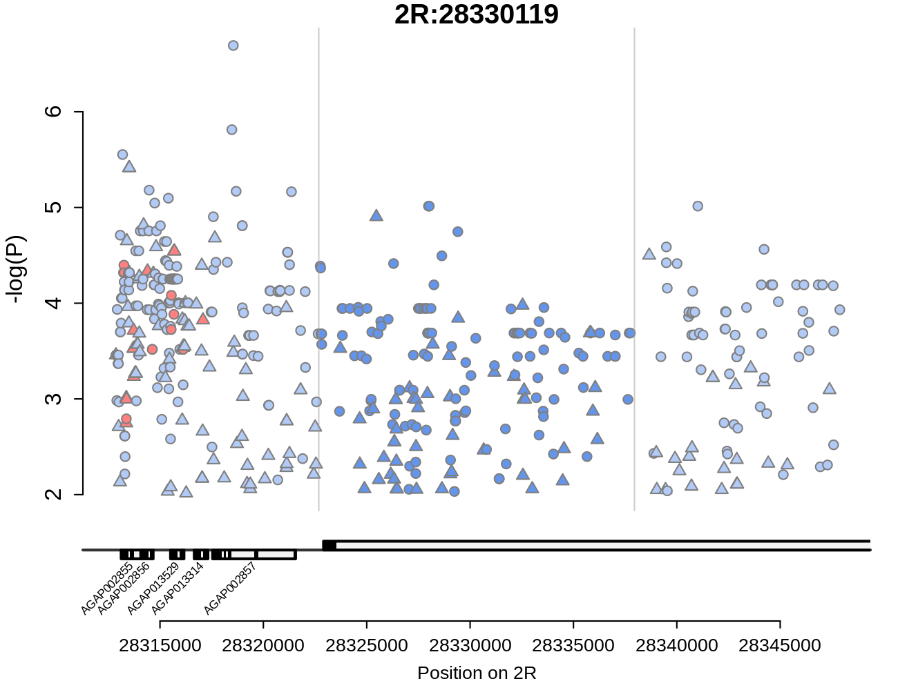

&nbsp;

&nbsp;

&nbsp;

#### Contingency table for cluster_1:

| &nbsp;&nbsp;&nbsp;  phenotype  &nbsp;&nbsp;&nbsp; |  &nbsp;&nbsp;&nbsp;  wt  &nbsp;&nbsp;&nbsp;  |  &nbsp;&nbsp;&nbsp;  het  &nbsp;&nbsp;&nbsp;  |  &nbsp;&nbsp;&nbsp;  hom  &nbsp;&nbsp;&nbsp;  |
| :---:     | :---: | :---: | :---: |
|  alive    | 9 | 14 | 4 |
|  dead     | 37 | 14 | 0 |

&nbsp;

#### Contingency table for cluster_2:

| &nbsp;&nbsp;&nbsp;  phenotype  &nbsp;&nbsp;&nbsp; |  &nbsp;&nbsp;&nbsp;  wt  &nbsp;&nbsp;&nbsp;  |  &nbsp;&nbsp;&nbsp;  het  &nbsp;&nbsp;&nbsp;  |  &nbsp;&nbsp;&nbsp;  hom  &nbsp;&nbsp;&nbsp;  |
| :---:     | :---: | :---: | :---: |
|  alive    | 23 | 4 | 0 |
|  dead     | 34 | 16 | 1 |

&nbsp;

#### Contingency table for cluster_3:

| &nbsp;&nbsp;&nbsp;  phenotype  &nbsp;&nbsp;&nbsp; |  &nbsp;&nbsp;&nbsp;  wt  &nbsp;&nbsp;&nbsp;  |  &nbsp;&nbsp;&nbsp;  het  &nbsp;&nbsp;&nbsp;  |  &nbsp;&nbsp;&nbsp;  hom  &nbsp;&nbsp;&nbsp;  |
| :---:     | :---: | :---: | :---: |
|  alive    | 24 | 3 | 0 |
|  dead     | 34 | 16 | 1 |

&nbsp;

### Obuasi_gambiae_Delta_2R_28337951-28354693

&nbsp;

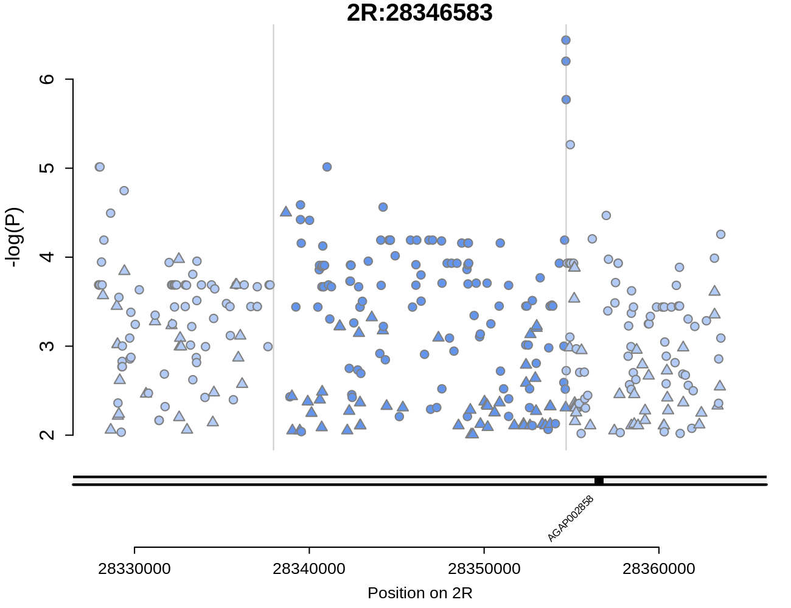

&nbsp;

&nbsp;

&nbsp;

#### Contingency table for cluster_1:

| &nbsp;&nbsp;&nbsp;  phenotype  &nbsp;&nbsp;&nbsp; |  &nbsp;&nbsp;&nbsp;  wt  &nbsp;&nbsp;&nbsp;  |  &nbsp;&nbsp;&nbsp;  het  &nbsp;&nbsp;&nbsp;  |  &nbsp;&nbsp;&nbsp;  hom  &nbsp;&nbsp;&nbsp;  |
| :---:     | :---: | :---: | :---: |
|  alive    | 9 | 14 | 4 |
|  dead     | 36 | 15 | 0 |

&nbsp;

#### Contingency table for cluster_2:

| &nbsp;&nbsp;&nbsp;  phenotype  &nbsp;&nbsp;&nbsp; |  &nbsp;&nbsp;&nbsp;  wt  &nbsp;&nbsp;&nbsp;  |  &nbsp;&nbsp;&nbsp;  het  &nbsp;&nbsp;&nbsp;  |  &nbsp;&nbsp;&nbsp;  hom  &nbsp;&nbsp;&nbsp;  |
| :---:     | :---: | :---: | :---: |
|  alive    | 24 | 3 | 0 |
|  dead     | 33 | 17 | 1 |

&nbsp;

#### Contingency table for cluster_3:

| &nbsp;&nbsp;&nbsp;  phenotype  &nbsp;&nbsp;&nbsp; |  &nbsp;&nbsp;&nbsp;  wt  &nbsp;&nbsp;&nbsp;  |  &nbsp;&nbsp;&nbsp;  het  &nbsp;&nbsp;&nbsp;  |  &nbsp;&nbsp;&nbsp;  hom  &nbsp;&nbsp;&nbsp;  |
| :---:     | :---: | :---: | :---: |
|  alive    | 22 | 5 | 0 |
|  dead     | 36 | 14 | 1 |

&nbsp;

### Obuasi_gambiae_Delta_2R_28354692-28369784

&nbsp;

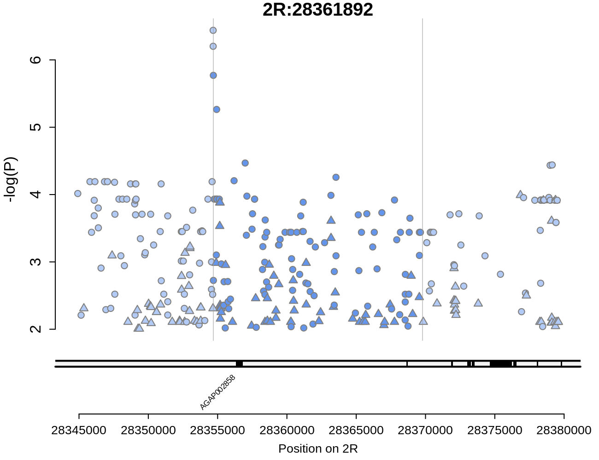

&nbsp;

&nbsp;

&nbsp;

#### Contingency table for cluster_1:

| &nbsp;&nbsp;&nbsp;  phenotype  &nbsp;&nbsp;&nbsp; |  &nbsp;&nbsp;&nbsp;  wt  &nbsp;&nbsp;&nbsp;  |  &nbsp;&nbsp;&nbsp;  het  &nbsp;&nbsp;&nbsp;  |  &nbsp;&nbsp;&nbsp;  hom  &nbsp;&nbsp;&nbsp;  |
| :---:     | :---: | :---: | :---: |
|  alive    | 8 | 15 | 4 |
|  dead     | 35 | 16 | 0 |

&nbsp;

#### Contingency table for cluster_2:

| &nbsp;&nbsp;&nbsp;  phenotype  &nbsp;&nbsp;&nbsp; |  &nbsp;&nbsp;&nbsp;  wt  &nbsp;&nbsp;&nbsp;  |  &nbsp;&nbsp;&nbsp;  het  &nbsp;&nbsp;&nbsp;  |  &nbsp;&nbsp;&nbsp;  hom  &nbsp;&nbsp;&nbsp;  |
| :---:     | :---: | :---: | :---: |
|  alive    | 24 | 3 | 0 |
|  dead     | 32 | 17 | 2 |

&nbsp;

#### Contingency table for cluster_3:

| &nbsp;&nbsp;&nbsp;  phenotype  &nbsp;&nbsp;&nbsp; |  &nbsp;&nbsp;&nbsp;  wt  &nbsp;&nbsp;&nbsp;  |  &nbsp;&nbsp;&nbsp;  het  &nbsp;&nbsp;&nbsp;  |  &nbsp;&nbsp;&nbsp;  hom  &nbsp;&nbsp;&nbsp;  |
| :---:     | :---: | :---: | :---: |
|  alive    | 21 | 6 | 0 |
|  dead     | 36 | 14 | 1 |

&nbsp;

### Obuasi_gambiae_Delta_2R_28369784-28391434

&nbsp;

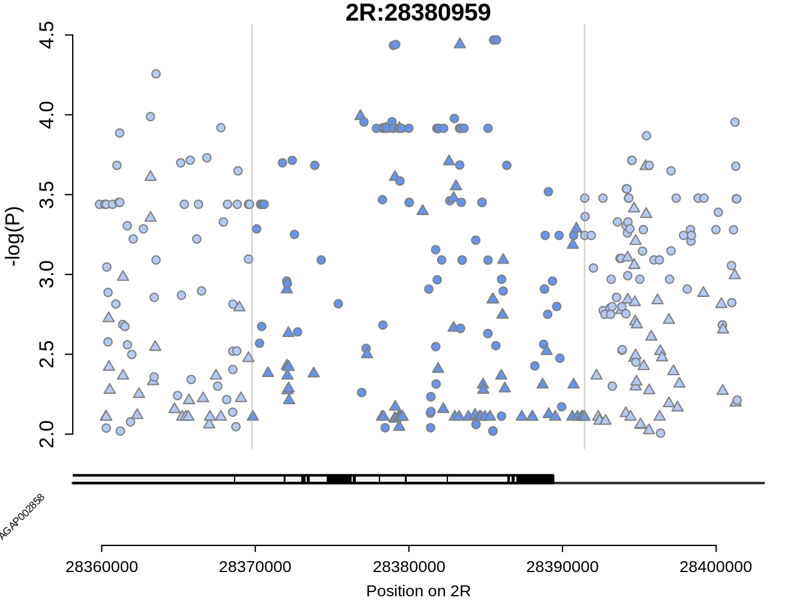

&nbsp;

&nbsp;

&nbsp;

#### Contingency table for cluster_1:

| &nbsp;&nbsp;&nbsp;  phenotype  &nbsp;&nbsp;&nbsp; |  &nbsp;&nbsp;&nbsp;  wt  &nbsp;&nbsp;&nbsp;  |  &nbsp;&nbsp;&nbsp;  het  &nbsp;&nbsp;&nbsp;  |  &nbsp;&nbsp;&nbsp;  hom  &nbsp;&nbsp;&nbsp;  |
| :---:     | :---: | :---: | :---: |
|  alive    | 8 | 15 | 4 |
|  dead     | 35 | 15 | 1 |

&nbsp;

#### Contingency table for cluster_2:

| &nbsp;&nbsp;&nbsp;  phenotype  &nbsp;&nbsp;&nbsp; |  &nbsp;&nbsp;&nbsp;  wt  &nbsp;&nbsp;&nbsp;  |  &nbsp;&nbsp;&nbsp;  het  &nbsp;&nbsp;&nbsp;  |  &nbsp;&nbsp;&nbsp;  hom  &nbsp;&nbsp;&nbsp;  |
| :---:     | :---: | :---: | :---: |
|  alive    | 24 | 3 | 0 |
|  dead     | 32 | 17 | 2 |

&nbsp;

#### Contingency table for cluster_3:

| &nbsp;&nbsp;&nbsp;  phenotype  &nbsp;&nbsp;&nbsp; |  &nbsp;&nbsp;&nbsp;  wt  &nbsp;&nbsp;&nbsp;  |  &nbsp;&nbsp;&nbsp;  het  &nbsp;&nbsp;&nbsp;  |  &nbsp;&nbsp;&nbsp;  hom  &nbsp;&nbsp;&nbsp;  |
| :---:     | :---: | :---: | :---: |
|  alive    | 21 | 6 | 0 |
|  dead     | 35 | 15 | 1 |

&nbsp;

### Obuasi_gambiae_Delta_2R_28391433-28405240

&nbsp;

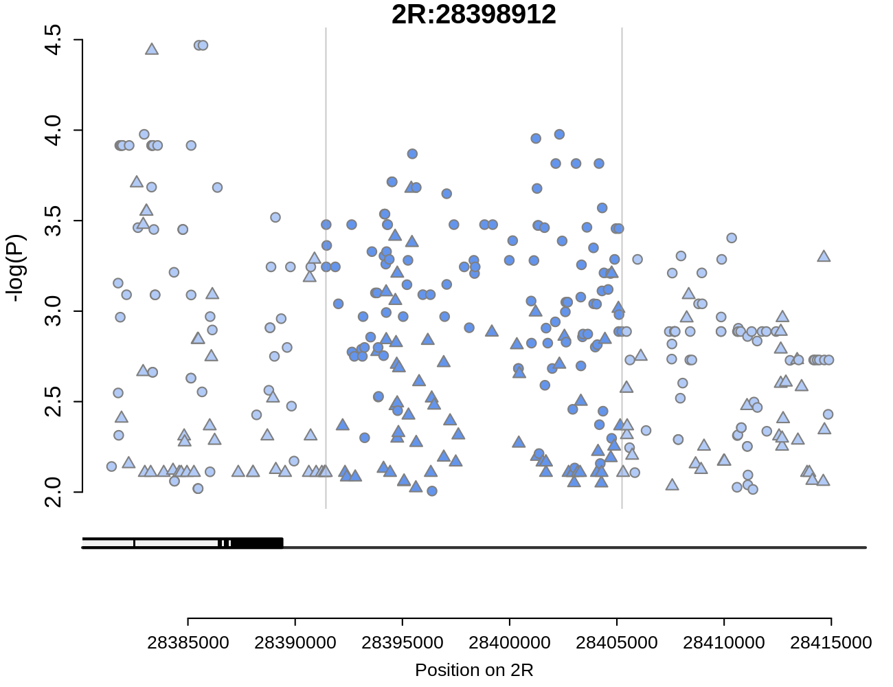

&nbsp;

&nbsp;

&nbsp;

#### Contingency table for cluster_1:

| &nbsp;&nbsp;&nbsp;  phenotype  &nbsp;&nbsp;&nbsp; |  &nbsp;&nbsp;&nbsp;  wt  &nbsp;&nbsp;&nbsp;  |  &nbsp;&nbsp;&nbsp;  het  &nbsp;&nbsp;&nbsp;  |  &nbsp;&nbsp;&nbsp;  hom  &nbsp;&nbsp;&nbsp;  |
| :---:     | :---: | :---: | :---: |
|  alive    | 7 | 16 | 4 |
|  dead     | 34 | 15 | 2 |

&nbsp;

#### Contingency table for cluster_2:

| &nbsp;&nbsp;&nbsp;  phenotype  &nbsp;&nbsp;&nbsp; |  &nbsp;&nbsp;&nbsp;  wt  &nbsp;&nbsp;&nbsp;  |  &nbsp;&nbsp;&nbsp;  het  &nbsp;&nbsp;&nbsp;  |  &nbsp;&nbsp;&nbsp;  hom  &nbsp;&nbsp;&nbsp;  |
| :---:     | :---: | :---: | :---: |
|  alive    | 24 | 3 | 0 |
|  dead     | 32 | 17 | 2 |

&nbsp;

#### Contingency table for cluster_3:

| &nbsp;&nbsp;&nbsp;  phenotype  &nbsp;&nbsp;&nbsp; |  &nbsp;&nbsp;&nbsp;  wt  &nbsp;&nbsp;&nbsp;  |  &nbsp;&nbsp;&nbsp;  het  &nbsp;&nbsp;&nbsp;  |  &nbsp;&nbsp;&nbsp;  hom  &nbsp;&nbsp;&nbsp;  |
| :---:     | :---: | :---: | :---: |
|  alive    | 21 | 6 | 0 |
|  dead     | 35 | 15 | 1 |

&nbsp;

### Obuasi_gambiae_Delta_2R_28405239-28421116

&nbsp;

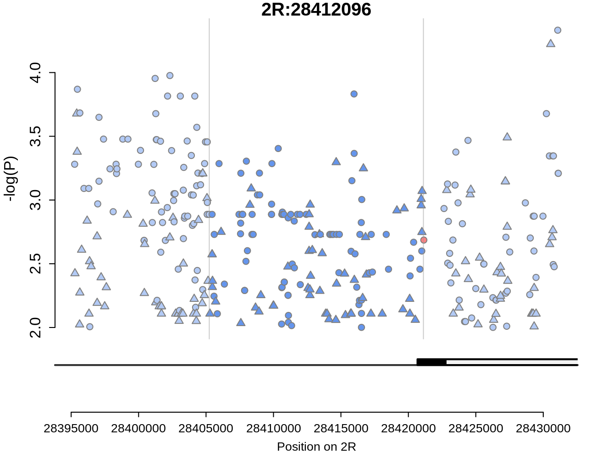

&nbsp;

&nbsp;

&nbsp;

#### Contingency table for cluster_1:

| &nbsp;&nbsp;&nbsp;  phenotype  &nbsp;&nbsp;&nbsp; |  &nbsp;&nbsp;&nbsp;  wt  &nbsp;&nbsp;&nbsp;  |  &nbsp;&nbsp;&nbsp;  het  &nbsp;&nbsp;&nbsp;  |  &nbsp;&nbsp;&nbsp;  hom  &nbsp;&nbsp;&nbsp;  |
| :---:     | :---: | :---: | :---: |
|  alive    | 9 | 11 | 7 |
|  dead     | 32 | 17 | 2 |

&nbsp;

#### Contingency table for cluster_2:

| &nbsp;&nbsp;&nbsp;  phenotype  &nbsp;&nbsp;&nbsp; |  &nbsp;&nbsp;&nbsp;  wt  &nbsp;&nbsp;&nbsp;  |  &nbsp;&nbsp;&nbsp;  het  &nbsp;&nbsp;&nbsp;  |  &nbsp;&nbsp;&nbsp;  hom  &nbsp;&nbsp;&nbsp;  |
| :---:     | :---: | :---: | :---: |
|  alive    | 21 | 6 | 0 |
|  dead     | 35 | 15 | 1 |

&nbsp;

#### Contingency table for cluster_3:

| &nbsp;&nbsp;&nbsp;  phenotype  &nbsp;&nbsp;&nbsp; |  &nbsp;&nbsp;&nbsp;  wt  &nbsp;&nbsp;&nbsp;  |  &nbsp;&nbsp;&nbsp;  het  &nbsp;&nbsp;&nbsp;  |  &nbsp;&nbsp;&nbsp;  hom  &nbsp;&nbsp;&nbsp;  |
| :---:     | :---: | :---: | :---: |
|  alive    | 24 | 3 | 0 |
|  dead     | 33 | 16 | 2 |

&nbsp;

### Obuasi_gambiae_Delta_2R_28421116-28439220

&nbsp;

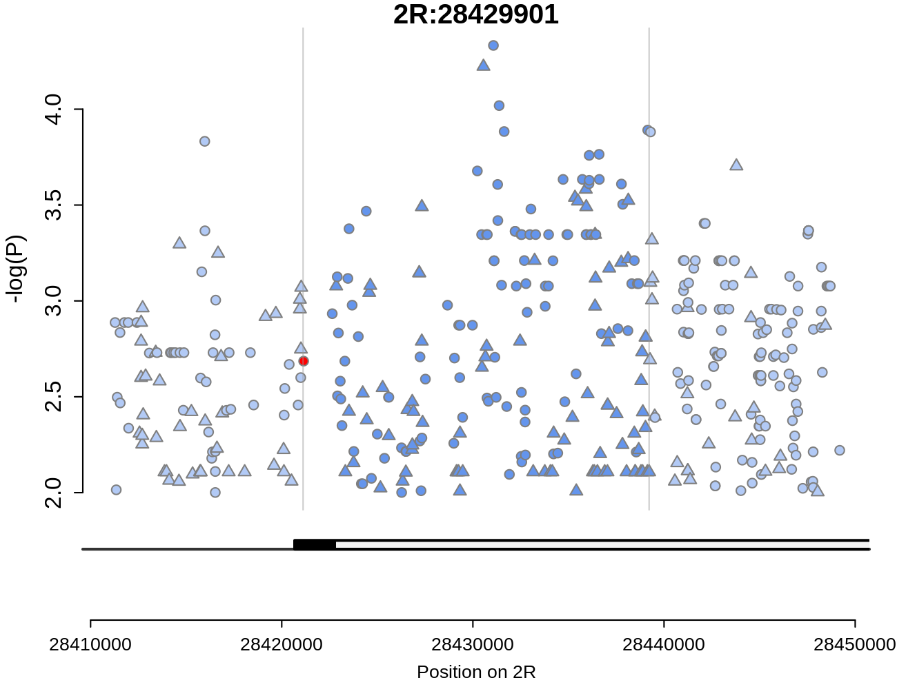

&nbsp;

&nbsp;

&nbsp;

#### Contingency table for cluster_1:

| &nbsp;&nbsp;&nbsp;  phenotype  &nbsp;&nbsp;&nbsp; |  &nbsp;&nbsp;&nbsp;  wt  &nbsp;&nbsp;&nbsp;  |  &nbsp;&nbsp;&nbsp;  het  &nbsp;&nbsp;&nbsp;  |  &nbsp;&nbsp;&nbsp;  hom  &nbsp;&nbsp;&nbsp;  |
| :---:     | :---: | :---: | :---: |
|  alive    | 7 | 13 | 7 |
|  dead     | 29 | 18 | 4 |

&nbsp;

#### Contingency table for cluster_2:

| &nbsp;&nbsp;&nbsp;  phenotype  &nbsp;&nbsp;&nbsp; |  &nbsp;&nbsp;&nbsp;  wt  &nbsp;&nbsp;&nbsp;  |  &nbsp;&nbsp;&nbsp;  het  &nbsp;&nbsp;&nbsp;  |  &nbsp;&nbsp;&nbsp;  hom  &nbsp;&nbsp;&nbsp;  |
| :---:     | :---: | :---: | :---: |
|  alive    | 24 | 3 | 0 |
|  dead     | 33 | 16 | 2 |

&nbsp;

#### Contingency table for cluster_3:

| &nbsp;&nbsp;&nbsp;  phenotype  &nbsp;&nbsp;&nbsp; |  &nbsp;&nbsp;&nbsp;  wt  &nbsp;&nbsp;&nbsp;  |  &nbsp;&nbsp;&nbsp;  het  &nbsp;&nbsp;&nbsp;  |  &nbsp;&nbsp;&nbsp;  hom  &nbsp;&nbsp;&nbsp;  |
| :---:     | :---: | :---: | :---: |
|  alive    | 21 | 6 | 0 |
|  dead     | 36 | 14 | 1 |

&nbsp;

### Obuasi_gambiae_Delta_2R_28439219-28456407

&nbsp;

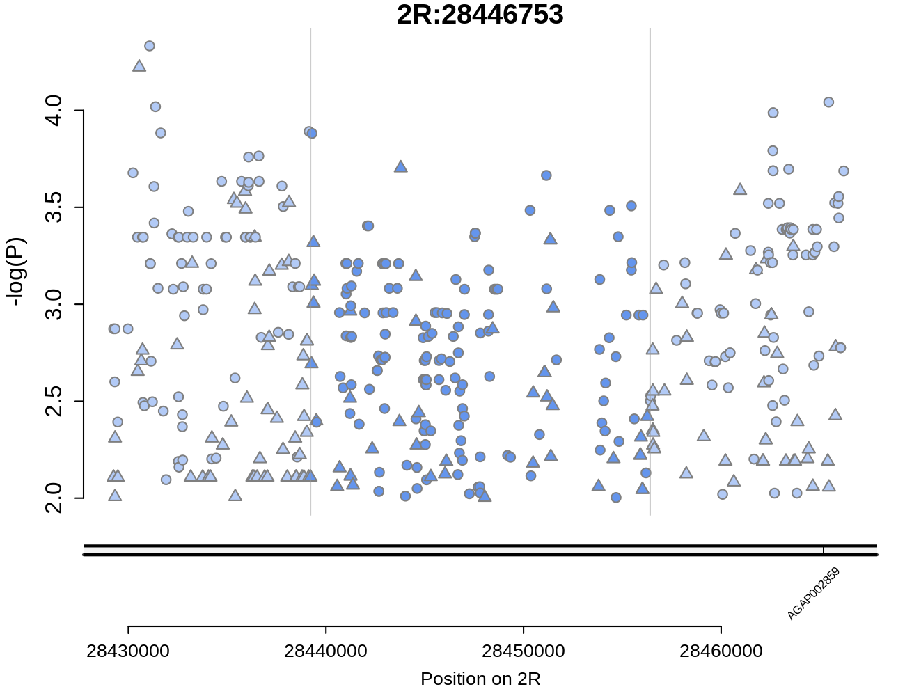

&nbsp;

&nbsp;

&nbsp;

#### Contingency table for cluster_1:

| &nbsp;&nbsp;&nbsp;  phenotype  &nbsp;&nbsp;&nbsp; |  &nbsp;&nbsp;&nbsp;  wt  &nbsp;&nbsp;&nbsp;  |  &nbsp;&nbsp;&nbsp;  het  &nbsp;&nbsp;&nbsp;  |  &nbsp;&nbsp;&nbsp;  hom  &nbsp;&nbsp;&nbsp;  |
| :---:     | :---: | :---: | :---: |
|  alive    | 4 | 14 | 9 |
|  dead     | 27 | 17 | 7 |

&nbsp;

#### Contingency table for cluster_2:

| &nbsp;&nbsp;&nbsp;  phenotype  &nbsp;&nbsp;&nbsp; |  &nbsp;&nbsp;&nbsp;  wt  &nbsp;&nbsp;&nbsp;  |  &nbsp;&nbsp;&nbsp;  het  &nbsp;&nbsp;&nbsp;  |  &nbsp;&nbsp;&nbsp;  hom  &nbsp;&nbsp;&nbsp;  |
| :---:     | :---: | :---: | :---: |
|  alive    | 23 | 4 | 0 |
|  dead     | 32 | 17 | 2 |

&nbsp;

#### Contingency table for cluster_3:

| &nbsp;&nbsp;&nbsp;  phenotype  &nbsp;&nbsp;&nbsp; |  &nbsp;&nbsp;&nbsp;  wt  &nbsp;&nbsp;&nbsp;  |  &nbsp;&nbsp;&nbsp;  het  &nbsp;&nbsp;&nbsp;  |  &nbsp;&nbsp;&nbsp;  hom  &nbsp;&nbsp;&nbsp;  |
| :---:     | :---: | :---: | :---: |
|  alive    | 20 | 7 | 0 |
|  dead     | 36 | 14 | 1 |

&nbsp;

### Obuasi_gambiae_Delta_2R_28456407-28475225

&nbsp;

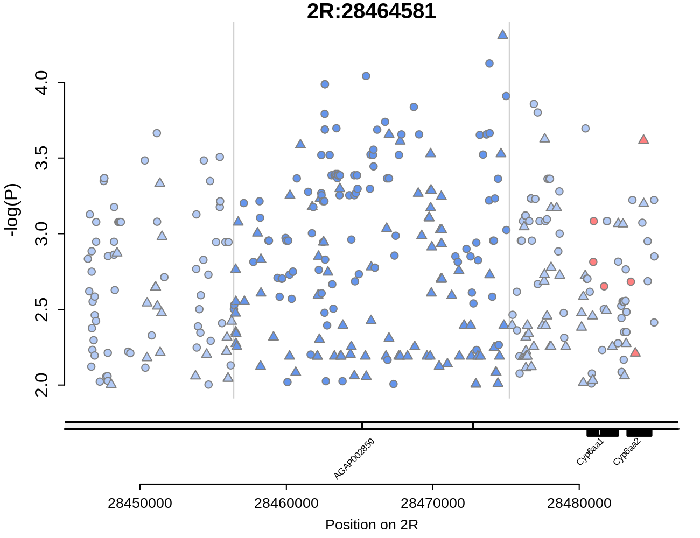

&nbsp;

&nbsp;

&nbsp;

#### Contingency table for cluster_1:

| &nbsp;&nbsp;&nbsp;  phenotype  &nbsp;&nbsp;&nbsp; |  &nbsp;&nbsp;&nbsp;  wt  &nbsp;&nbsp;&nbsp;  |  &nbsp;&nbsp;&nbsp;  het  &nbsp;&nbsp;&nbsp;  |  &nbsp;&nbsp;&nbsp;  hom  &nbsp;&nbsp;&nbsp;  |
| :---:     | :---: | :---: | :---: |
|  alive    | 3 | 15 | 9 |
|  dead     | 25 | 19 | 7 |

&nbsp;

#### Contingency table for cluster_2:

| &nbsp;&nbsp;&nbsp;  phenotype  &nbsp;&nbsp;&nbsp; |  &nbsp;&nbsp;&nbsp;  wt  &nbsp;&nbsp;&nbsp;  |  &nbsp;&nbsp;&nbsp;  het  &nbsp;&nbsp;&nbsp;  |  &nbsp;&nbsp;&nbsp;  hom  &nbsp;&nbsp;&nbsp;  |
| :---:     | :---: | :---: | :---: |
|  alive    | 23 | 4 | 0 |
|  dead     | 32 | 17 | 2 |

&nbsp;

#### Contingency table for cluster_3:

| &nbsp;&nbsp;&nbsp;  phenotype  &nbsp;&nbsp;&nbsp; |  &nbsp;&nbsp;&nbsp;  wt  &nbsp;&nbsp;&nbsp;  |  &nbsp;&nbsp;&nbsp;  het  &nbsp;&nbsp;&nbsp;  |  &nbsp;&nbsp;&nbsp;  hom  &nbsp;&nbsp;&nbsp;  |
| :---:     | :---: | :---: | :---: |
|  alive    | 20 | 7 | 0 |
|  dead     | 38 | 12 | 1 |

&nbsp;

### Obuasi_gambiae_Delta_2R_28475225-28496115

&nbsp;

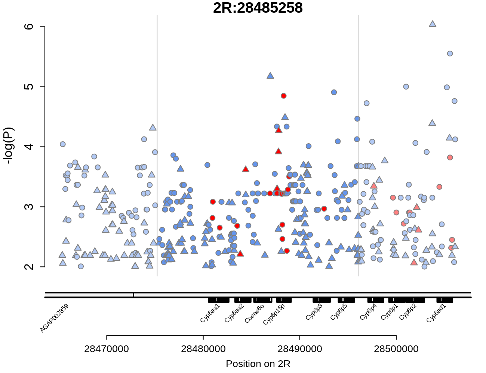

&nbsp;

&nbsp;

&nbsp;

#### Contingency table for cluster_1:

| &nbsp;&nbsp;&nbsp;  phenotype  &nbsp;&nbsp;&nbsp; |  &nbsp;&nbsp;&nbsp;  wt  &nbsp;&nbsp;&nbsp;  |  &nbsp;&nbsp;&nbsp;  het  &nbsp;&nbsp;&nbsp;  |  &nbsp;&nbsp;&nbsp;  hom  &nbsp;&nbsp;&nbsp;  |
| :---:     | :---: | :---: | :---: |
|  alive    | 7 | 12 | 8 |
|  dead     | 28 | 18 | 5 |

&nbsp;

#### Contingency table for cluster_2:

| &nbsp;&nbsp;&nbsp;  phenotype  &nbsp;&nbsp;&nbsp; |  &nbsp;&nbsp;&nbsp;  wt  &nbsp;&nbsp;&nbsp;  |  &nbsp;&nbsp;&nbsp;  het  &nbsp;&nbsp;&nbsp;  |  &nbsp;&nbsp;&nbsp;  hom  &nbsp;&nbsp;&nbsp;  |
| :---:     | :---: | :---: | :---: |
|  alive    | 19 | 8 | 0 |
|  dead     | 39 | 11 | 1 |

&nbsp;

### Obuasi_gambiae_Delta_2R_28496114-28515482

&nbsp;

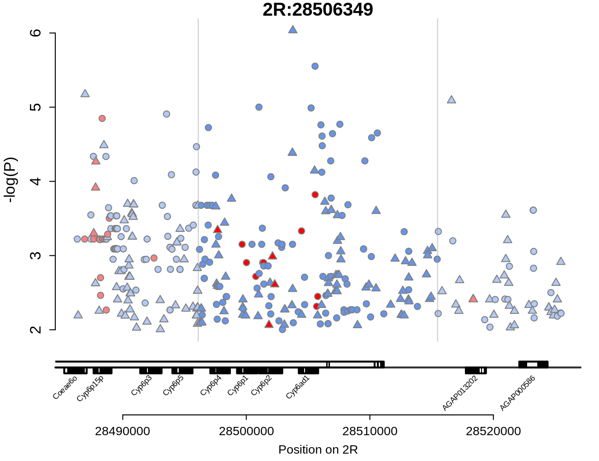

&nbsp;

&nbsp;

&nbsp;

#### Contingency table for cluster_1:

| &nbsp;&nbsp;&nbsp;  phenotype  &nbsp;&nbsp;&nbsp; |  &nbsp;&nbsp;&nbsp;  wt  &nbsp;&nbsp;&nbsp;  |  &nbsp;&nbsp;&nbsp;  het  &nbsp;&nbsp;&nbsp;  |  &nbsp;&nbsp;&nbsp;  hom  &nbsp;&nbsp;&nbsp;  |
| :---:     | :---: | :---: | :---: |
|  alive    | 11 | 9 | 7 |
|  dead     | 30 | 16 | 5 |

&nbsp;

#### Contingency table for cluster_2:

| &nbsp;&nbsp;&nbsp;  phenotype  &nbsp;&nbsp;&nbsp; |  &nbsp;&nbsp;&nbsp;  wt  &nbsp;&nbsp;&nbsp;  |  &nbsp;&nbsp;&nbsp;  het  &nbsp;&nbsp;&nbsp;  |  &nbsp;&nbsp;&nbsp;  hom  &nbsp;&nbsp;&nbsp;  |
| :---:     | :---: | :---: | :---: |
|  alive    | 17 | 10 | 0 |
|  dead     | 38 | 12 | 1 |

&nbsp;

### Obuasi_gambiae_Delta_2R_28515481-28531112

&nbsp;

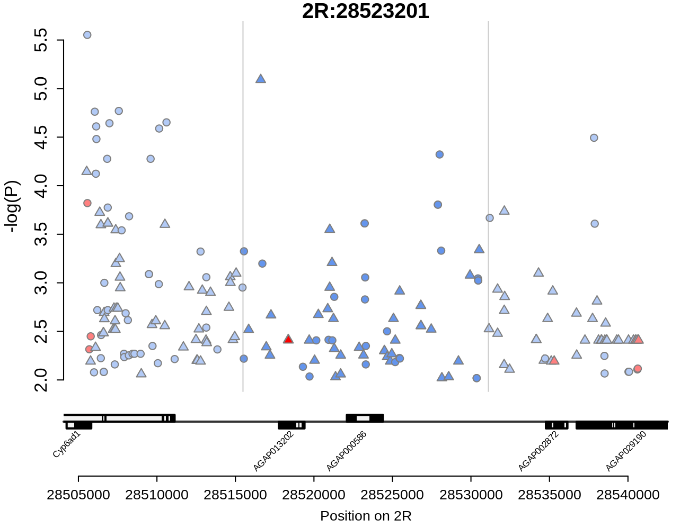

&nbsp;

&nbsp;

&nbsp;

#### Contingency table for cluster_1:

| &nbsp;&nbsp;&nbsp;  phenotype  &nbsp;&nbsp;&nbsp; |  &nbsp;&nbsp;&nbsp;  wt  &nbsp;&nbsp;&nbsp;  |  &nbsp;&nbsp;&nbsp;  het  &nbsp;&nbsp;&nbsp;  |  &nbsp;&nbsp;&nbsp;  hom  &nbsp;&nbsp;&nbsp;  |
| :---:     | :---: | :---: | :---: |
|  alive    | 13 | 11 | 3 |
|  dead     | 35 | 12 | 4 |

&nbsp;

#### Contingency table for cluster_2:

| &nbsp;&nbsp;&nbsp;  phenotype  &nbsp;&nbsp;&nbsp; |  &nbsp;&nbsp;&nbsp;  wt  &nbsp;&nbsp;&nbsp;  |  &nbsp;&nbsp;&nbsp;  het  &nbsp;&nbsp;&nbsp;  |  &nbsp;&nbsp;&nbsp;  hom  &nbsp;&nbsp;&nbsp;  |
| :---:     | :---: | :---: | :---: |
|  alive    | 14 | 12 | 1 |
|  dead     | 38 | 12 | 1 |

&nbsp;

___

## Baguida\_*gambiae*\_PM

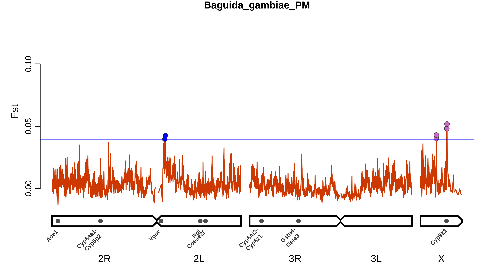

&nbsp;

[Baguida_gambiae_PM_X:15411876-15495650](#baguida_gambiae_pm_x_15411876-15495650)  
[Baguida_gambiae_PM_X:9165646-9222299](#baguida_gambiae_pm_x_9165646-9222299)  
[Baguida_gambiae_PM_X:9222298-9273975](#baguida_gambiae_pm_x_9222298-9273975)  
[Baguida_gambiae_PM_X:9273975-9317640](#baguida_gambiae_pm_x_9273975-9317640)  
[Baguida_gambiae_PM_X:9317639-9346605](#baguida_gambiae_pm_x_9317639-9346605)  
### Baguida_gambiae_PM_X_15411876-15495650

&nbsp;

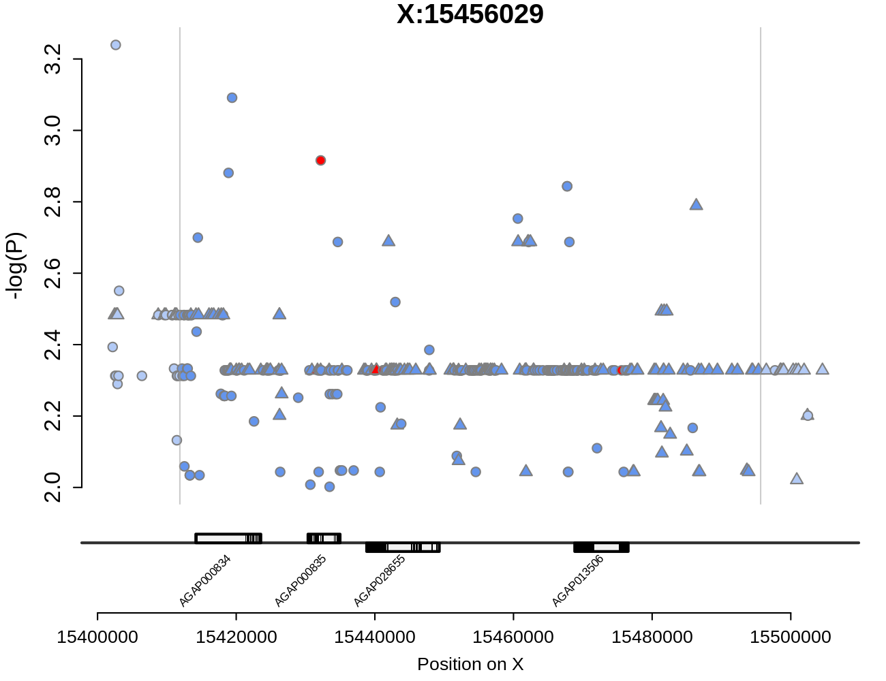

&nbsp;

&nbsp;

&nbsp;

#### Contingency table for cluster_1:

| &nbsp;&nbsp;&nbsp;  phenotype  &nbsp;&nbsp;&nbsp; |  &nbsp;&nbsp;&nbsp;  wt  &nbsp;&nbsp;&nbsp;  |  &nbsp;&nbsp;&nbsp;  het  &nbsp;&nbsp;&nbsp;  |  &nbsp;&nbsp;&nbsp;  hom  &nbsp;&nbsp;&nbsp;  |
| :---:     | :---: | :---: | :---: |
|  alive    | 17 | 14 | 4 |
|  dead     | 13 | 12 | 5 |

&nbsp;

#### Contingency table for cluster_2:

| &nbsp;&nbsp;&nbsp;  phenotype  &nbsp;&nbsp;&nbsp; |  &nbsp;&nbsp;&nbsp;  wt  &nbsp;&nbsp;&nbsp;  |  &nbsp;&nbsp;&nbsp;  het  &nbsp;&nbsp;&nbsp;  |  &nbsp;&nbsp;&nbsp;  hom  &nbsp;&nbsp;&nbsp;  |
| :---:     | :---: | :---: | :---: |
|  alive    | 24 | 11 | 0 |
|  dead     | 12 | 16 | 2 |

&nbsp;

#### Contingency table for cluster_3:

| &nbsp;&nbsp;&nbsp;  phenotype  &nbsp;&nbsp;&nbsp; |  &nbsp;&nbsp;&nbsp;  wt  &nbsp;&nbsp;&nbsp;  |  &nbsp;&nbsp;&nbsp;  het  &nbsp;&nbsp;&nbsp;  |  &nbsp;&nbsp;&nbsp;  hom  &nbsp;&nbsp;&nbsp;  |
| :---:     | :---: | :---: | :---: |
|  alive    | 20 | 11 | 4 |
|  dead     | 24 | 5 | 1 |

&nbsp;

### Baguida_gambiae_PM_X_9165646-9222299

&nbsp;

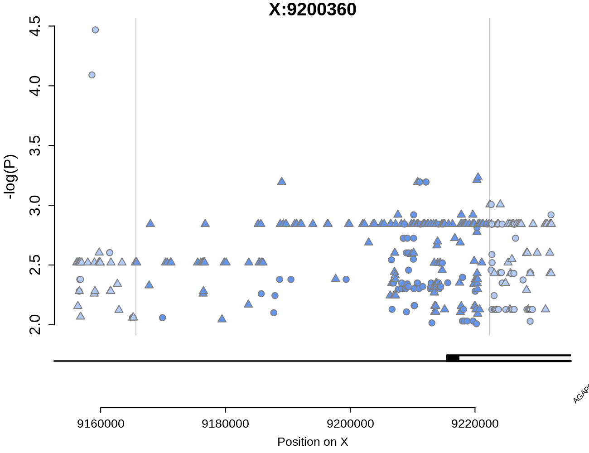

&nbsp;

&nbsp;

&nbsp;

#### Contingency table for cluster_1:

| &nbsp;&nbsp;&nbsp;  phenotype  &nbsp;&nbsp;&nbsp; |  &nbsp;&nbsp;&nbsp;  wt  &nbsp;&nbsp;&nbsp;  |  &nbsp;&nbsp;&nbsp;  het  &nbsp;&nbsp;&nbsp;  |  &nbsp;&nbsp;&nbsp;  hom  &nbsp;&nbsp;&nbsp;  |
| :---:     | :---: | :---: | :---: |
|  alive    | 6 | 13 | 16 |
|  dead     | 9 | 13 | 8 |

&nbsp;

#### Contingency table for cluster_2:

| &nbsp;&nbsp;&nbsp;  phenotype  &nbsp;&nbsp;&nbsp; |  &nbsp;&nbsp;&nbsp;  wt  &nbsp;&nbsp;&nbsp;  |  &nbsp;&nbsp;&nbsp;  het  &nbsp;&nbsp;&nbsp;  |  &nbsp;&nbsp;&nbsp;  hom  &nbsp;&nbsp;&nbsp;  |
| :---:     | :---: | :---: | :---: |
|  alive    | 24 | 10 | 1 |
|  dead     | 10 | 14 | 6 |

&nbsp;

### Baguida_gambiae_PM_X_9222298-9273975

&nbsp;

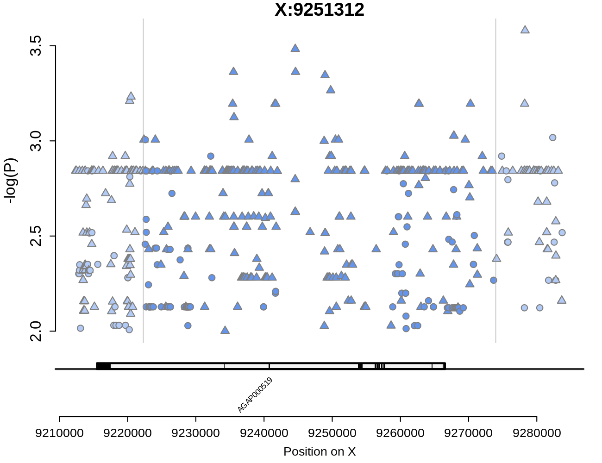

&nbsp;

&nbsp;

&nbsp;

#### Contingency table for cluster_1:

| &nbsp;&nbsp;&nbsp;  phenotype  &nbsp;&nbsp;&nbsp; |  &nbsp;&nbsp;&nbsp;  wt  &nbsp;&nbsp;&nbsp;  |  &nbsp;&nbsp;&nbsp;  het  &nbsp;&nbsp;&nbsp;  |  &nbsp;&nbsp;&nbsp;  hom  &nbsp;&nbsp;&nbsp;  |
| :---:     | :---: | :---: | :---: |
|  alive    | 16 | 13 | 6 |
|  dead     | 13 | 15 | 2 |

&nbsp;

#### Contingency table for cluster_2:

| &nbsp;&nbsp;&nbsp;  phenotype  &nbsp;&nbsp;&nbsp; |  &nbsp;&nbsp;&nbsp;  wt  &nbsp;&nbsp;&nbsp;  |  &nbsp;&nbsp;&nbsp;  het  &nbsp;&nbsp;&nbsp;  |  &nbsp;&nbsp;&nbsp;  hom  &nbsp;&nbsp;&nbsp;  |
| :---:     | :---: | :---: | :---: |
|  alive    | 24 | 10 | 1 |
|  dead     | 10 | 14 | 6 |

&nbsp;

### Baguida_gambiae_PM_X_9273975-9317640

&nbsp;

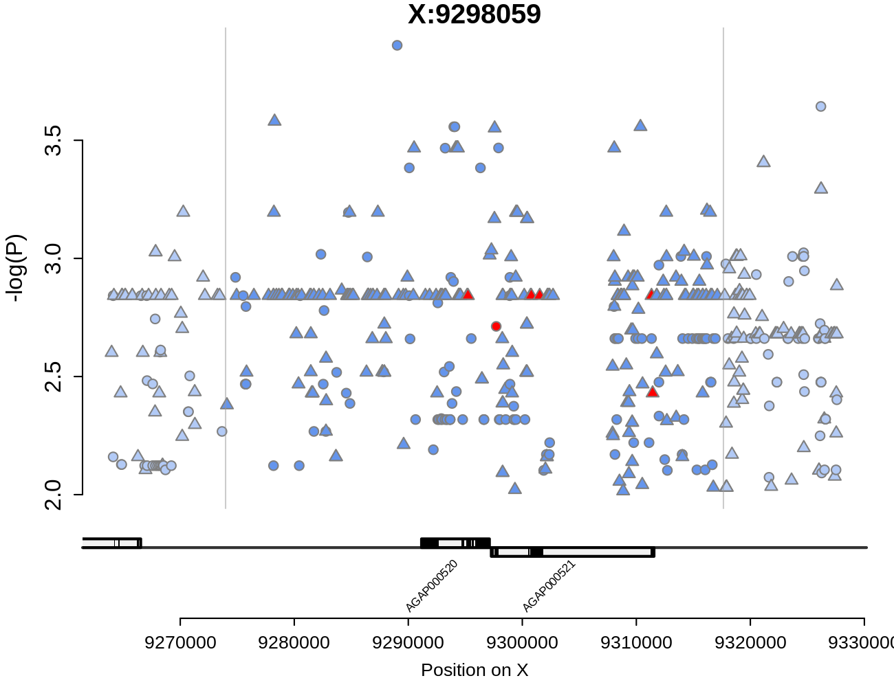

&nbsp;

&nbsp;

&nbsp;

#### Contingency table for cluster_1:

| &nbsp;&nbsp;&nbsp;  phenotype  &nbsp;&nbsp;&nbsp; |  &nbsp;&nbsp;&nbsp;  wt  &nbsp;&nbsp;&nbsp;  |  &nbsp;&nbsp;&nbsp;  het  &nbsp;&nbsp;&nbsp;  |  &nbsp;&nbsp;&nbsp;  hom  &nbsp;&nbsp;&nbsp;  |
| :---:     | :---: | :---: | :---: |
|  alive    | 24 | 10 | 1 |
|  dead     | 10 | 14 | 6 |

&nbsp;

#### Contingency table for cluster_2:

| &nbsp;&nbsp;&nbsp;  phenotype  &nbsp;&nbsp;&nbsp; |  &nbsp;&nbsp;&nbsp;  wt  &nbsp;&nbsp;&nbsp;  |  &nbsp;&nbsp;&nbsp;  het  &nbsp;&nbsp;&nbsp;  |  &nbsp;&nbsp;&nbsp;  hom  &nbsp;&nbsp;&nbsp;  |
| :---:     | :---: | :---: | :---: |
|  alive    | 20 | 11 | 4 |
|  dead     | 19 | 11 | 0 |

&nbsp;

### Baguida_gambiae_PM_X_9317639-9346605

&nbsp;

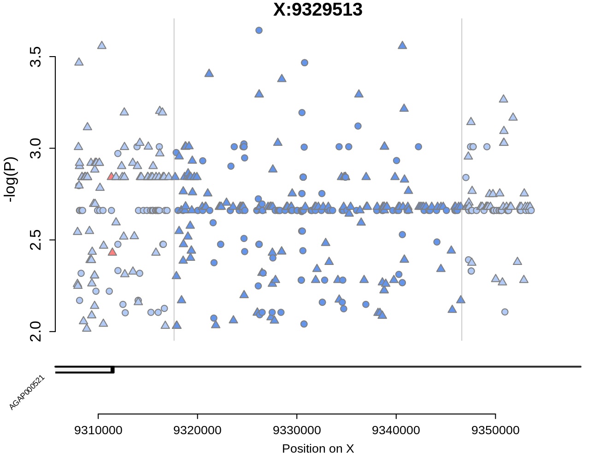

&nbsp;

&nbsp;

&nbsp;

#### Contingency table for cluster_1:

| &nbsp;&nbsp;&nbsp;  phenotype  &nbsp;&nbsp;&nbsp; |  &nbsp;&nbsp;&nbsp;  wt  &nbsp;&nbsp;&nbsp;  |  &nbsp;&nbsp;&nbsp;  het  &nbsp;&nbsp;&nbsp;  |  &nbsp;&nbsp;&nbsp;  hom  &nbsp;&nbsp;&nbsp;  |
| :---:     | :---: | :---: | :---: |
|  alive    | 24 | 10 | 1 |
|  dead     | 11 | 14 | 5 |

&nbsp;

#### Contingency table for cluster_2:

| &nbsp;&nbsp;&nbsp;  phenotype  &nbsp;&nbsp;&nbsp; |  &nbsp;&nbsp;&nbsp;  wt  &nbsp;&nbsp;&nbsp;  |  &nbsp;&nbsp;&nbsp;  het  &nbsp;&nbsp;&nbsp;  |  &nbsp;&nbsp;&nbsp;  hom  &nbsp;&nbsp;&nbsp;  |
| :---:     | :---: | :---: | :---: |
|  alive    | 19 | 14 | 2 |
|  dead     | 22 | 8 | 0 |

&nbsp;

___

## Korle-Bu\_*coluzzii*\_PM

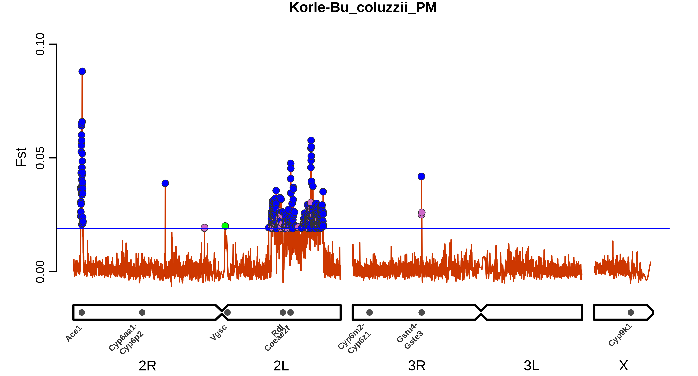

&nbsp;

[Korle-Bu_coluzzii_PM_2R:54392588-54425247](#korle-bu_coluzzii_pm_2r_54392588-54425247)  
[Korle-Bu_coluzzii_PM_3R:28470441-28489578](#korle-bu_coluzzii_pm_3r_28470441-28489578)  
[Korle-Bu_coluzzii_PM_3R:28489578-28516482](#korle-bu_coluzzii_pm_3r_28489578-28516482)  
[Korle-Bu_coluzzii_PM_3R:28516482-28545971](#korle-bu_coluzzii_pm_3r_28516482-28545971)  
[Korle-Bu_coluzzii_PM_3R:28633422-28664039](#korle-bu_coluzzii_pm_3r_28633422-28664039)  
[Korle-Bu_coluzzii_PM_3R:2920673-2937378](#korle-bu_coluzzii_pm_3r_2920673-2937378)  
### Korle-Bu_coluzzii_PM_2R_54392588-54425247

&nbsp;

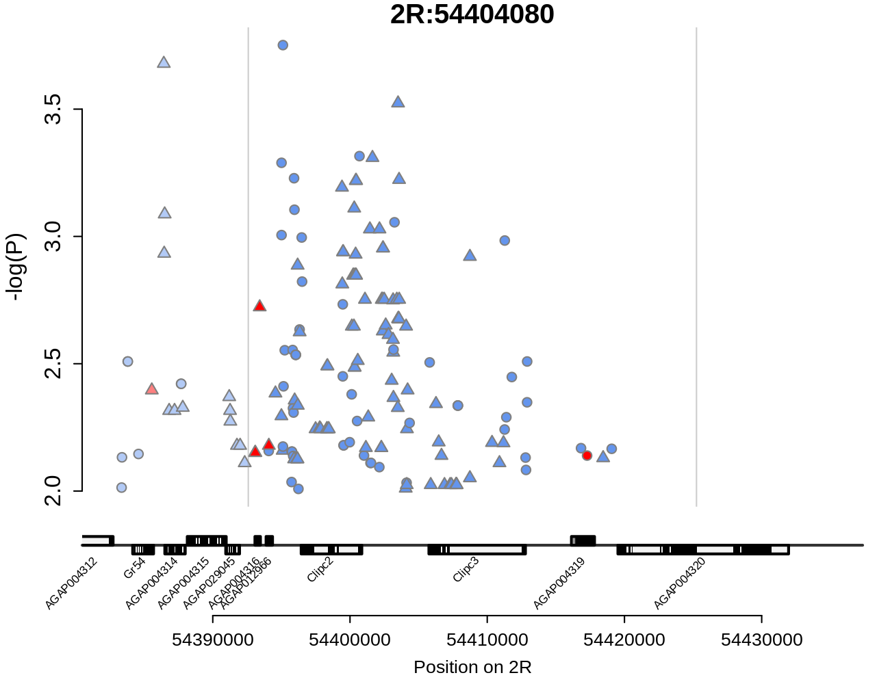

&nbsp;

&nbsp;

&nbsp;

#### Contingency table for cluster_1:

| &nbsp;&nbsp;&nbsp;  phenotype  &nbsp;&nbsp;&nbsp; |  &nbsp;&nbsp;&nbsp;  wt  &nbsp;&nbsp;&nbsp;  |  &nbsp;&nbsp;&nbsp;  het  &nbsp;&nbsp;&nbsp;  |  &nbsp;&nbsp;&nbsp;  hom  &nbsp;&nbsp;&nbsp;  |
| :---:     | :---: | :---: | :---: |
|  alive    | 18 | 30 | 9 |
|  dead     | 26 | 15 | 8 |

&nbsp;

### Korle-Bu_coluzzii_PM_3R_28470441-28489578

&nbsp;

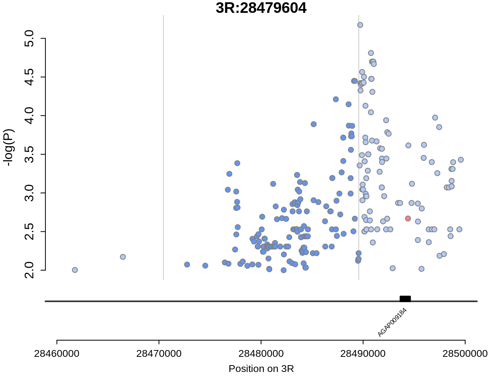

&nbsp;

&nbsp;

&nbsp;

#### Contingency table for cluster_1:

| &nbsp;&nbsp;&nbsp;  phenotype  &nbsp;&nbsp;&nbsp; |  &nbsp;&nbsp;&nbsp;  wt  &nbsp;&nbsp;&nbsp;  |  &nbsp;&nbsp;&nbsp;  het  &nbsp;&nbsp;&nbsp;  |  &nbsp;&nbsp;&nbsp;  hom  &nbsp;&nbsp;&nbsp;  |
| :---:     | :---: | :---: | :---: |
|  alive    | 32 | 22 | 3 |
|  dead     | 14 | 29 | 6 |

&nbsp;

#### Contingency table for cluster_2:

| &nbsp;&nbsp;&nbsp;  phenotype  &nbsp;&nbsp;&nbsp; |  &nbsp;&nbsp;&nbsp;  wt  &nbsp;&nbsp;&nbsp;  |  &nbsp;&nbsp;&nbsp;  het  &nbsp;&nbsp;&nbsp;  |  &nbsp;&nbsp;&nbsp;  hom  &nbsp;&nbsp;&nbsp;  |
| :---:     | :---: | :---: | :---: |
|  alive    | 42 | 15 | 0 |
|  dead     | 42 | 6 | 1 |

&nbsp;

#### Contingency table for cluster_3:

| &nbsp;&nbsp;&nbsp;  phenotype  &nbsp;&nbsp;&nbsp; |  &nbsp;&nbsp;&nbsp;  wt  &nbsp;&nbsp;&nbsp;  |  &nbsp;&nbsp;&nbsp;  het  &nbsp;&nbsp;&nbsp;  |  &nbsp;&nbsp;&nbsp;  hom  &nbsp;&nbsp;&nbsp;  |
| :---:     | :---: | :---: | :---: |
|  alive    | 42 | 13 | 2 |
|  dead     | 43 | 6 | 0 |

&nbsp;

### Korle-Bu_coluzzii_PM_3R_28489578-28516482

&nbsp;

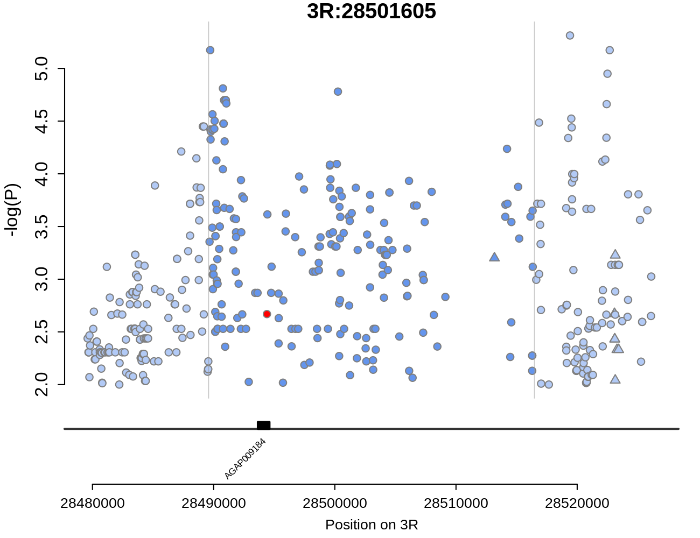

&nbsp;

&nbsp;

&nbsp;

#### Contingency table for cluster_1:

| &nbsp;&nbsp;&nbsp;  phenotype  &nbsp;&nbsp;&nbsp; |  &nbsp;&nbsp;&nbsp;  wt  &nbsp;&nbsp;&nbsp;  |  &nbsp;&nbsp;&nbsp;  het  &nbsp;&nbsp;&nbsp;  |  &nbsp;&nbsp;&nbsp;  hom  &nbsp;&nbsp;&nbsp;  |
| :---:     | :---: | :---: | :---: |
|  alive    | 34 | 20 | 3 |
|  dead     | 14 | 29 | 6 |

&nbsp;

#### Contingency table for cluster_2:

| &nbsp;&nbsp;&nbsp;  phenotype  &nbsp;&nbsp;&nbsp; |  &nbsp;&nbsp;&nbsp;  wt  &nbsp;&nbsp;&nbsp;  |  &nbsp;&nbsp;&nbsp;  het  &nbsp;&nbsp;&nbsp;  |  &nbsp;&nbsp;&nbsp;  hom  &nbsp;&nbsp;&nbsp;  |
| :---:     | :---: | :---: | :---: |
|  alive    | 33 | 20 | 4 |
|  dead     | 41 | 8 | 0 |

&nbsp;

#### Contingency table for cluster_3:

| &nbsp;&nbsp;&nbsp;  phenotype  &nbsp;&nbsp;&nbsp; |  &nbsp;&nbsp;&nbsp;  wt  &nbsp;&nbsp;&nbsp;  |  &nbsp;&nbsp;&nbsp;  het  &nbsp;&nbsp;&nbsp;  |  &nbsp;&nbsp;&nbsp;  hom  &nbsp;&nbsp;&nbsp;  |
| :---:     | :---: | :---: | :---: |
|  alive    | 39 | 16 | 2 |
|  dead     | 41 | 7 | 1 |

&nbsp;

### Korle-Bu_coluzzii_PM_3R_28516482-28545971

&nbsp;

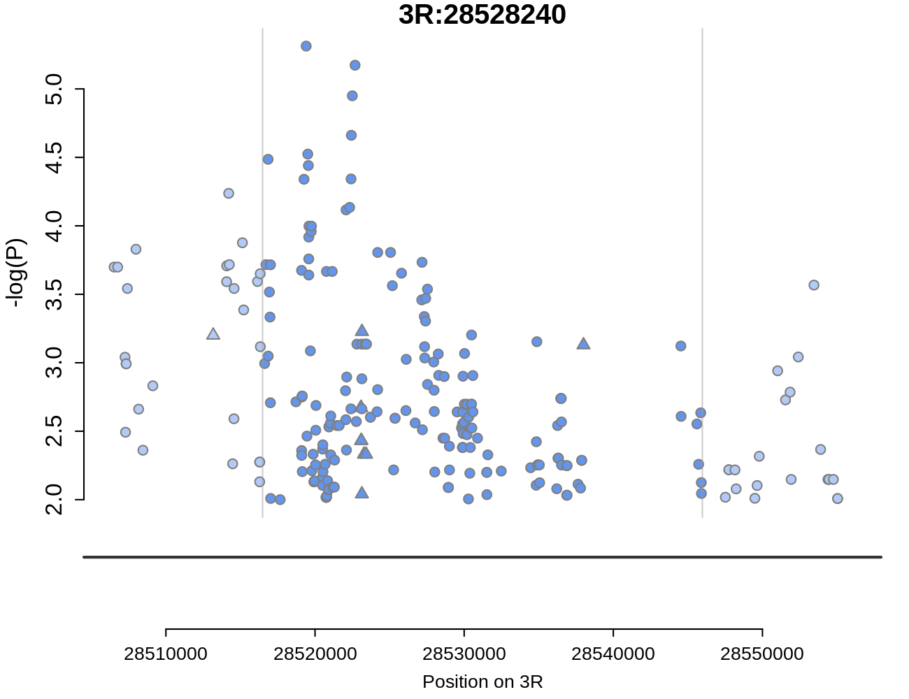

&nbsp;

&nbsp;

&nbsp;

#### Contingency table for cluster_1:

| &nbsp;&nbsp;&nbsp;  phenotype  &nbsp;&nbsp;&nbsp; |  &nbsp;&nbsp;&nbsp;  wt  &nbsp;&nbsp;&nbsp;  |  &nbsp;&nbsp;&nbsp;  het  &nbsp;&nbsp;&nbsp;  |  &nbsp;&nbsp;&nbsp;  hom  &nbsp;&nbsp;&nbsp;  |
| :---:     | :---: | :---: | :---: |
|  alive    | 38 | 16 | 3 |
|  dead     | 18 | 26 | 5 |

&nbsp;

#### Contingency table for cluster_2:

| &nbsp;&nbsp;&nbsp;  phenotype  &nbsp;&nbsp;&nbsp; |  &nbsp;&nbsp;&nbsp;  wt  &nbsp;&nbsp;&nbsp;  |  &nbsp;&nbsp;&nbsp;  het  &nbsp;&nbsp;&nbsp;  |  &nbsp;&nbsp;&nbsp;  hom  &nbsp;&nbsp;&nbsp;  |
| :---:     | :---: | :---: | :---: |
|  alive    | 26 | 24 | 7 |
|  dead     | 32 | 16 | 1 |

&nbsp;

#### Contingency table for cluster_3:

| &nbsp;&nbsp;&nbsp;  phenotype  &nbsp;&nbsp;&nbsp; |  &nbsp;&nbsp;&nbsp;  wt  &nbsp;&nbsp;&nbsp;  |  &nbsp;&nbsp;&nbsp;  het  &nbsp;&nbsp;&nbsp;  |  &nbsp;&nbsp;&nbsp;  hom  &nbsp;&nbsp;&nbsp;  |
| :---:     | :---: | :---: | :---: |
|  alive    | 39 | 15 | 3 |
|  dead     | 40 | 8 | 1 |

&nbsp;

### Korle-Bu_coluzzii_PM_3R_28633422-28664039

&nbsp;

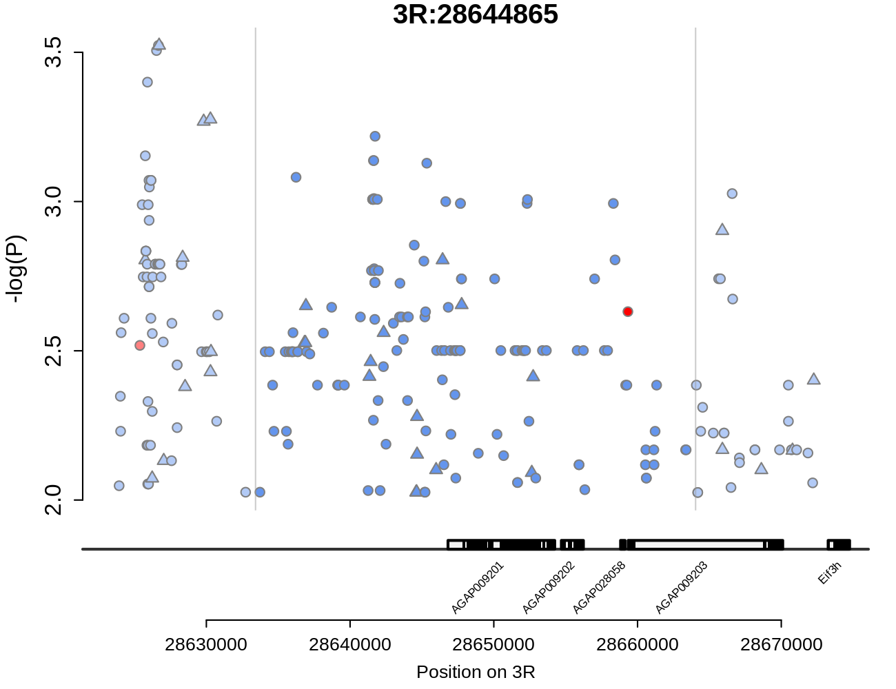

&nbsp;

&nbsp;

&nbsp;

#### Contingency table for cluster_1:

| &nbsp;&nbsp;&nbsp;  phenotype  &nbsp;&nbsp;&nbsp; |  &nbsp;&nbsp;&nbsp;  wt  &nbsp;&nbsp;&nbsp;  |  &nbsp;&nbsp;&nbsp;  het  &nbsp;&nbsp;&nbsp;  |  &nbsp;&nbsp;&nbsp;  hom  &nbsp;&nbsp;&nbsp;  |
| :---:     | :---: | :---: | :---: |
|  alive    | 15 | 32 | 10 |
|  dead     | 10 | 23 | 16 |

&nbsp;

#### Contingency table for cluster_2:

| &nbsp;&nbsp;&nbsp;  phenotype  &nbsp;&nbsp;&nbsp; |  &nbsp;&nbsp;&nbsp;  wt  &nbsp;&nbsp;&nbsp;  |  &nbsp;&nbsp;&nbsp;  het  &nbsp;&nbsp;&nbsp;  |  &nbsp;&nbsp;&nbsp;  hom  &nbsp;&nbsp;&nbsp;  |
| :---:     | :---: | :---: | :---: |
|  alive    | 28 | 26 | 3 |
|  dead     | 36 | 13 | 0 |

&nbsp;

### Korle-Bu_coluzzii_PM_3R_2920673-2937378

&nbsp;

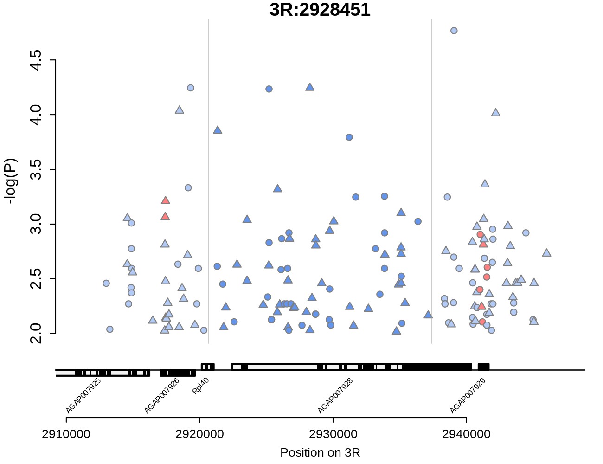

&nbsp;

&nbsp;

&nbsp;

#### Contingency table for cluster_1:

| &nbsp;&nbsp;&nbsp;  phenotype  &nbsp;&nbsp;&nbsp; |  &nbsp;&nbsp;&nbsp;  wt  &nbsp;&nbsp;&nbsp;  |  &nbsp;&nbsp;&nbsp;  het  &nbsp;&nbsp;&nbsp;  |  &nbsp;&nbsp;&nbsp;  hom  &nbsp;&nbsp;&nbsp;  |
| :---:     | :---: | :---: | :---: |
|  alive    | 18 | 30 | 9 |
|  dead     | 8 | 24 | 17 |

&nbsp;

___

## Madina\_*gambiae*\_PM

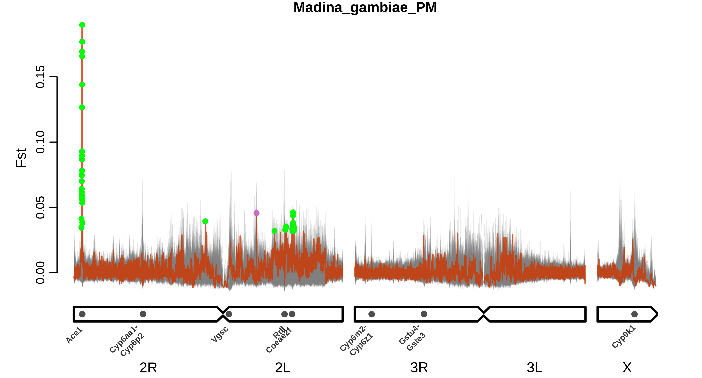

&nbsp;

[Madina_gambiae_PM_2R:54255612-54278008](#madina_gambiae_pm_2r_54255612-54278008)  
### Madina_gambiae_PM_2R_54255612-54278008

&nbsp;

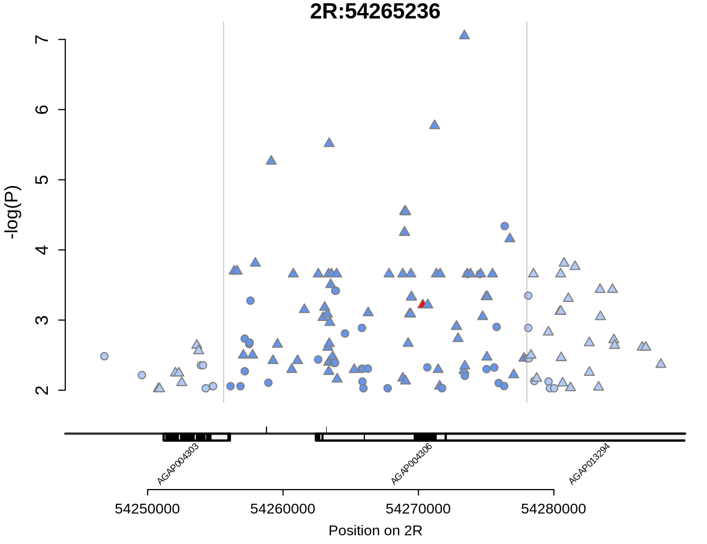

&nbsp;

&nbsp;

&nbsp;

#### Contingency table for cluster_1:

| &nbsp;&nbsp;&nbsp;  phenotype  &nbsp;&nbsp;&nbsp; |  &nbsp;&nbsp;&nbsp;  wt  &nbsp;&nbsp;&nbsp;  |  &nbsp;&nbsp;&nbsp;  het  &nbsp;&nbsp;&nbsp;  |  &nbsp;&nbsp;&nbsp;  hom  &nbsp;&nbsp;&nbsp;  |
| :---:     | :---: | :---: | :---: |
|  alive    | 31 | 7 | 0 |
|  dead     | 14 | 12 | 1 |

&nbsp;

___

## Obuasi\_*gambiae*\_PM

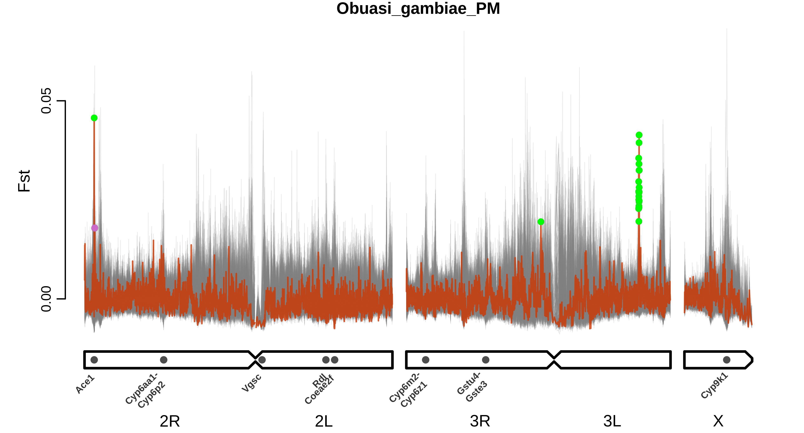

&nbsp;

[Obuasi_gambiae_PM_2R:3474360-3509400](#obuasi_gambiae_pm_2r_3474360-3509400)  
[Obuasi_gambiae_PM_3L:30477135-30487616](#obuasi_gambiae_pm_3l_30477135-30487616)  
[Obuasi_gambiae_PM_3L:30487615-30497759](#obuasi_gambiae_pm_3l_30487615-30497759)  
[Obuasi_gambiae_PM_3L:30497758-30506894](#obuasi_gambiae_pm_3l_30497758-30506894)  
[Obuasi_gambiae_PM_3L:30506893-30516797](#obuasi_gambiae_pm_3l_30506893-30516797)  
[Obuasi_gambiae_PM_3L:30534828-30545854](#obuasi_gambiae_pm_3l_30534828-30545854)  
[Obuasi_gambiae_PM_3L:30554459-30562573](#obuasi_gambiae_pm_3l_30554459-30562573)  
[Obuasi_gambiae_PM_3L:30562572-30578511](#obuasi_gambiae_pm_3l_30562572-30578511)  
[Obuasi_gambiae_PM_3L:30578511-30587941](#obuasi_gambiae_pm_3l_30578511-30587941)  
[Obuasi_gambiae_PM_3L:30587941-30597762](#obuasi_gambiae_pm_3l_30587941-30597762)  
[Obuasi_gambiae_PM_3L:30597761-30607138](#obuasi_gambiae_pm_3l_30597761-30607138)  
[Obuasi_gambiae_PM_3L:30607137-30617085](#obuasi_gambiae_pm_3l_30607137-30617085)  
[Obuasi_gambiae_PM_3L:30617085-30624950](#obuasi_gambiae_pm_3l_30617085-30624950)  
[Obuasi_gambiae_PM_3L:30624949-30635698](#obuasi_gambiae_pm_3l_30624949-30635698)  
[Obuasi_gambiae_PM_3L:30635698-30646602](#obuasi_gambiae_pm_3l_30635698-30646602)  
[Obuasi_gambiae_PM_3L:30646601-30657763](#obuasi_gambiae_pm_3l_30646601-30657763)  
[Obuasi_gambiae_PM_3L:30657762-30667355](#obuasi_gambiae_pm_3l_30657762-30667355)  
[Obuasi_gambiae_PM_3L:30667355-30678119](#obuasi_gambiae_pm_3l_30667355-30678119)  
[Obuasi_gambiae_PM_3L:30678119-30687769](#obuasi_gambiae_pm_3l_30678119-30687769)  
[Obuasi_gambiae_PM_3L:30687769-30697180](#obuasi_gambiae_pm_3l_30687769-30697180)  
[Obuasi_gambiae_PM_3R:48454456-48494640](#obuasi_gambiae_pm_3r_48454456-48494640)  
### Obuasi_gambiae_PM_2R_3474360-3509400

&nbsp;

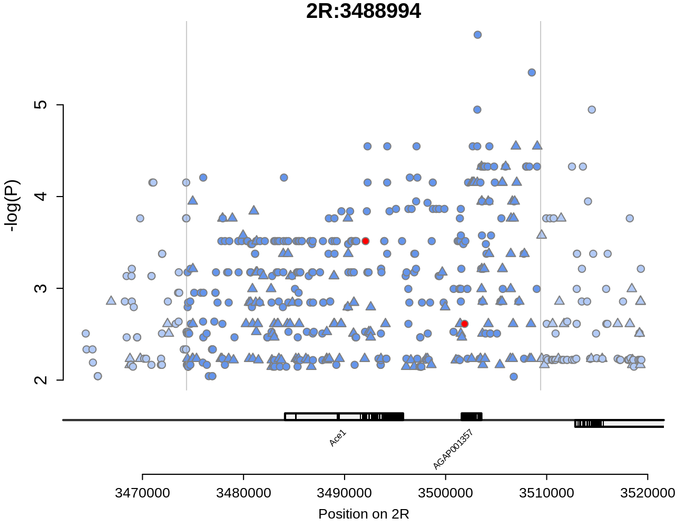

&nbsp;

&nbsp;

&nbsp;

#### Contingency table for cluster_1:

| &nbsp;&nbsp;&nbsp;  phenotype  &nbsp;&nbsp;&nbsp; |  &nbsp;&nbsp;&nbsp;  wt  &nbsp;&nbsp;&nbsp;  |  &nbsp;&nbsp;&nbsp;  het  &nbsp;&nbsp;&nbsp;  |  &nbsp;&nbsp;&nbsp;  hom  &nbsp;&nbsp;&nbsp;  |
| :---:     | :---: | :---: | :---: |
|  alive    | 1 | 2 | 51 |
|  dead     | 1 | 16 | 33 |

&nbsp;

### Obuasi_gambiae_PM_3L_30477135-30487616

&nbsp;

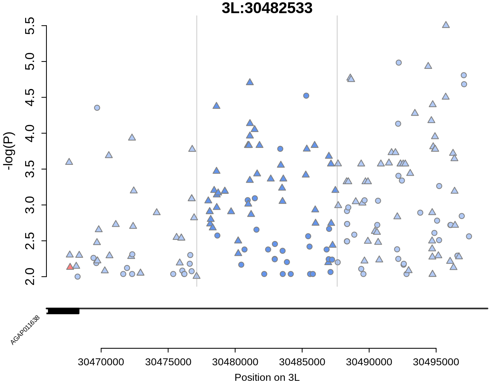

&nbsp;

&nbsp;

&nbsp;

#### Contingency table for cluster_1:

| &nbsp;&nbsp;&nbsp;  phenotype  &nbsp;&nbsp;&nbsp; |  &nbsp;&nbsp;&nbsp;  wt  &nbsp;&nbsp;&nbsp;  |  &nbsp;&nbsp;&nbsp;  het  &nbsp;&nbsp;&nbsp;  |  &nbsp;&nbsp;&nbsp;  hom  &nbsp;&nbsp;&nbsp;  |
| :---:     | :---: | :---: | :---: |
|  alive    | 37 | 16 | 1 |
|  dead     | 17 | 28 | 5 |

&nbsp;

### Obuasi_gambiae_PM_3L_30487615-30497759

&nbsp;

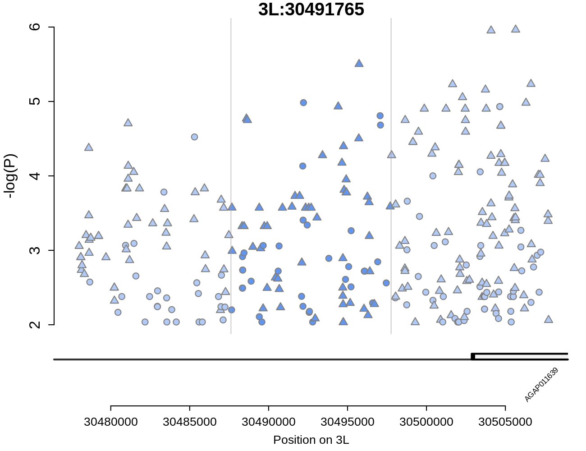

&nbsp;

&nbsp;

&nbsp;

#### Contingency table for cluster_1:

| &nbsp;&nbsp;&nbsp;  phenotype  &nbsp;&nbsp;&nbsp; |  &nbsp;&nbsp;&nbsp;  wt  &nbsp;&nbsp;&nbsp;  |  &nbsp;&nbsp;&nbsp;  het  &nbsp;&nbsp;&nbsp;  |  &nbsp;&nbsp;&nbsp;  hom  &nbsp;&nbsp;&nbsp;  |
| :---:     | :---: | :---: | :---: |
|  alive    | 33 | 20 | 1 |
|  dead     | 14 | 29 | 7 |

&nbsp;

### Obuasi_gambiae_PM_3L_30497758-30506894

&nbsp;

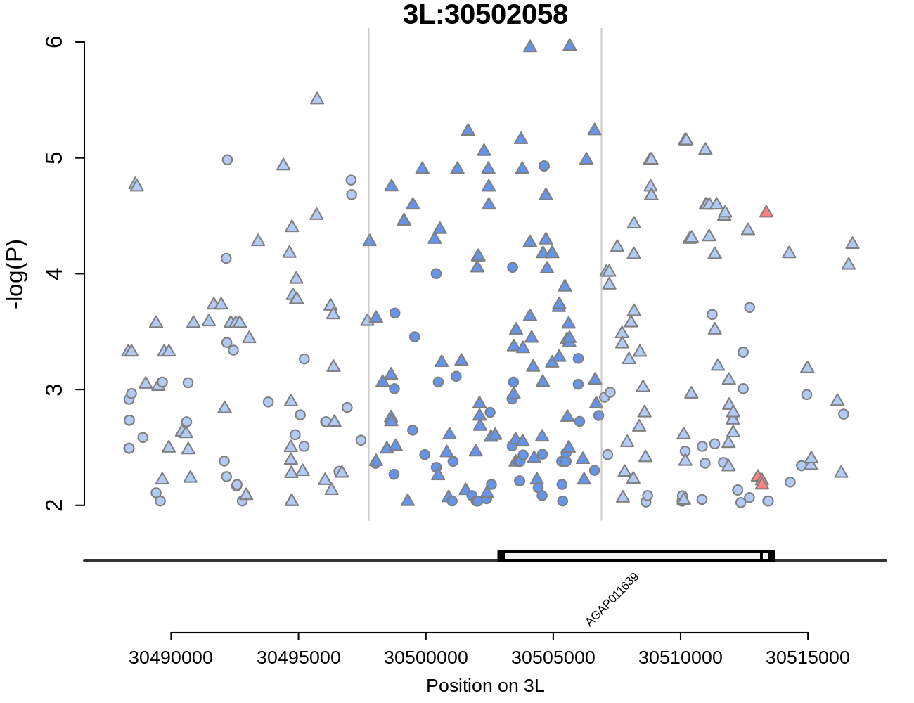

&nbsp;

&nbsp;

&nbsp;

#### Contingency table for cluster_1:

| &nbsp;&nbsp;&nbsp;  phenotype  &nbsp;&nbsp;&nbsp; |  &nbsp;&nbsp;&nbsp;  wt  &nbsp;&nbsp;&nbsp;  |  &nbsp;&nbsp;&nbsp;  het  &nbsp;&nbsp;&nbsp;  |  &nbsp;&nbsp;&nbsp;  hom  &nbsp;&nbsp;&nbsp;  |
| :---:     | :---: | :---: | :---: |
|  alive    | 36 | 17 | 1 |
|  dead     | 13 | 31 | 6 |

&nbsp;

### Obuasi_gambiae_PM_3L_30506893-30516797

&nbsp;

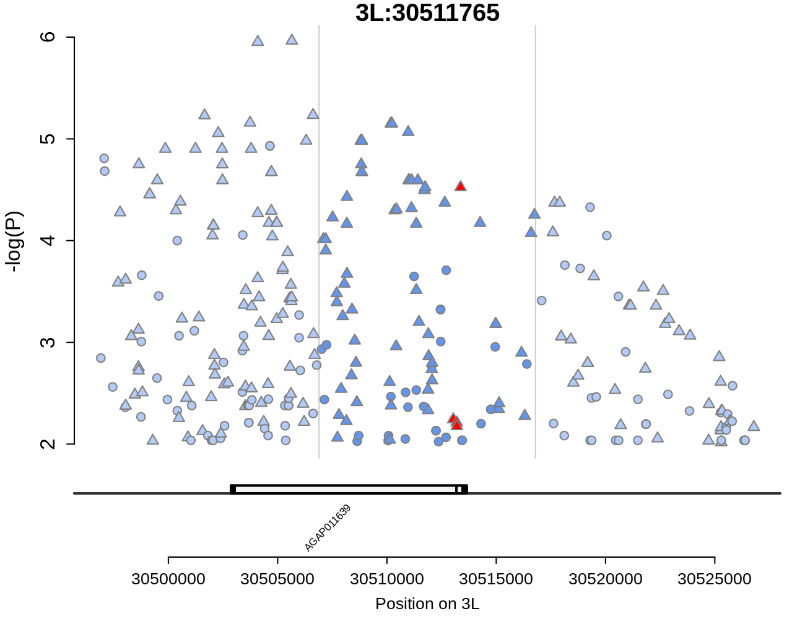

&nbsp;

&nbsp;

&nbsp;

#### Contingency table for cluster_1:

| &nbsp;&nbsp;&nbsp;  phenotype  &nbsp;&nbsp;&nbsp; |  &nbsp;&nbsp;&nbsp;  wt  &nbsp;&nbsp;&nbsp;  |  &nbsp;&nbsp;&nbsp;  het  &nbsp;&nbsp;&nbsp;  |  &nbsp;&nbsp;&nbsp;  hom  &nbsp;&nbsp;&nbsp;  |
| :---:     | :---: | :---: | :---: |
|  alive    | 35 | 19 | 0 |
|  dead     | 15 | 29 | 6 |

&nbsp;

### Obuasi_gambiae_PM_3L_30534828-30545854

&nbsp;

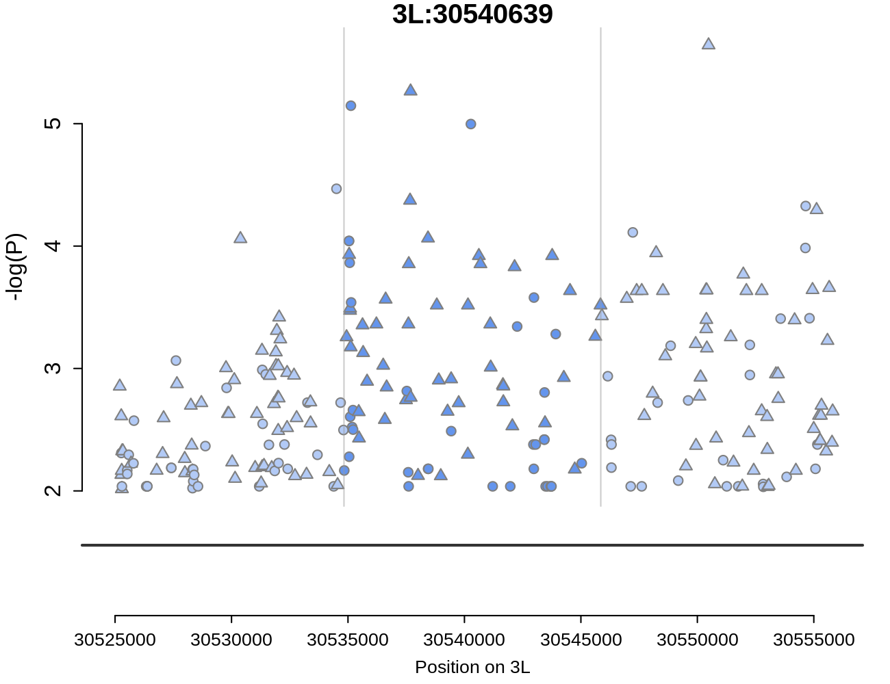

&nbsp;

&nbsp;

&nbsp;

#### Contingency table for cluster_1:

| &nbsp;&nbsp;&nbsp;  phenotype  &nbsp;&nbsp;&nbsp; |  &nbsp;&nbsp;&nbsp;  wt  &nbsp;&nbsp;&nbsp;  |  &nbsp;&nbsp;&nbsp;  het  &nbsp;&nbsp;&nbsp;  |  &nbsp;&nbsp;&nbsp;  hom  &nbsp;&nbsp;&nbsp;  |
| :---:     | :---: | :---: | :---: |
|  alive    | 35 | 18 | 1 |
|  dead     | 15 | 31 | 4 |

&nbsp;

### Obuasi_gambiae_PM_3L_30554459-30562573

&nbsp;

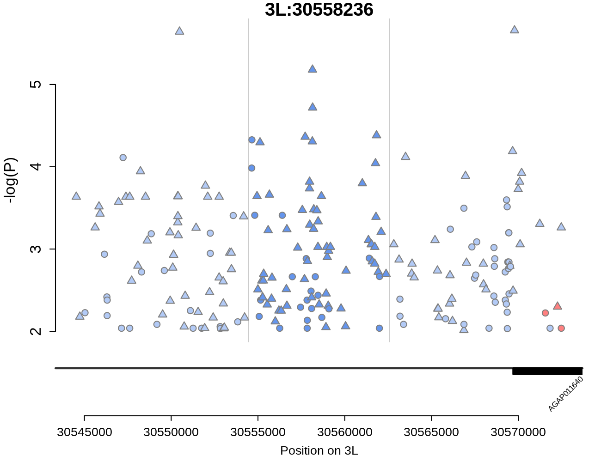

&nbsp;

&nbsp;

&nbsp;

#### Contingency table for cluster_1:

| &nbsp;&nbsp;&nbsp;  phenotype  &nbsp;&nbsp;&nbsp; |  &nbsp;&nbsp;&nbsp;  wt  &nbsp;&nbsp;&nbsp;  |  &nbsp;&nbsp;&nbsp;  het  &nbsp;&nbsp;&nbsp;  |  &nbsp;&nbsp;&nbsp;  hom  &nbsp;&nbsp;&nbsp;  |
| :---:     | :---: | :---: | :---: |
|  alive    | 36 | 17 | 1 |
|  dead     | 16 | 29 | 5 |

&nbsp;

### Obuasi_gambiae_PM_3L_30562572-30578511

&nbsp;

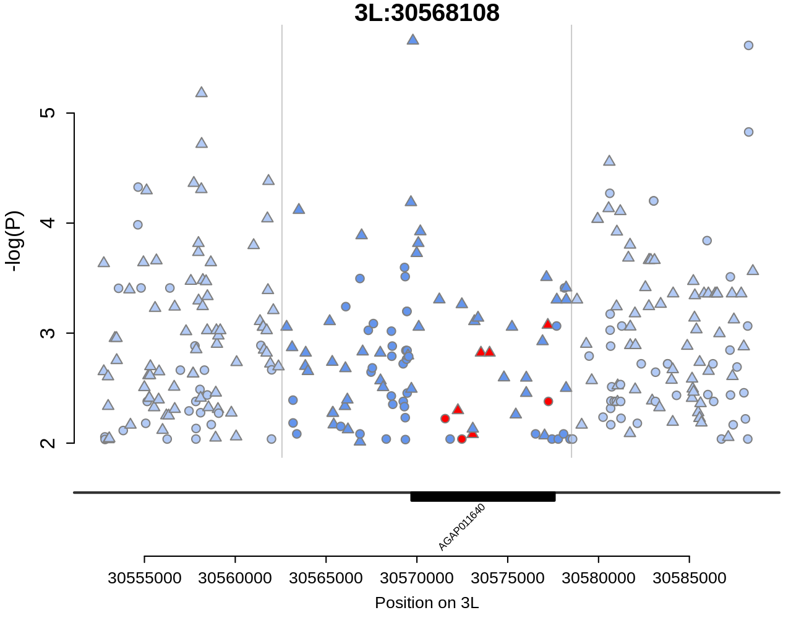

&nbsp;

&nbsp;

&nbsp;

#### Contingency table for cluster_1:

| &nbsp;&nbsp;&nbsp;  phenotype  &nbsp;&nbsp;&nbsp; |  &nbsp;&nbsp;&nbsp;  wt  &nbsp;&nbsp;&nbsp;  |  &nbsp;&nbsp;&nbsp;  het  &nbsp;&nbsp;&nbsp;  |  &nbsp;&nbsp;&nbsp;  hom  &nbsp;&nbsp;&nbsp;  |
| :---:     | :---: | :---: | :---: |
|  alive    | 36 | 16 | 2 |
|  dead     | 16 | 29 | 5 |

&nbsp;

### Obuasi_gambiae_PM_3L_30578511-30587941

&nbsp;

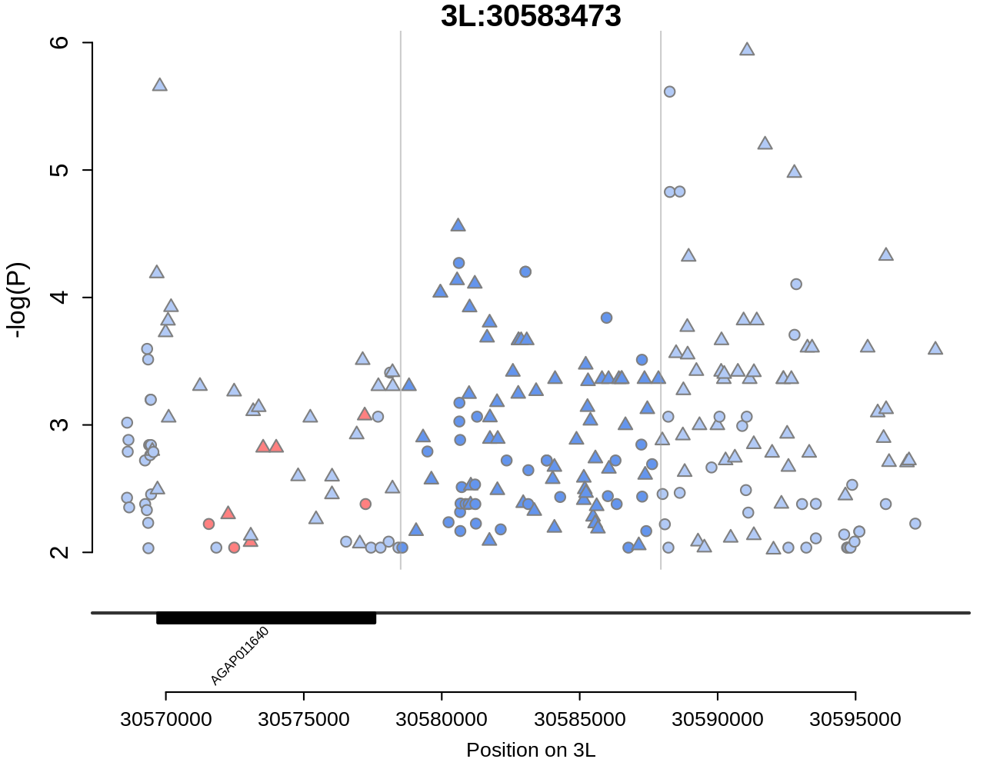

&nbsp;

&nbsp;

&nbsp;

#### Contingency table for cluster_1:

| &nbsp;&nbsp;&nbsp;  phenotype  &nbsp;&nbsp;&nbsp; |  &nbsp;&nbsp;&nbsp;  wt  &nbsp;&nbsp;&nbsp;  |  &nbsp;&nbsp;&nbsp;  het  &nbsp;&nbsp;&nbsp;  |  &nbsp;&nbsp;&nbsp;  hom  &nbsp;&nbsp;&nbsp;  |
| :---:     | :---: | :---: | :---: |
|  alive    | 35 | 17 | 2 |
|  dead     | 15 | 28 | 7 |

&nbsp;

### Obuasi_gambiae_PM_3L_30587941-30597762

&nbsp;

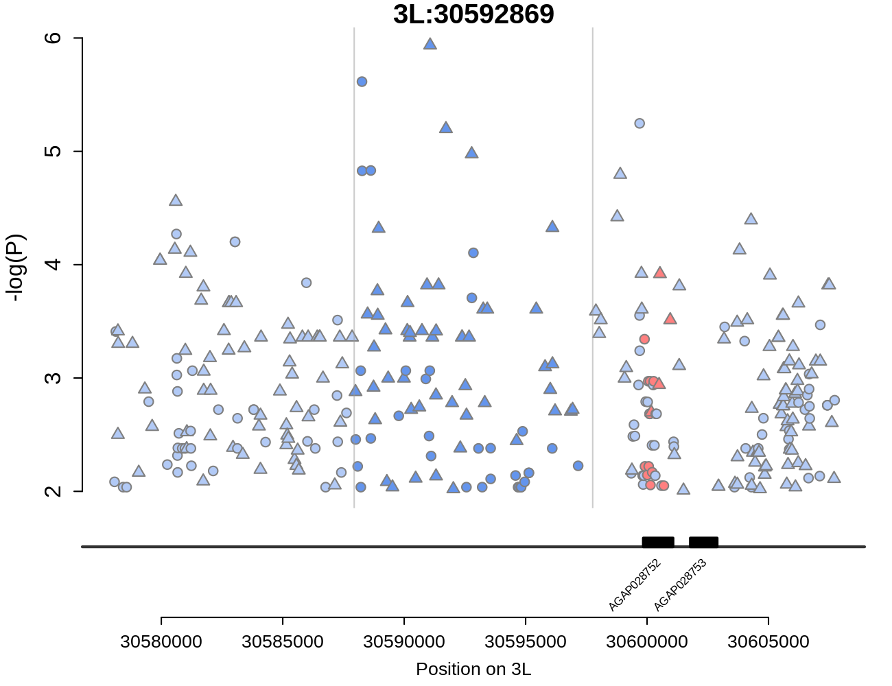

&nbsp;

&nbsp;

&nbsp;

#### Contingency table for cluster_1:

| &nbsp;&nbsp;&nbsp;  phenotype  &nbsp;&nbsp;&nbsp; |  &nbsp;&nbsp;&nbsp;  wt  &nbsp;&nbsp;&nbsp;  |  &nbsp;&nbsp;&nbsp;  het  &nbsp;&nbsp;&nbsp;  |  &nbsp;&nbsp;&nbsp;  hom  &nbsp;&nbsp;&nbsp;  |
| :---:     | :---: | :---: | :---: |
|  alive    | 35 | 17 | 2 |
|  dead     | 15 | 28 | 7 |

&nbsp;

### Obuasi_gambiae_PM_3L_30597761-30607138

&nbsp;

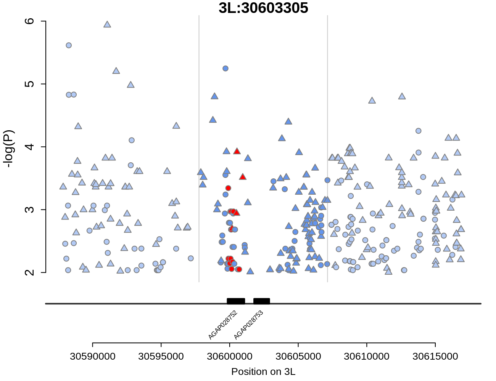

&nbsp;

&nbsp;

&nbsp;

#### Contingency table for cluster_1:

| &nbsp;&nbsp;&nbsp;  phenotype  &nbsp;&nbsp;&nbsp; |  &nbsp;&nbsp;&nbsp;  wt  &nbsp;&nbsp;&nbsp;  |  &nbsp;&nbsp;&nbsp;  het  &nbsp;&nbsp;&nbsp;  |  &nbsp;&nbsp;&nbsp;  hom  &nbsp;&nbsp;&nbsp;  |
| :---:     | :---: | :---: | :---: |
|  alive    | 35 | 17 | 2 |
|  dead     | 15 | 28 | 7 |

&nbsp;

### Obuasi_gambiae_PM_3L_30607137-30617085

&nbsp;

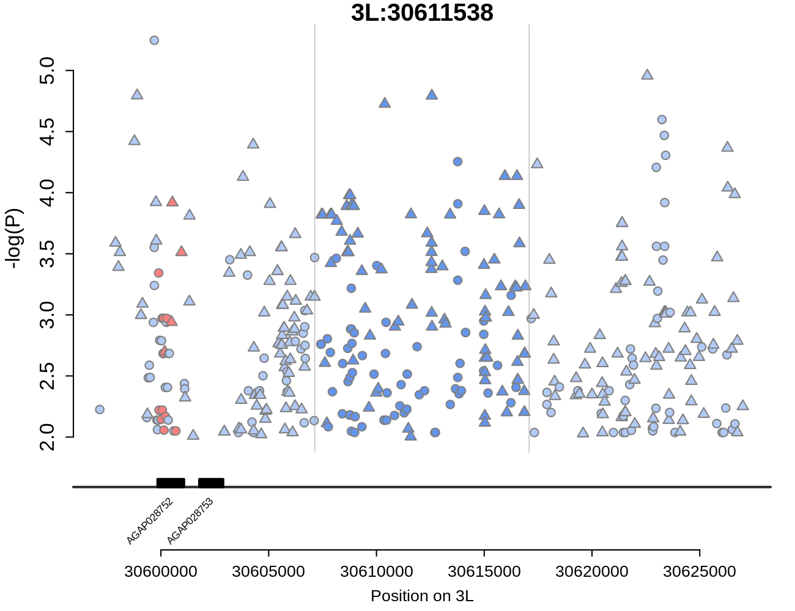

&nbsp;

&nbsp;

&nbsp;

#### Contingency table for cluster_1:

| &nbsp;&nbsp;&nbsp;  phenotype  &nbsp;&nbsp;&nbsp; |  &nbsp;&nbsp;&nbsp;  wt  &nbsp;&nbsp;&nbsp;  |  &nbsp;&nbsp;&nbsp;  het  &nbsp;&nbsp;&nbsp;  |  &nbsp;&nbsp;&nbsp;  hom  &nbsp;&nbsp;&nbsp;  |
| :---:     | :---: | :---: | :---: |
|  alive    | 34 | 18 | 2 |
|  dead     | 15 | 27 | 8 |

&nbsp;

### Obuasi_gambiae_PM_3L_30617085-30624950

&nbsp;

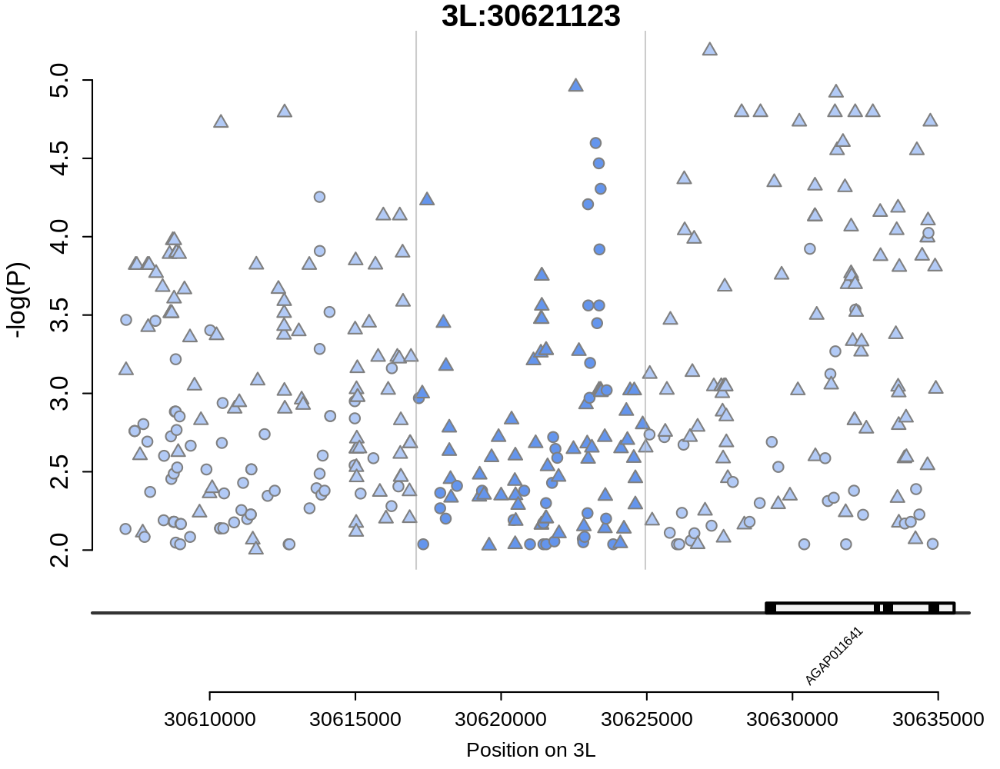

&nbsp;

&nbsp;

&nbsp;

#### Contingency table for cluster_1:

| &nbsp;&nbsp;&nbsp;  phenotype  &nbsp;&nbsp;&nbsp; |  &nbsp;&nbsp;&nbsp;  wt  &nbsp;&nbsp;&nbsp;  |  &nbsp;&nbsp;&nbsp;  het  &nbsp;&nbsp;&nbsp;  |  &nbsp;&nbsp;&nbsp;  hom  &nbsp;&nbsp;&nbsp;  |
| :---:     | :---: | :---: | :---: |
|  alive    | 33 | 18 | 3 |
|  dead     | 15 | 25 | 10 |

&nbsp;

### Obuasi_gambiae_PM_3L_30624949-30635698

&nbsp;

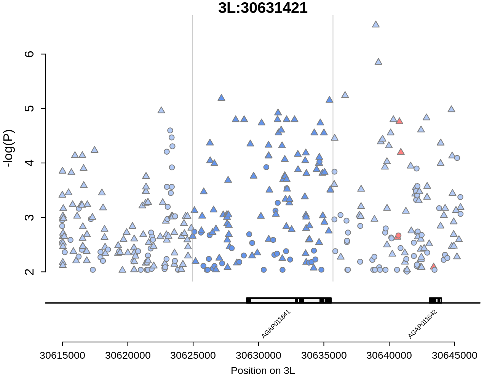

&nbsp;

&nbsp;

&nbsp;

#### Contingency table for cluster_1:

| &nbsp;&nbsp;&nbsp;  phenotype  &nbsp;&nbsp;&nbsp; |  &nbsp;&nbsp;&nbsp;  wt  &nbsp;&nbsp;&nbsp;  |  &nbsp;&nbsp;&nbsp;  het  &nbsp;&nbsp;&nbsp;  |  &nbsp;&nbsp;&nbsp;  hom  &nbsp;&nbsp;&nbsp;  |
| :---:     | :---: | :---: | :---: |
|  alive    | 30 | 21 | 3 |
|  dead     | 10 | 28 | 12 |

&nbsp;

### Obuasi_gambiae_PM_3L_30635698-30646602

&nbsp;

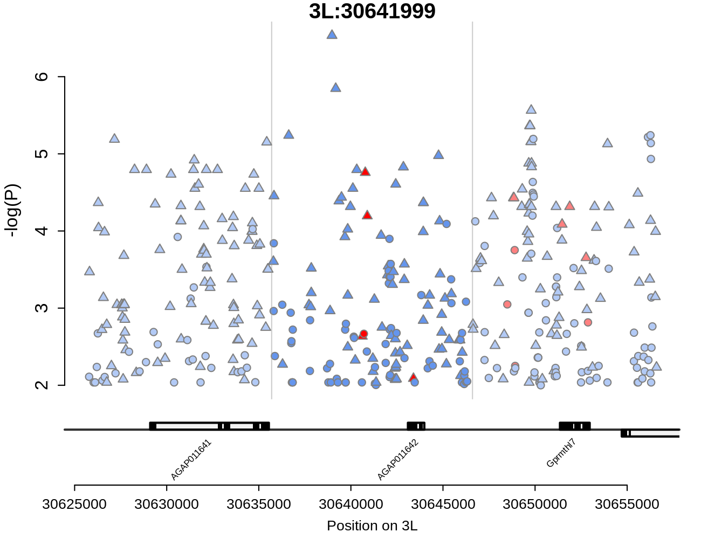

&nbsp;

&nbsp;

&nbsp;

#### Contingency table for cluster_1:

| &nbsp;&nbsp;&nbsp;  phenotype  &nbsp;&nbsp;&nbsp; |  &nbsp;&nbsp;&nbsp;  wt  &nbsp;&nbsp;&nbsp;  |  &nbsp;&nbsp;&nbsp;  het  &nbsp;&nbsp;&nbsp;  |  &nbsp;&nbsp;&nbsp;  hom  &nbsp;&nbsp;&nbsp;  |
| :---:     | :---: | :---: | :---: |
|  alive    | 30 | 21 | 3 |
|  dead     | 10 | 28 | 12 |

&nbsp;

### Obuasi_gambiae_PM_3L_30646601-30657763

&nbsp;

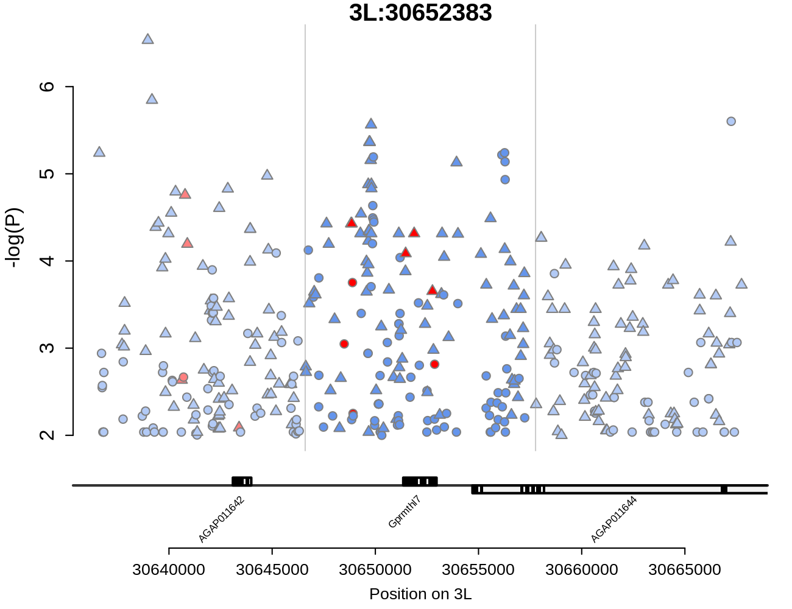

&nbsp;

&nbsp;

&nbsp;

#### Contingency table for cluster_1:

| &nbsp;&nbsp;&nbsp;  phenotype  &nbsp;&nbsp;&nbsp; |  &nbsp;&nbsp;&nbsp;  wt  &nbsp;&nbsp;&nbsp;  |  &nbsp;&nbsp;&nbsp;  het  &nbsp;&nbsp;&nbsp;  |  &nbsp;&nbsp;&nbsp;  hom  &nbsp;&nbsp;&nbsp;  |
| :---:     | :---: | :---: | :---: |
|  alive    | 28 | 24 | 2 |
|  dead     | 11 | 29 | 10 |

&nbsp;

### Obuasi_gambiae_PM_3L_30657762-30667355

&nbsp;

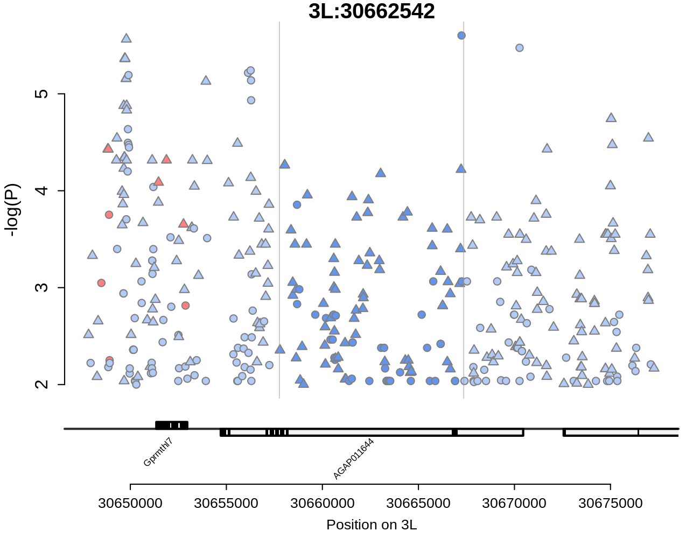

&nbsp;

&nbsp;

&nbsp;

#### Contingency table for cluster_1:

| &nbsp;&nbsp;&nbsp;  phenotype  &nbsp;&nbsp;&nbsp; |  &nbsp;&nbsp;&nbsp;  wt  &nbsp;&nbsp;&nbsp;  |  &nbsp;&nbsp;&nbsp;  het  &nbsp;&nbsp;&nbsp;  |  &nbsp;&nbsp;&nbsp;  hom  &nbsp;&nbsp;&nbsp;  |
| :---:     | :---: | :---: | :---: |
|  alive    | 28 | 24 | 2 |
|  dead     | 11 | 30 | 9 |

&nbsp;

### Obuasi_gambiae_PM_3L_30667355-30678119

&nbsp;

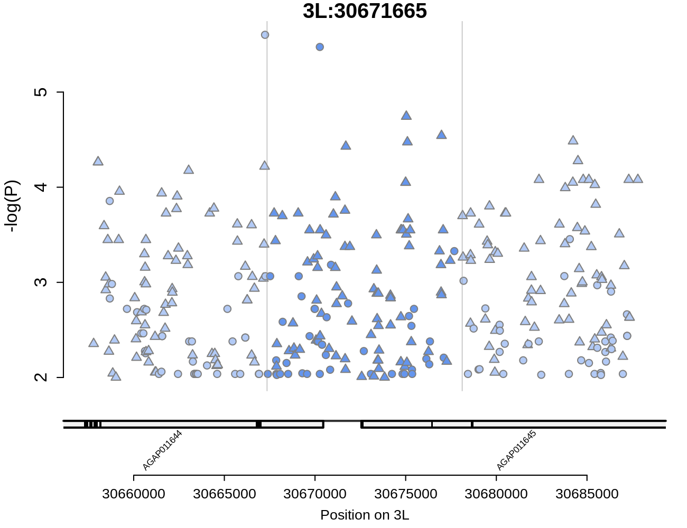

&nbsp;

&nbsp;

&nbsp;

#### Contingency table for cluster_1:

| &nbsp;&nbsp;&nbsp;  phenotype  &nbsp;&nbsp;&nbsp; |  &nbsp;&nbsp;&nbsp;  wt  &nbsp;&nbsp;&nbsp;  |  &nbsp;&nbsp;&nbsp;  het  &nbsp;&nbsp;&nbsp;  |  &nbsp;&nbsp;&nbsp;  hom  &nbsp;&nbsp;&nbsp;  |
| :---:     | :---: | :---: | :---: |
|  alive    | 27 | 25 | 2 |
|  dead     | 10 | 31 | 9 |

&nbsp;

### Obuasi_gambiae_PM_3L_30678119-30687769

&nbsp;

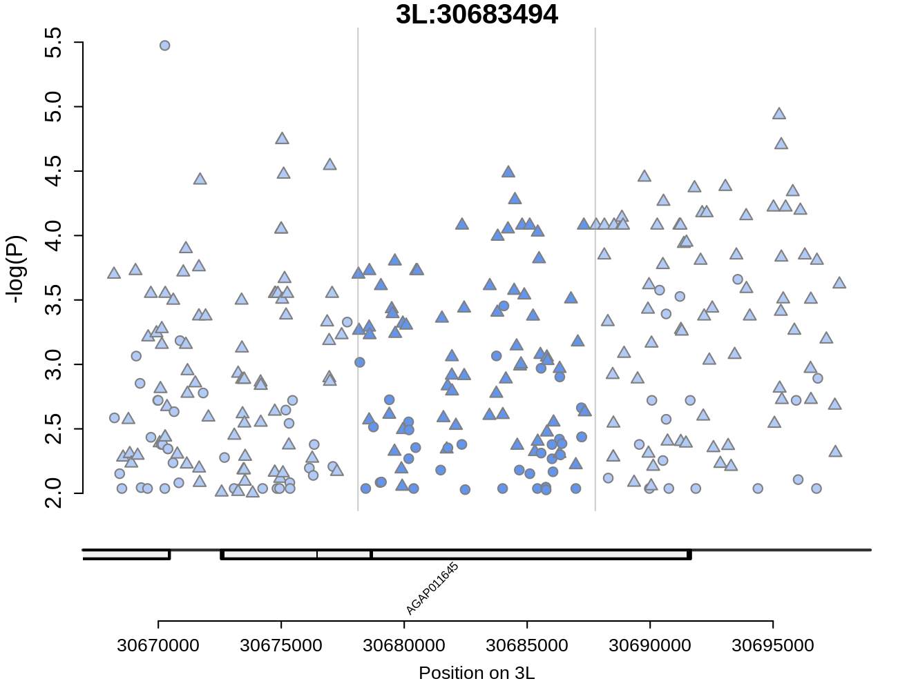

&nbsp;

&nbsp;

&nbsp;

#### Contingency table for cluster_1:

| &nbsp;&nbsp;&nbsp;  phenotype  &nbsp;&nbsp;&nbsp; |  &nbsp;&nbsp;&nbsp;  wt  &nbsp;&nbsp;&nbsp;  |  &nbsp;&nbsp;&nbsp;  het  &nbsp;&nbsp;&nbsp;  |  &nbsp;&nbsp;&nbsp;  hom  &nbsp;&nbsp;&nbsp;  |
| :---:     | :---: | :---: | :---: |
|  alive    | 26 | 26 | 2 |
|  dead     | 11 | 29 | 10 |

&nbsp;

### Obuasi_gambiae_PM_3L_30687769-30697180

&nbsp;

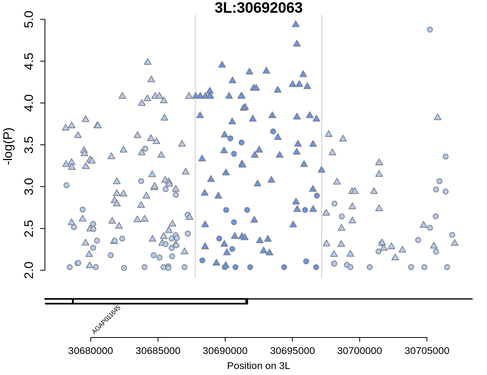

&nbsp;

&nbsp;

&nbsp;

#### Contingency table for cluster_1:

| &nbsp;&nbsp;&nbsp;  phenotype  &nbsp;&nbsp;&nbsp; |  &nbsp;&nbsp;&nbsp;  wt  &nbsp;&nbsp;&nbsp;  |  &nbsp;&nbsp;&nbsp;  het  &nbsp;&nbsp;&nbsp;  |  &nbsp;&nbsp;&nbsp;  hom  &nbsp;&nbsp;&nbsp;  |
| :---:     | :---: | :---: | :---: |
|  alive    | 26 | 26 | 2 |
|  dead     | 9 | 30 | 11 |

&nbsp;

### Obuasi_gambiae_PM_3R_48454456-48494640

&nbsp;

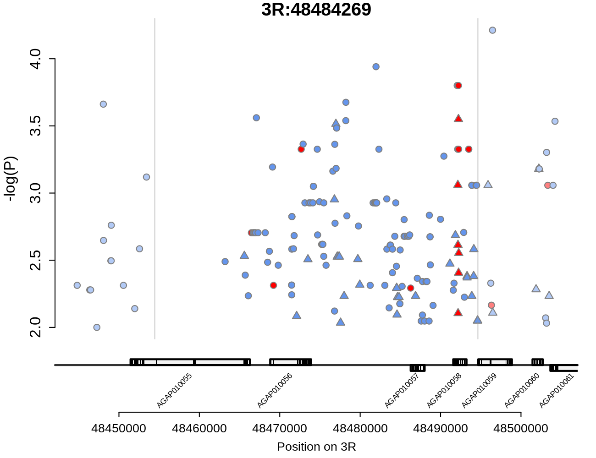

&nbsp;

&nbsp;

&nbsp;

#### Contingency table for cluster_1:

| &nbsp;&nbsp;&nbsp;  phenotype  &nbsp;&nbsp;&nbsp; |  &nbsp;&nbsp;&nbsp;  wt  &nbsp;&nbsp;&nbsp;  |  &nbsp;&nbsp;&nbsp;  het  &nbsp;&nbsp;&nbsp;  |  &nbsp;&nbsp;&nbsp;  hom  &nbsp;&nbsp;&nbsp;  |
| :---:     | :---: | :---: | :---: |
|  alive    | 24 | 24 | 6 |
|  dead     | 39 | 9 | 2 |

&nbsp;

#### Contingency table for cluster_2:

| &nbsp;&nbsp;&nbsp;  phenotype  &nbsp;&nbsp;&nbsp; |  &nbsp;&nbsp;&nbsp;  wt  &nbsp;&nbsp;&nbsp;  |  &nbsp;&nbsp;&nbsp;  het  &nbsp;&nbsp;&nbsp;  |  &nbsp;&nbsp;&nbsp;  hom  &nbsp;&nbsp;&nbsp;  |
| :---:     | :---: | :---: | :---: |
|  alive    | 43 | 10 | 1 |
|  dead     | 38 | 9 | 3 |

&nbsp;

#### Contingency table for cluster_3:

| &nbsp;&nbsp;&nbsp;  phenotype  &nbsp;&nbsp;&nbsp; |  &nbsp;&nbsp;&nbsp;  wt  &nbsp;&nbsp;&nbsp;  |  &nbsp;&nbsp;&nbsp;  het  &nbsp;&nbsp;&nbsp;  |  &nbsp;&nbsp;&nbsp;  hom  &nbsp;&nbsp;&nbsp;  |
| :---:     | :---: | :---: | :---: |
|  alive    | 44 | 10 | 0 |
|  dead     | 39 | 10 | 1 |

&nbsp;

___

