# FST windows of interest

For each sample set, we first provide a summary plot of FST bewteen resistant and susceptible samples across the genome, with FST shown in red and the results of the 200 randomisations shown behind in grey. Windows identified as peaks are highlighted by points, colour-coded by whether they are significantly higher than expected based on the simulations (green) or not (purple). For each significant window (green points), we then provide four additional figures. The first shows the significant (*P* < 0.01) SNPs found in the region of that window, and their -log10(Pvalue) of association with phenotype. Red points indicate non-synonymous SNPs, blue points indicate all other SNPs. Point shape indicates whether the mutant allele at that SNP is associated with increased (circle) or decreased (triangle) resistance. Dark points in the centre of the plot show SNPs within the significant window, light points on the sides show SNPs in region 10,000 bp either side of the window. The second plot shows the hierarchical cluster of haplotypes in the window, with brackets indicating large haplotype clusters. The third plot shows, each haplotype cluster, indicating the number of haplotypes comprising the cluster (n), the *P* value of association of the cluster with resistance phenotype, and the SNPs that differentiate that cluster from other haplotypes in the region, colour-coded by type (red = non-synonymous, yellow = synonymous, blue = non-coding). The final figure shows the contingency tables of phenotype association for each haplotype cluster. 

[Legend](#Plot_legend)  
[Avrankou\_*coluzzii*\_Delta](#avrankou_coluzzii_delta)  
[Baguida\_*gambiae*\_Delta](#baguida_gambiae_delta)  
[Korle-Bu\_*coluzzii*\_Delta](#korle-bu_coluzzii_delta)  
[Madina\_*gambiae*\_Delta](#madina_gambiae_delta)  
[Obuasi\_*gambiae*\_Delta](#obuasi_gambiae_delta)  
[Baguida\_*gambiae*\_PM](#baguida_gambiae_pm)  
[Korle-Bu\_*coluzzii*\_PM](#korle-bu_coluzzii_pm)  
[Madina\_*gambiae*\_PM](#madina_gambiae_pm)  
[Obuasi\_*gambiae*\_PM](#obuasi_gambiae_pm)  

___

## Plot legend

<a id="Plot_legend">

___

## Avrankou\_*coluzzii*\_Delta

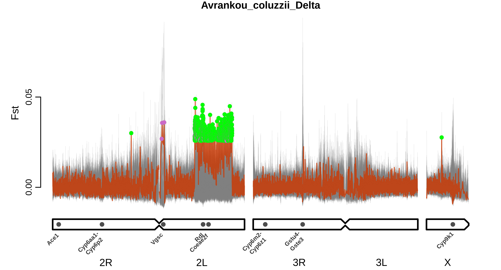

&nbsp;

[Avrankou_coluzzii_Delta_2R:45413683-45433265](#avrankou_coluzzii_delta_2r_45413683-45433265)  
[Avrankou_coluzzii_Delta_X:8745589-8778998](#avrankou_coluzzii_delta_x_8745589-8778998)  

### Avrankou_coluzzii_Delta_2R_45413683-45433265

&nbsp;

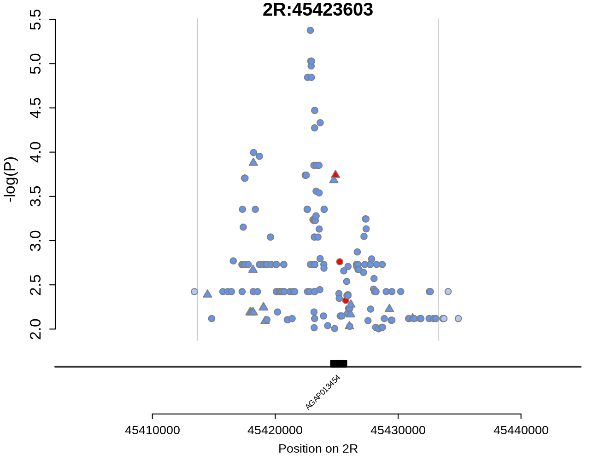

&nbsp;

&nbsp;

&nbsp;

### Avrankou_coluzzii_Delta_X_8745589-8778998

&nbsp;

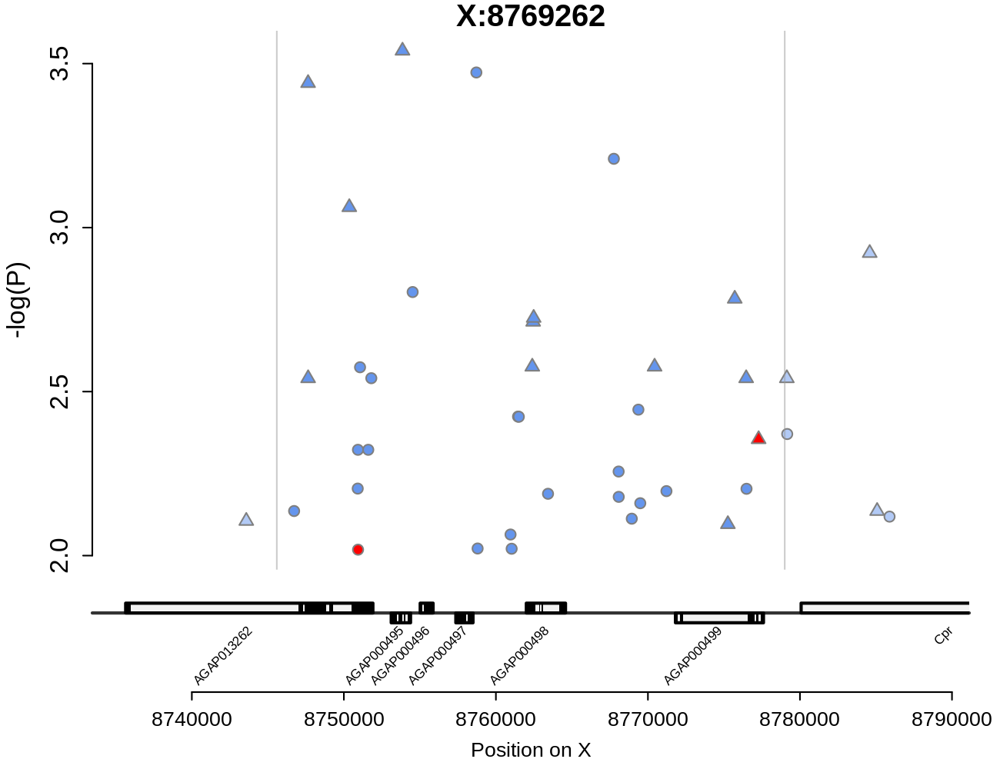

&nbsp;

&nbsp;

&nbsp;

#### Contingency table for cluster_1:

| &nbsp;&nbsp;&nbsp;  phenotype  &nbsp;&nbsp;&nbsp; |  &nbsp;&nbsp;&nbsp;  wt  &nbsp;&nbsp;&nbsp;  |  &nbsp;&nbsp;&nbsp;  het  &nbsp;&nbsp;&nbsp;  |  &nbsp;&nbsp;&nbsp;  hom  &nbsp;&nbsp;&nbsp;  |
| :---:     | :---: | :---: | :---: |
|  alive    | 11 | 22 | 12 |
|  dead     | 14 | 16 | 4 |

&nbsp;

___

## Baguida\_*gambiae*\_Delta

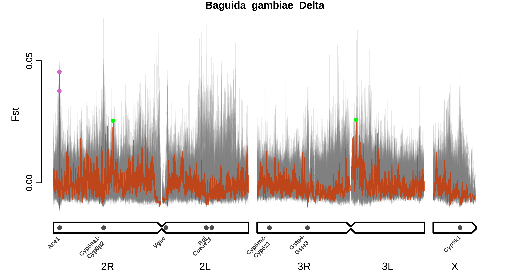

&nbsp;

[Baguida_gambiae_Delta_2R:33967209-33981960](#baguida_gambiae_delta_2r_33967209-33981960)  
[Baguida_gambiae_Delta_3L:3059554-3112922](#baguida_gambiae_delta_3l_3059554-3112922)  

### Baguida_gambiae_Delta_2R_33967209-33981960

&nbsp;

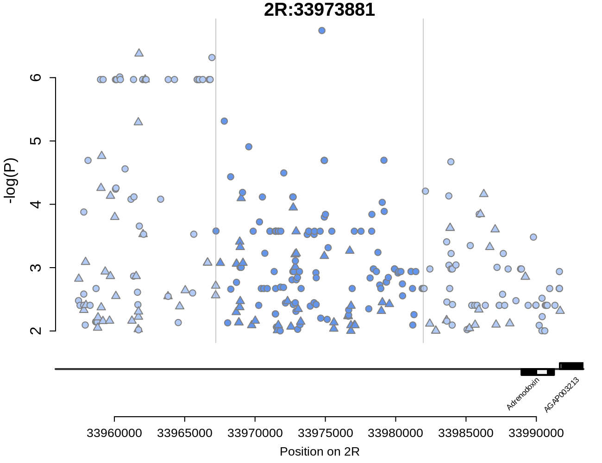

&nbsp;

&nbsp;

&nbsp;

#### Contingency table for cluster_1:

| &nbsp;&nbsp;&nbsp;  phenotype  &nbsp;&nbsp;&nbsp; |  &nbsp;&nbsp;&nbsp;  wt  &nbsp;&nbsp;&nbsp;  |  &nbsp;&nbsp;&nbsp;  het  &nbsp;&nbsp;&nbsp;  |  &nbsp;&nbsp;&nbsp;  hom  &nbsp;&nbsp;&nbsp;  |
| :---:     | :---: | :---: | :---: |
|  alive    | 31 | 21 | 2 |
|  dead     | 31 | 3 | 0 |

&nbsp;

### Baguida_gambiae_Delta_3L_3059554-3112922

&nbsp;

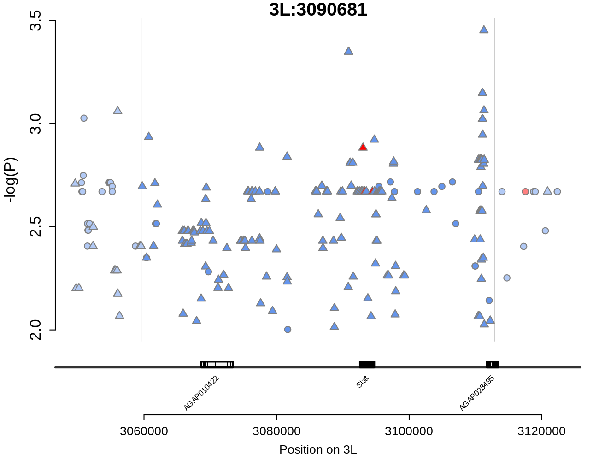

&nbsp;

&nbsp;

&nbsp;

#### Contingency table for cluster_1:

| &nbsp;&nbsp;&nbsp;  phenotype  &nbsp;&nbsp;&nbsp; |  &nbsp;&nbsp;&nbsp;  wt  &nbsp;&nbsp;&nbsp;  |  &nbsp;&nbsp;&nbsp;  het  &nbsp;&nbsp;&nbsp;  |  &nbsp;&nbsp;&nbsp;  hom  &nbsp;&nbsp;&nbsp;  |
| :---:     | :---: | :---: | :---: |
|  alive    | 37 | 8 | 9 |
|  dead     | 11 | 21 | 2 |

&nbsp;

#### Contingency table for cluster_2:

| &nbsp;&nbsp;&nbsp;  phenotype  &nbsp;&nbsp;&nbsp; |  &nbsp;&nbsp;&nbsp;  wt  &nbsp;&nbsp;&nbsp;  |  &nbsp;&nbsp;&nbsp;  het  &nbsp;&nbsp;&nbsp;  |  &nbsp;&nbsp;&nbsp;  hom  &nbsp;&nbsp;&nbsp;  |
| :---:     | :---: | :---: | :---: |
|  alive    | 39 | 14 | 1 |
|  dead     | 28 | 6 | 0 |

&nbsp;

___

## Korle-Bu\_*coluzzii*\_Delta

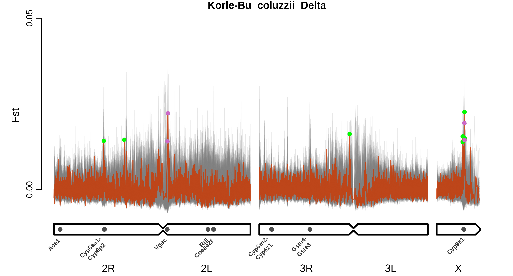

&nbsp;

[Korle-Bu_coluzzii_Delta_2R:28145243-28168331](#korle-bu_coluzzii_delta_2r_28145243-28168331)  
[Korle-Bu_coluzzii_Delta_2R:39682306-39698081](#korle-bu_coluzzii_delta_2r_39682306-39698081)  
[Korle-Bu_coluzzii_Delta_3R:50971406-51021318](#korle-bu_coluzzii_delta_3r_50971406-51021318)  
[Korle-Bu_coluzzii_Delta_X:14653714-14668824](#korle-bu_coluzzii_delta_x_14653714-14668824)  
[Korle-Bu_coluzzii_Delta_X:14668824-14684264](#korle-bu_coluzzii_delta_x_14668824-14684264)  
[Korle-Bu_coluzzii_Delta_X:15670884-15702974](#korle-bu_coluzzii_delta_x_15670884-15702974)  
[Korle-Bu_coluzzii_Delta_X:15702974-15756306](#korle-bu_coluzzii_delta_x_15702974-15756306)  

### Korle-Bu_coluzzii_Delta_2R_28145243-28168331

&nbsp;

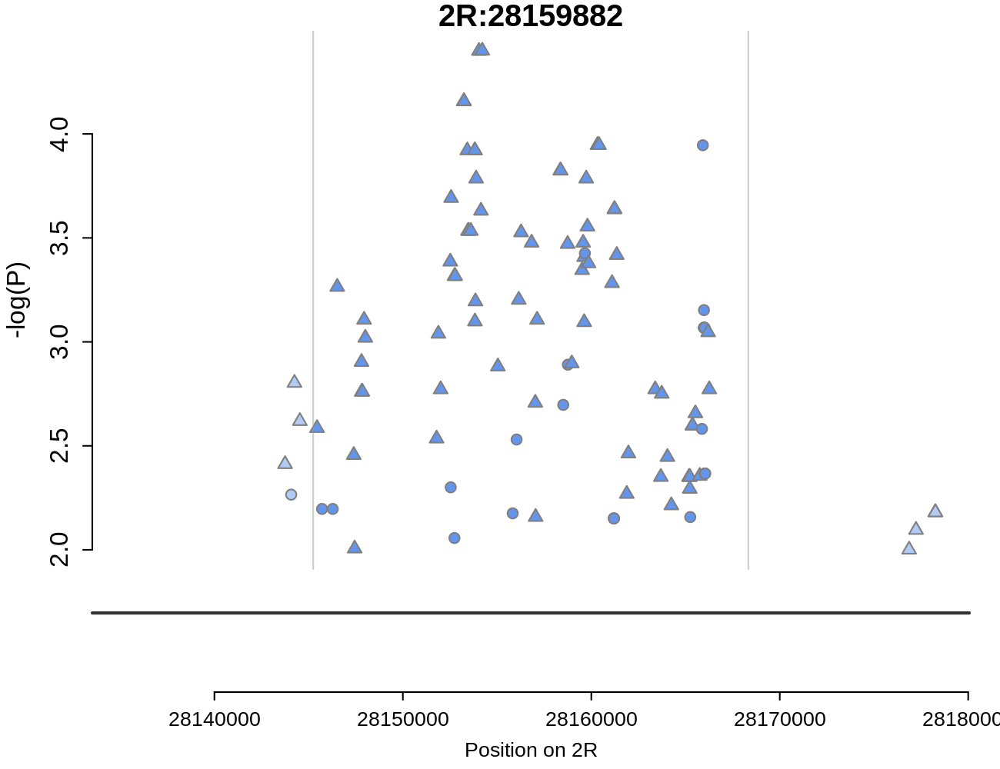

&nbsp;

&nbsp;

&nbsp;

#### Contingency table for cluster_1:

| &nbsp;&nbsp;&nbsp;  phenotype  &nbsp;&nbsp;&nbsp; |  &nbsp;&nbsp;&nbsp;  wt  &nbsp;&nbsp;&nbsp;  |  &nbsp;&nbsp;&nbsp;  het  &nbsp;&nbsp;&nbsp;  |  &nbsp;&nbsp;&nbsp;  hom  &nbsp;&nbsp;&nbsp;  |
| :---:     | :---: | :---: | :---: |
|  alive    | 52 | 7 | 0 |
|  dead     | 52 | 30 | 1 |

&nbsp;

#### Contingency table for cluster_2:

| &nbsp;&nbsp;&nbsp;  phenotype  &nbsp;&nbsp;&nbsp; |  &nbsp;&nbsp;&nbsp;  wt  &nbsp;&nbsp;&nbsp;  |  &nbsp;&nbsp;&nbsp;  het  &nbsp;&nbsp;&nbsp;  |  &nbsp;&nbsp;&nbsp;  hom  &nbsp;&nbsp;&nbsp;  |
| :---:     | :---: | :---: | :---: |
|  alive    | 46 | 12 | 1 |
|  dead     | 69 | 13 | 1 |

&nbsp;

#### Contingency table for cluster_3:

| &nbsp;&nbsp;&nbsp;  phenotype  &nbsp;&nbsp;&nbsp; |  &nbsp;&nbsp;&nbsp;  wt  &nbsp;&nbsp;&nbsp;  |  &nbsp;&nbsp;&nbsp;  het  &nbsp;&nbsp;&nbsp;  |  &nbsp;&nbsp;&nbsp;  hom  &nbsp;&nbsp;&nbsp;  |
| :---:     | :---: | :---: | :---: |
|  alive    | 50 | 9 | 0 |
|  dead     | 67 | 16 | 0 |

&nbsp;

#### Contingency table for cluster_4:

| &nbsp;&nbsp;&nbsp;  phenotype  &nbsp;&nbsp;&nbsp; |  &nbsp;&nbsp;&nbsp;  wt  &nbsp;&nbsp;&nbsp;  |  &nbsp;&nbsp;&nbsp;  het  &nbsp;&nbsp;&nbsp;  |  &nbsp;&nbsp;&nbsp;  hom  &nbsp;&nbsp;&nbsp;  |
| :---:     | :---: | :---: | :---: |
|  alive    | 48 | 11 | 0 |
|  dead     | 72 | 11 | 0 |

&nbsp;

### Korle-Bu_coluzzii_Delta_2R_39682306-39698081

&nbsp;

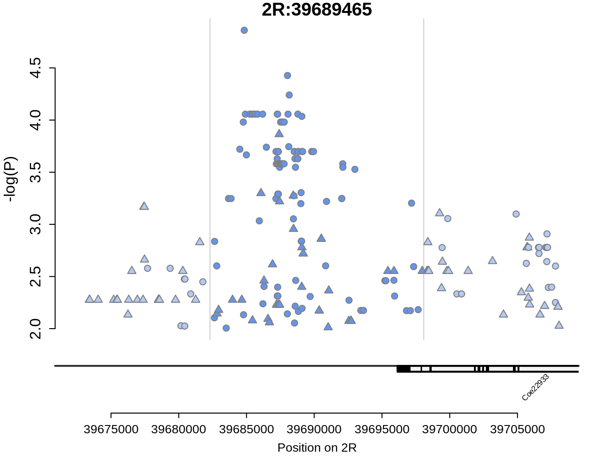

&nbsp;

&nbsp;

&nbsp;

#### Contingency table for cluster_1:

| &nbsp;&nbsp;&nbsp;  phenotype  &nbsp;&nbsp;&nbsp; |  &nbsp;&nbsp;&nbsp;  wt  &nbsp;&nbsp;&nbsp;  |  &nbsp;&nbsp;&nbsp;  het  &nbsp;&nbsp;&nbsp;  |  &nbsp;&nbsp;&nbsp;  hom  &nbsp;&nbsp;&nbsp;  |
| :---:     | :---: | :---: | :---: |
|  alive    | 47 | 12 | 0 |
|  dead     | 65 | 16 | 2 |

&nbsp;

#### Contingency table for cluster_2:

| &nbsp;&nbsp;&nbsp;  phenotype  &nbsp;&nbsp;&nbsp; |  &nbsp;&nbsp;&nbsp;  wt  &nbsp;&nbsp;&nbsp;  |  &nbsp;&nbsp;&nbsp;  het  &nbsp;&nbsp;&nbsp;  |  &nbsp;&nbsp;&nbsp;  hom  &nbsp;&nbsp;&nbsp;  |
| :---:     | :---: | :---: | :---: |
|  alive    | 42 | 16 | 1 |
|  dead     | 77 | 6 | 0 |

&nbsp;

### Korle-Bu_coluzzii_Delta_3R_50971406-51021318

&nbsp;

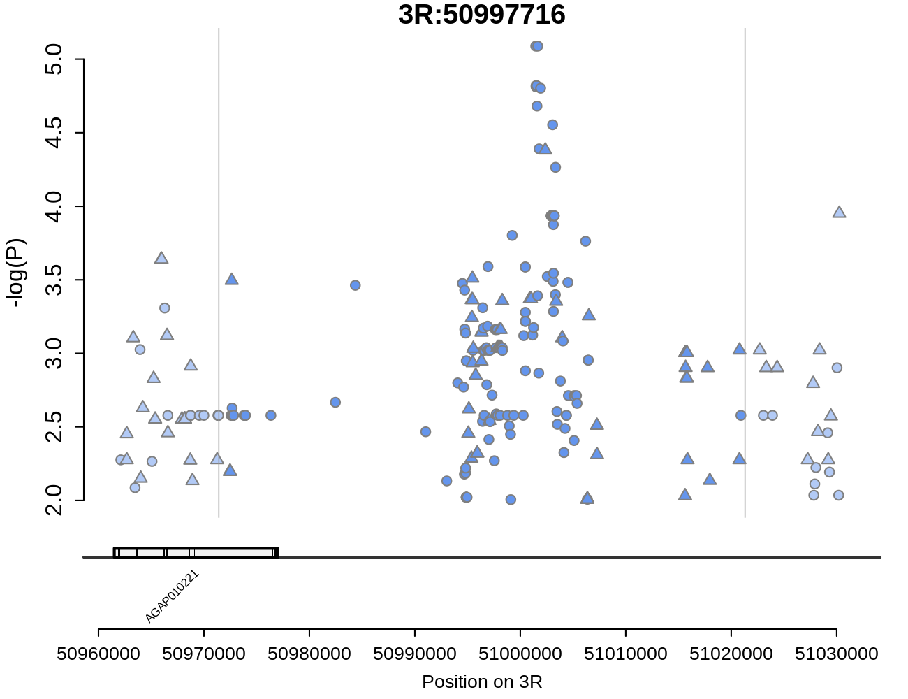

&nbsp;

&nbsp;

&nbsp;

#### Contingency table for cluster_1:

| &nbsp;&nbsp;&nbsp;  phenotype  &nbsp;&nbsp;&nbsp; |  &nbsp;&nbsp;&nbsp;  wt  &nbsp;&nbsp;&nbsp;  |  &nbsp;&nbsp;&nbsp;  het  &nbsp;&nbsp;&nbsp;  |  &nbsp;&nbsp;&nbsp;  hom  &nbsp;&nbsp;&nbsp;  |
| :---:     | :---: | :---: | :---: |
|  alive    | 44 | 13 | 2 |
|  dead     | 53 | 26 | 4 |

&nbsp;

#### Contingency table for cluster_2:

| &nbsp;&nbsp;&nbsp;  phenotype  &nbsp;&nbsp;&nbsp; |  &nbsp;&nbsp;&nbsp;  wt  &nbsp;&nbsp;&nbsp;  |  &nbsp;&nbsp;&nbsp;  het  &nbsp;&nbsp;&nbsp;  |  &nbsp;&nbsp;&nbsp;  hom  &nbsp;&nbsp;&nbsp;  |
| :---:     | :---: | :---: | :---: |
|  alive    | 45 | 14 | 0 |
|  dead     | 75 | 7 | 1 |

&nbsp;

#### Contingency table for cluster_3:

| &nbsp;&nbsp;&nbsp;  phenotype  &nbsp;&nbsp;&nbsp; |  &nbsp;&nbsp;&nbsp;  wt  &nbsp;&nbsp;&nbsp;  |  &nbsp;&nbsp;&nbsp;  het  &nbsp;&nbsp;&nbsp;  |  &nbsp;&nbsp;&nbsp;  hom  &nbsp;&nbsp;&nbsp;  |
| :---:     | :---: | :---: | :---: |
|  alive    | 49 | 10 | 0 |
|  dead     | 72 | 10 | 1 |

&nbsp;

### Korle-Bu_coluzzii_Delta_X_14653714-14668824

&nbsp;

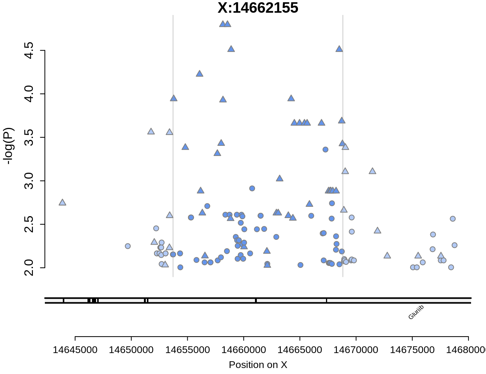

&nbsp;

&nbsp;

&nbsp;

#### Contingency table for cluster_1:

| &nbsp;&nbsp;&nbsp;  phenotype  &nbsp;&nbsp;&nbsp; |  &nbsp;&nbsp;&nbsp;  wt  &nbsp;&nbsp;&nbsp;  |  &nbsp;&nbsp;&nbsp;  het  &nbsp;&nbsp;&nbsp;  |  &nbsp;&nbsp;&nbsp;  hom  &nbsp;&nbsp;&nbsp;  |
| :---:     | :---: | :---: | :---: |
|  alive    | 30 | 26 | 3 |
|  dead     | 58 | 24 | 1 |

&nbsp;

#### Contingency table for cluster_2:

| &nbsp;&nbsp;&nbsp;  phenotype  &nbsp;&nbsp;&nbsp; |  &nbsp;&nbsp;&nbsp;  wt  &nbsp;&nbsp;&nbsp;  |  &nbsp;&nbsp;&nbsp;  het  &nbsp;&nbsp;&nbsp;  |  &nbsp;&nbsp;&nbsp;  hom  &nbsp;&nbsp;&nbsp;  |
| :---:     | :---: | :---: | :---: |
|  alive    | 49 | 9 | 1 |
|  dead     | 69 | 12 | 2 |

&nbsp;

#### Contingency table for cluster_3:

| &nbsp;&nbsp;&nbsp;  phenotype  &nbsp;&nbsp;&nbsp; |  &nbsp;&nbsp;&nbsp;  wt  &nbsp;&nbsp;&nbsp;  |  &nbsp;&nbsp;&nbsp;  het  &nbsp;&nbsp;&nbsp;  |  &nbsp;&nbsp;&nbsp;  hom  &nbsp;&nbsp;&nbsp;  |
| :---:     | :---: | :---: | :---: |
|  alive    | 51 | 8 | 0 |
|  dead     | 70 | 13 | 0 |

&nbsp;

### Korle-Bu_coluzzii_Delta_X_14668824-14684264

&nbsp;

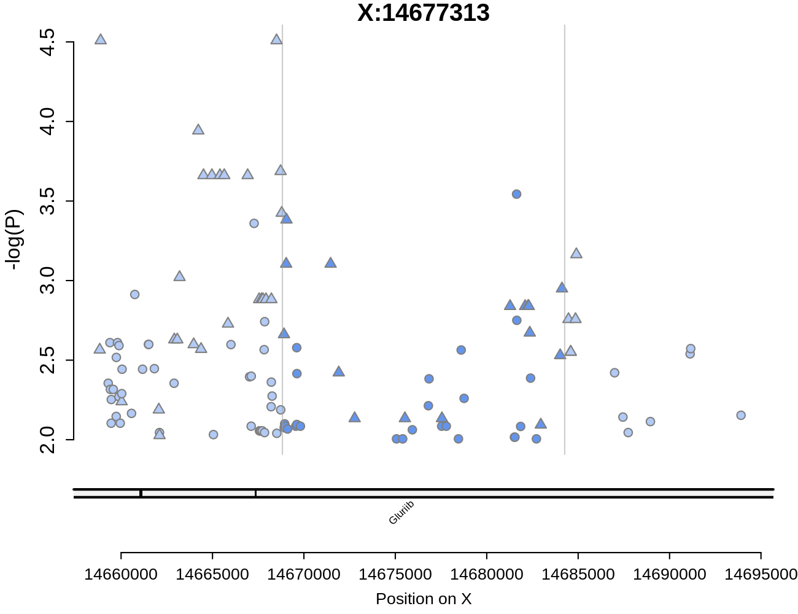

&nbsp;

&nbsp;

&nbsp;

#### Contingency table for cluster_1:

| &nbsp;&nbsp;&nbsp;  phenotype  &nbsp;&nbsp;&nbsp; |  &nbsp;&nbsp;&nbsp;  wt  &nbsp;&nbsp;&nbsp;  |  &nbsp;&nbsp;&nbsp;  het  &nbsp;&nbsp;&nbsp;  |  &nbsp;&nbsp;&nbsp;  hom  &nbsp;&nbsp;&nbsp;  |
| :---:     | :---: | :---: | :---: |
|  alive    | 31 | 25 | 3 |
|  dead     | 58 | 24 | 1 |

&nbsp;

#### Contingency table for cluster_2:

| &nbsp;&nbsp;&nbsp;  phenotype  &nbsp;&nbsp;&nbsp; |  &nbsp;&nbsp;&nbsp;  wt  &nbsp;&nbsp;&nbsp;  |  &nbsp;&nbsp;&nbsp;  het  &nbsp;&nbsp;&nbsp;  |  &nbsp;&nbsp;&nbsp;  hom  &nbsp;&nbsp;&nbsp;  |
| :---:     | :---: | :---: | :---: |
|  alive    | 47 | 11 | 1 |
|  dead     | 69 | 12 | 2 |

&nbsp;

#### Contingency table for cluster_3:

| &nbsp;&nbsp;&nbsp;  phenotype  &nbsp;&nbsp;&nbsp; |  &nbsp;&nbsp;&nbsp;  wt  &nbsp;&nbsp;&nbsp;  |  &nbsp;&nbsp;&nbsp;  het  &nbsp;&nbsp;&nbsp;  |  &nbsp;&nbsp;&nbsp;  hom  &nbsp;&nbsp;&nbsp;  |
| :---:     | :---: | :---: | :---: |
|  alive    | 51 | 8 | 0 |
|  dead     | 70 | 13 | 0 |

&nbsp;

### Korle-Bu_coluzzii_Delta_X_15670884-15702974

&nbsp;

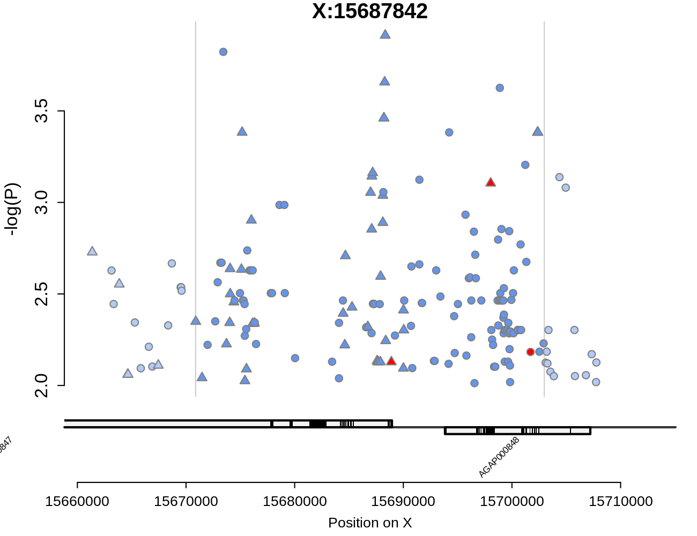

&nbsp;

&nbsp;

&nbsp;

#### Contingency table for cluster_1:

| &nbsp;&nbsp;&nbsp;  phenotype  &nbsp;&nbsp;&nbsp; |  &nbsp;&nbsp;&nbsp;  wt  &nbsp;&nbsp;&nbsp;  |  &nbsp;&nbsp;&nbsp;  het  &nbsp;&nbsp;&nbsp;  |  &nbsp;&nbsp;&nbsp;  hom  &nbsp;&nbsp;&nbsp;  |
| :---:     | :---: | :---: | :---: |
|  alive    | 13 | 32 | 14 |
|  dead     | 37 | 35 | 11 |

&nbsp;

#### Contingency table for cluster_2:

| &nbsp;&nbsp;&nbsp;  phenotype  &nbsp;&nbsp;&nbsp; |  &nbsp;&nbsp;&nbsp;  wt  &nbsp;&nbsp;&nbsp;  |  &nbsp;&nbsp;&nbsp;  het  &nbsp;&nbsp;&nbsp;  |  &nbsp;&nbsp;&nbsp;  hom  &nbsp;&nbsp;&nbsp;  |
| :---:     | :---: | :---: | :---: |
|  alive    | 52 | 7 | 0 |
|  dead     | 69 | 14 | 0 |

&nbsp;

#### Contingency table for cluster_3:

| &nbsp;&nbsp;&nbsp;  phenotype  &nbsp;&nbsp;&nbsp; |  &nbsp;&nbsp;&nbsp;  wt  &nbsp;&nbsp;&nbsp;  |  &nbsp;&nbsp;&nbsp;  het  &nbsp;&nbsp;&nbsp;  |  &nbsp;&nbsp;&nbsp;  hom  &nbsp;&nbsp;&nbsp;  |
| :---:     | :---: | :---: | :---: |
|  alive    | 53 | 6 | 0 |
|  dead     | 68 | 15 | 0 |

&nbsp;

### Korle-Bu_coluzzii_Delta_X_15702974-15756306

&nbsp;

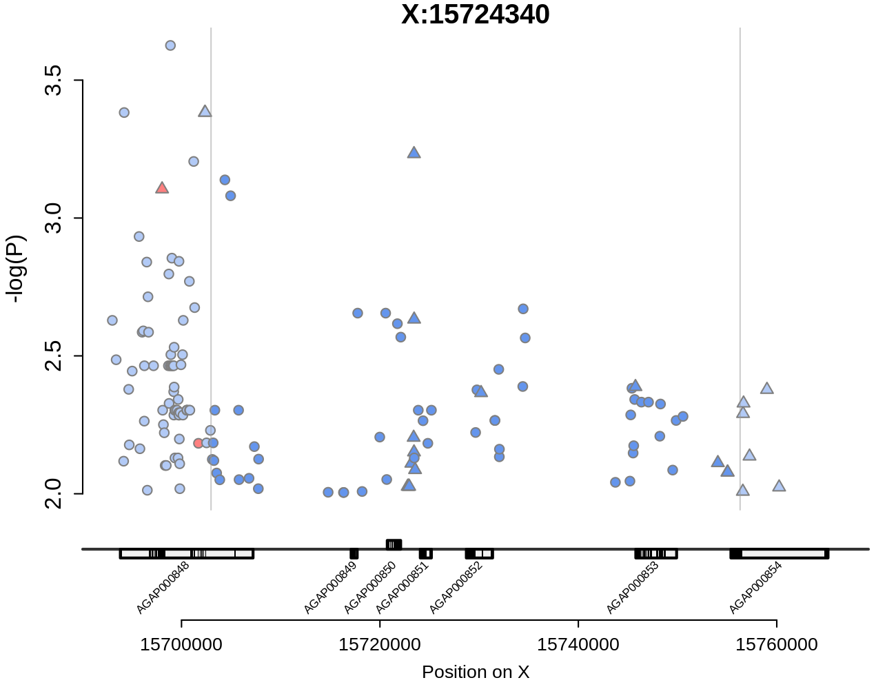

&nbsp;

&nbsp;

&nbsp;

#### Contingency table for cluster_1:

| &nbsp;&nbsp;&nbsp;  phenotype  &nbsp;&nbsp;&nbsp; |  &nbsp;&nbsp;&nbsp;  wt  &nbsp;&nbsp;&nbsp;  |  &nbsp;&nbsp;&nbsp;  het  &nbsp;&nbsp;&nbsp;  |  &nbsp;&nbsp;&nbsp;  hom  &nbsp;&nbsp;&nbsp;  |
| :---:     | :---: | :---: | :---: |
|  alive    | 12 | 38 | 9 |
|  dead     | 38 | 35 | 10 |

&nbsp;

#### Contingency table for cluster_2:

| &nbsp;&nbsp;&nbsp;  phenotype  &nbsp;&nbsp;&nbsp; |  &nbsp;&nbsp;&nbsp;  wt  &nbsp;&nbsp;&nbsp;  |  &nbsp;&nbsp;&nbsp;  het  &nbsp;&nbsp;&nbsp;  |  &nbsp;&nbsp;&nbsp;  hom  &nbsp;&nbsp;&nbsp;  |
| :---:     | :---: | :---: | :---: |
|  alive    | 52 | 7 | 0 |
|  dead     | 68 | 14 | 1 |

&nbsp;

#### Contingency table for cluster_3:

| &nbsp;&nbsp;&nbsp;  phenotype  &nbsp;&nbsp;&nbsp; |  &nbsp;&nbsp;&nbsp;  wt  &nbsp;&nbsp;&nbsp;  |  &nbsp;&nbsp;&nbsp;  het  &nbsp;&nbsp;&nbsp;  |  &nbsp;&nbsp;&nbsp;  hom  &nbsp;&nbsp;&nbsp;  |
| :---:     | :---: | :---: | :---: |
|  alive    | 52 | 7 | 0 |
|  dead     | 69 | 14 | 0 |

&nbsp;

___

## Madina\_*gambiae*\_Delta

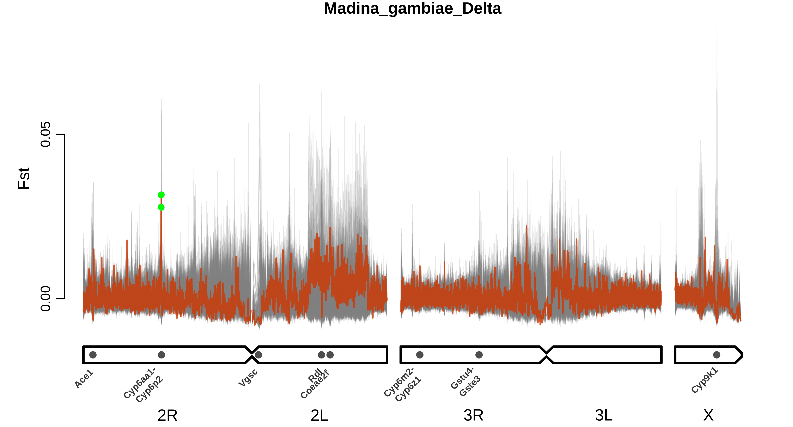

&nbsp;

[Madina_gambiae_Delta_2R:28401363-28416200](#madina_gambiae_delta_2r_28401363-28416200)  
[Madina_gambiae_Delta_2R:28454838-28474602](#madina_gambiae_delta_2r_28454838-28474602)  

### Madina_gambiae_Delta_2R_28401363-28416200

&nbsp;

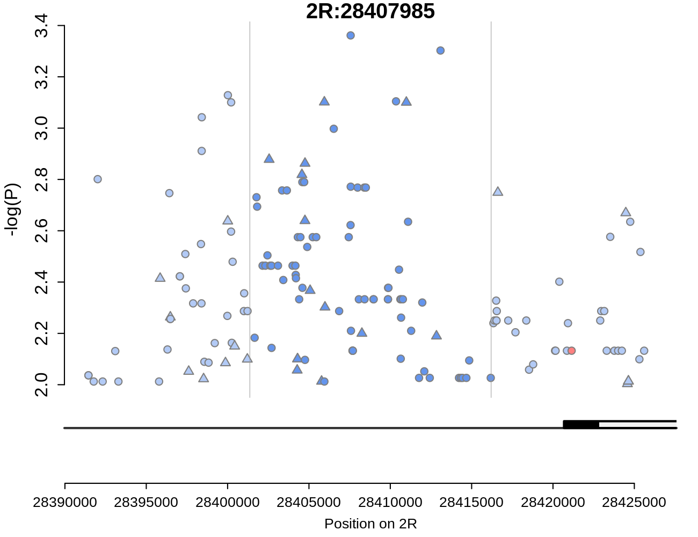

&nbsp;

&nbsp;

&nbsp;

#### Contingency table for cluster_1:

| &nbsp;&nbsp;&nbsp;  phenotype  &nbsp;&nbsp;&nbsp; |  &nbsp;&nbsp;&nbsp;  wt  &nbsp;&nbsp;&nbsp;  |  &nbsp;&nbsp;&nbsp;  het  &nbsp;&nbsp;&nbsp;  |  &nbsp;&nbsp;&nbsp;  hom  &nbsp;&nbsp;&nbsp;  |
| :---:     | :---: | :---: | :---: |
|  alive    | 13 | 33 | 18 |
|  dead     | 14 | 21 | 2 |

&nbsp;

### Madina_gambiae_Delta_2R_28454838-28474602

&nbsp;

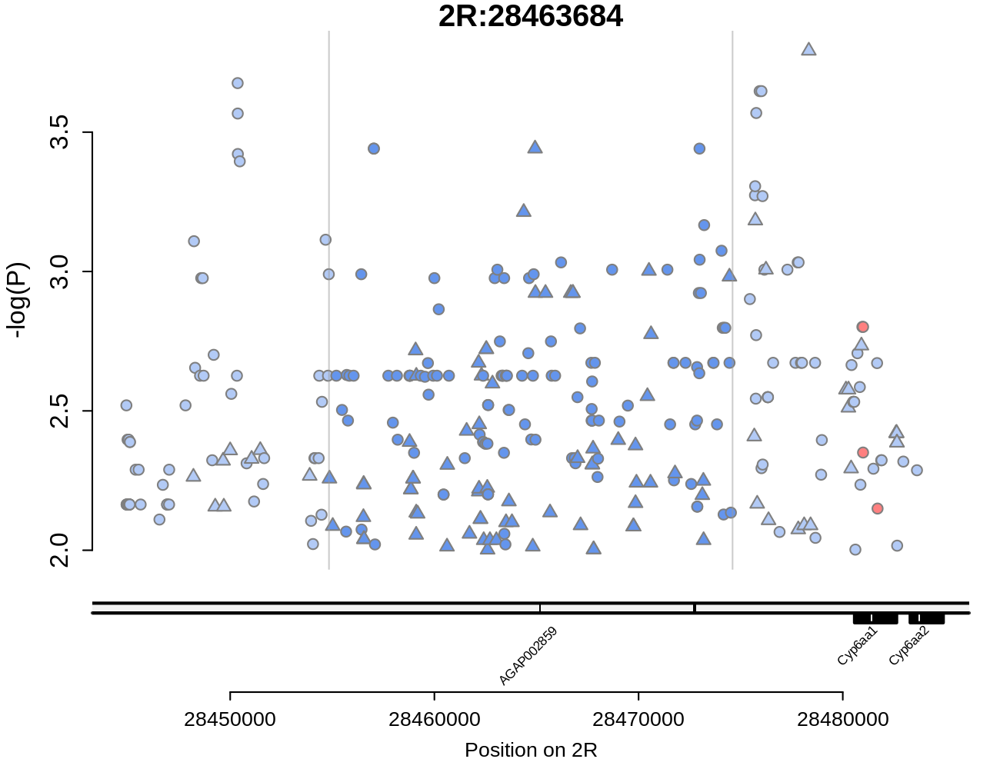

&nbsp;

&nbsp;

&nbsp;

#### Contingency table for cluster_1:

| &nbsp;&nbsp;&nbsp;  phenotype  &nbsp;&nbsp;&nbsp; |  &nbsp;&nbsp;&nbsp;  wt  &nbsp;&nbsp;&nbsp;  |  &nbsp;&nbsp;&nbsp;  het  &nbsp;&nbsp;&nbsp;  |  &nbsp;&nbsp;&nbsp;  hom  &nbsp;&nbsp;&nbsp;  |
| :---:     | :---: | :---: | :---: |
|  alive    | 8 | 33 | 23 |
|  dead     | 12 | 20 | 5 |

&nbsp;

#### Contingency table for cluster_2:

| &nbsp;&nbsp;&nbsp;  phenotype  &nbsp;&nbsp;&nbsp; |  &nbsp;&nbsp;&nbsp;  wt  &nbsp;&nbsp;&nbsp;  |  &nbsp;&nbsp;&nbsp;  het  &nbsp;&nbsp;&nbsp;  |  &nbsp;&nbsp;&nbsp;  hom  &nbsp;&nbsp;&nbsp;  |
| :---:     | :---: | :---: | :---: |
|  alive    | 50 | 13 | 1 |
|  dead     | 26 | 10 | 1 |

&nbsp;

___

## Obuasi\_*gambiae*\_Delta

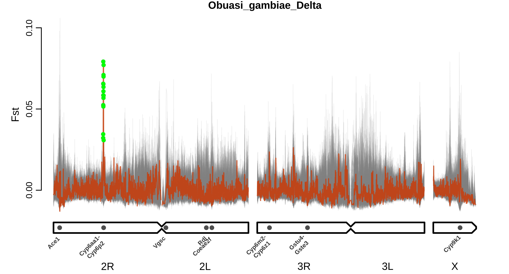

&nbsp;

[Obuasi_gambiae_Delta_2R:28250033-28262588](#obuasi_gambiae_delta_2r_28250033-28262588)  
[Obuasi_gambiae_Delta_2R:28262588-28274893](#obuasi_gambiae_delta_2r_28262588-28274893)  
[Obuasi_gambiae_Delta_2R:28274893-28289873](#obuasi_gambiae_delta_2r_28274893-28289873)  
[Obuasi_gambiae_Delta_2R:28289873-28306606](#obuasi_gambiae_delta_2r_28289873-28306606)  
[Obuasi_gambiae_Delta_2R:28306605-28322681](#obuasi_gambiae_delta_2r_28306605-28322681)  
[Obuasi_gambiae_Delta_2R:28322681-28337951](#obuasi_gambiae_delta_2r_28322681-28337951)  
[Obuasi_gambiae_Delta_2R:28337951-28354693](#obuasi_gambiae_delta_2r_28337951-28354693)  
[Obuasi_gambiae_Delta_2R:28354692-28369784](#obuasi_gambiae_delta_2r_28354692-28369784)  
[Obuasi_gambiae_Delta_2R:28369784-28391434](#obuasi_gambiae_delta_2r_28369784-28391434)  
[Obuasi_gambiae_Delta_2R:28391433-28405240](#obuasi_gambiae_delta_2r_28391433-28405240)  
[Obuasi_gambiae_Delta_2R:28405239-28421116](#obuasi_gambiae_delta_2r_28405239-28421116)  
[Obuasi_gambiae_Delta_2R:28421116-28439220](#obuasi_gambiae_delta_2r_28421116-28439220)  
[Obuasi_gambiae_Delta_2R:28439219-28456407](#obuasi_gambiae_delta_2r_28439219-28456407)  
[Obuasi_gambiae_Delta_2R:28456407-28475225](#obuasi_gambiae_delta_2r_28456407-28475225)  
[Obuasi_gambiae_Delta_2R:28475225-28496115](#obuasi_gambiae_delta_2r_28475225-28496115)  
[Obuasi_gambiae_Delta_2R:28496114-28515482](#obuasi_gambiae_delta_2r_28496114-28515482)  
[Obuasi_gambiae_Delta_2R:28515481-28531112](#obuasi_gambiae_delta_2r_28515481-28531112)  

### Obuasi_gambiae_Delta_2R_28250033-28262588

&nbsp;

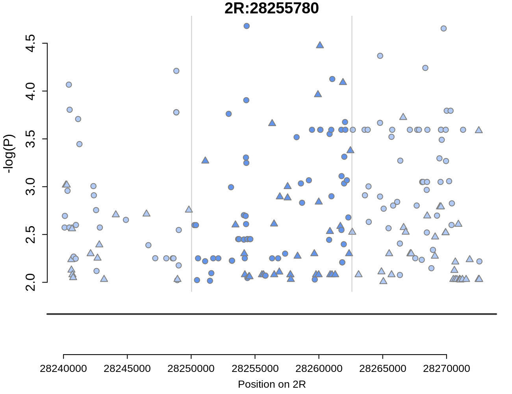

&nbsp;

&nbsp;

&nbsp;

#### Contingency table for cluster_1:

| &nbsp;&nbsp;&nbsp;  phenotype  &nbsp;&nbsp;&nbsp; |  &nbsp;&nbsp;&nbsp;  wt  &nbsp;&nbsp;&nbsp;  |  &nbsp;&nbsp;&nbsp;  het  &nbsp;&nbsp;&nbsp;  |  &nbsp;&nbsp;&nbsp;  hom  &nbsp;&nbsp;&nbsp;  |
| :---:     | :---: | :---: | :---: |
|  alive    | 11 | 16 | 0 |
|  dead     | 39 | 12 | 0 |

&nbsp;

#### Contingency table for cluster_2:

| &nbsp;&nbsp;&nbsp;  phenotype  &nbsp;&nbsp;&nbsp; |  &nbsp;&nbsp;&nbsp;  wt  &nbsp;&nbsp;&nbsp;  |  &nbsp;&nbsp;&nbsp;  het  &nbsp;&nbsp;&nbsp;  |  &nbsp;&nbsp;&nbsp;  hom  &nbsp;&nbsp;&nbsp;  |
| :---:     | :---: | :---: | :---: |
|  alive    | 23 | 4 | 0 |
|  dead     | 33 | 16 | 2 |

&nbsp;

### Obuasi_gambiae_Delta_2R_28262588-28274893

&nbsp;

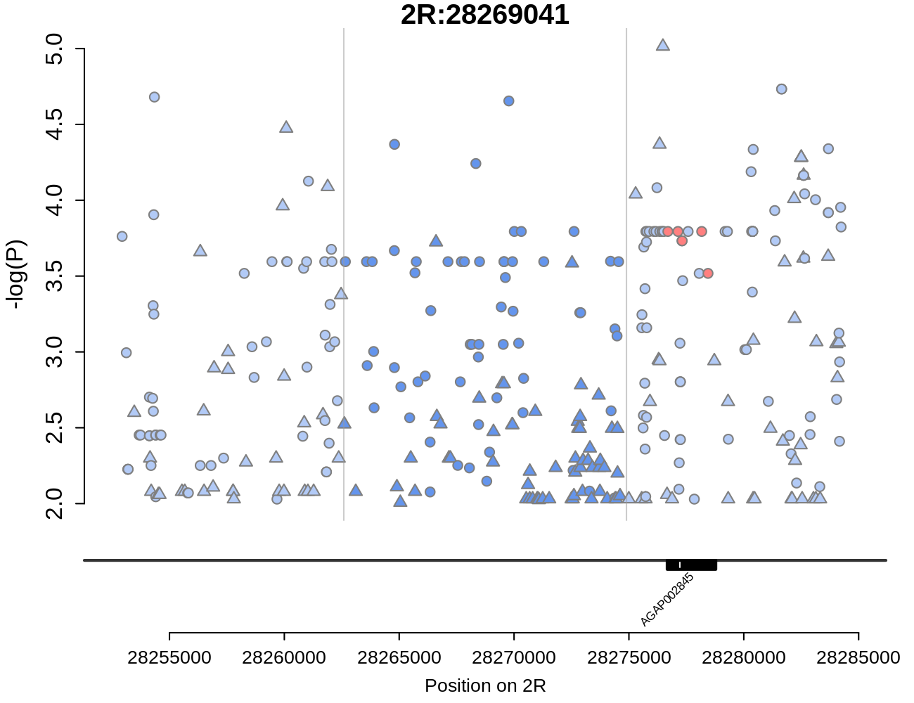

&nbsp;

&nbsp;

&nbsp;

#### Contingency table for cluster_1:

| &nbsp;&nbsp;&nbsp;  phenotype  &nbsp;&nbsp;&nbsp; |  &nbsp;&nbsp;&nbsp;  wt  &nbsp;&nbsp;&nbsp;  |  &nbsp;&nbsp;&nbsp;  het  &nbsp;&nbsp;&nbsp;  |  &nbsp;&nbsp;&nbsp;  hom  &nbsp;&nbsp;&nbsp;  |
| :---:     | :---: | :---: | :---: |
|  alive    | 10 | 15 | 2 |
|  dead     | 39 | 12 | 0 |

&nbsp;

#### Contingency table for cluster_2:

| &nbsp;&nbsp;&nbsp;  phenotype  &nbsp;&nbsp;&nbsp; |  &nbsp;&nbsp;&nbsp;  wt  &nbsp;&nbsp;&nbsp;  |  &nbsp;&nbsp;&nbsp;  het  &nbsp;&nbsp;&nbsp;  |  &nbsp;&nbsp;&nbsp;  hom  &nbsp;&nbsp;&nbsp;  |
| :---:     | :---: | :---: | :---: |
|  alive    | 23 | 4 | 0 |
|  dead     | 33 | 16 | 2 |

&nbsp;

### Obuasi_gambiae_Delta_2R_28274893-28289873

&nbsp;

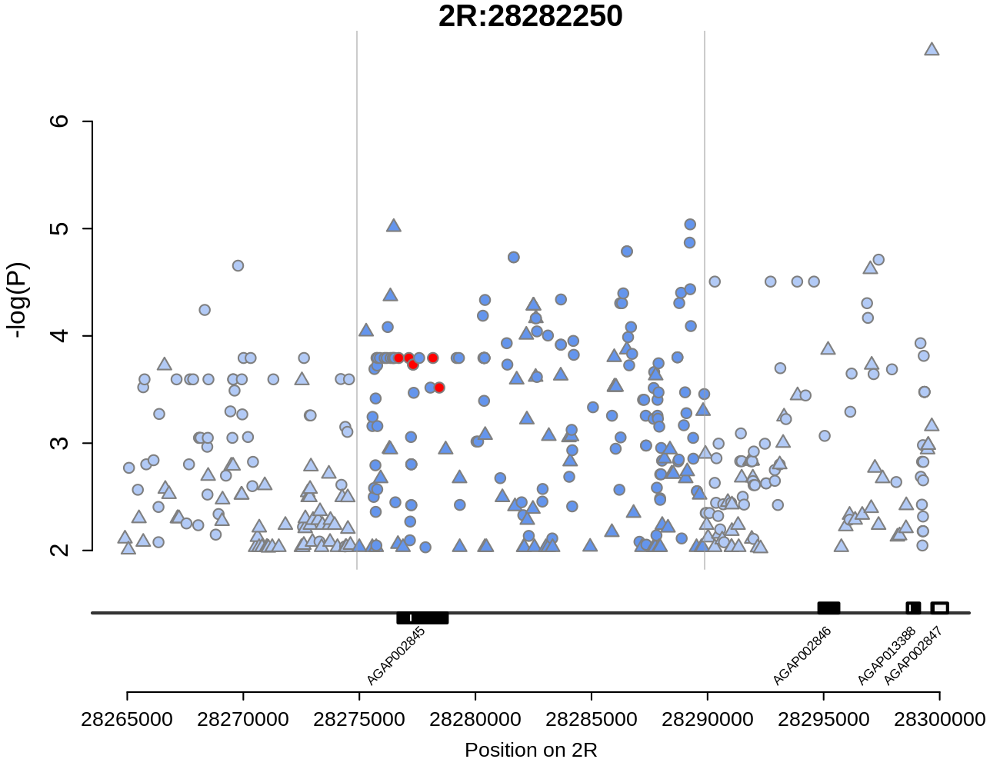

&nbsp;

&nbsp;

&nbsp;

#### Contingency table for cluster_1:

| &nbsp;&nbsp;&nbsp;  phenotype  &nbsp;&nbsp;&nbsp; |  &nbsp;&nbsp;&nbsp;  wt  &nbsp;&nbsp;&nbsp;  |  &nbsp;&nbsp;&nbsp;  het  &nbsp;&nbsp;&nbsp;  |  &nbsp;&nbsp;&nbsp;  hom  &nbsp;&nbsp;&nbsp;  |
| :---:     | :---: | :---: | :---: |
|  alive    | 10 | 14 | 3 |
|  dead     | 39 | 12 | 0 |

&nbsp;

#### Contingency table for cluster_2:

| &nbsp;&nbsp;&nbsp;  phenotype  &nbsp;&nbsp;&nbsp; |  &nbsp;&nbsp;&nbsp;  wt  &nbsp;&nbsp;&nbsp;  |  &nbsp;&nbsp;&nbsp;  het  &nbsp;&nbsp;&nbsp;  |  &nbsp;&nbsp;&nbsp;  hom  &nbsp;&nbsp;&nbsp;  |
| :---:     | :---: | :---: | :---: |
|  alive    | 23 | 4 | 0 |
|  dead     | 33 | 16 | 2 |

&nbsp;

### Obuasi_gambiae_Delta_2R_28289873-28306606

&nbsp;

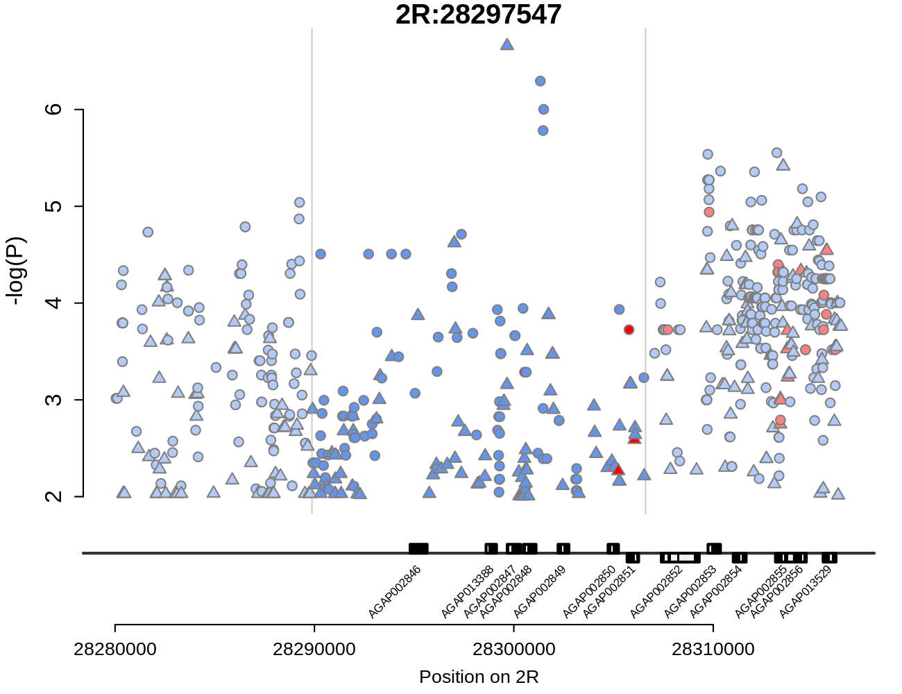

&nbsp;

&nbsp;

&nbsp;

#### Contingency table for cluster_1:

| &nbsp;&nbsp;&nbsp;  phenotype  &nbsp;&nbsp;&nbsp; |  &nbsp;&nbsp;&nbsp;  wt  &nbsp;&nbsp;&nbsp;  |  &nbsp;&nbsp;&nbsp;  het  &nbsp;&nbsp;&nbsp;  |  &nbsp;&nbsp;&nbsp;  hom  &nbsp;&nbsp;&nbsp;  |
| :---:     | :---: | :---: | :---: |
|  alive    | 9 | 14 | 4 |
|  dead     | 39 | 12 | 0 |

&nbsp;

#### Contingency table for cluster_2:

| &nbsp;&nbsp;&nbsp;  phenotype  &nbsp;&nbsp;&nbsp; |  &nbsp;&nbsp;&nbsp;  wt  &nbsp;&nbsp;&nbsp;  |  &nbsp;&nbsp;&nbsp;  het  &nbsp;&nbsp;&nbsp;  |  &nbsp;&nbsp;&nbsp;  hom  &nbsp;&nbsp;&nbsp;  |
| :---:     | :---: | :---: | :---: |
|  alive    | 23 | 4 | 0 |
|  dead     | 33 | 17 | 1 |

&nbsp;

### Obuasi_gambiae_Delta_2R_28306605-28322681

&nbsp;

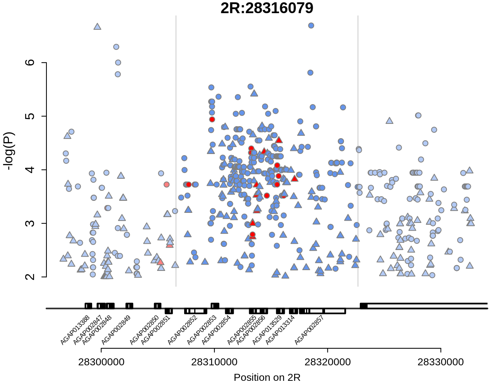

&nbsp;

&nbsp;

&nbsp;

#### Contingency table for cluster_1:

| &nbsp;&nbsp;&nbsp;  phenotype  &nbsp;&nbsp;&nbsp; |  &nbsp;&nbsp;&nbsp;  wt  &nbsp;&nbsp;&nbsp;  |  &nbsp;&nbsp;&nbsp;  het  &nbsp;&nbsp;&nbsp;  |  &nbsp;&nbsp;&nbsp;  hom  &nbsp;&nbsp;&nbsp;  |
| :---:     | :---: | :---: | :---: |
|  alive    | 10 | 14 | 3 |
|  dead     | 38 | 13 | 0 |

&nbsp;

#### Contingency table for cluster_2:

| &nbsp;&nbsp;&nbsp;  phenotype  &nbsp;&nbsp;&nbsp; |  &nbsp;&nbsp;&nbsp;  wt  &nbsp;&nbsp;&nbsp;  |  &nbsp;&nbsp;&nbsp;  het  &nbsp;&nbsp;&nbsp;  |  &nbsp;&nbsp;&nbsp;  hom  &nbsp;&nbsp;&nbsp;  |
| :---:     | :---: | :---: | :---: |
|  alive    | 23 | 4 | 0 |
|  dead     | 33 | 17 | 1 |

&nbsp;

### Obuasi_gambiae_Delta_2R_28322681-28337951

&nbsp;

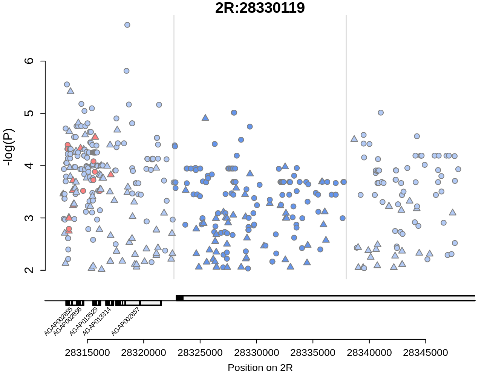

&nbsp;

&nbsp;

&nbsp;

#### Contingency table for cluster_1:

| &nbsp;&nbsp;&nbsp;  phenotype  &nbsp;&nbsp;&nbsp; |  &nbsp;&nbsp;&nbsp;  wt  &nbsp;&nbsp;&nbsp;  |  &nbsp;&nbsp;&nbsp;  het  &nbsp;&nbsp;&nbsp;  |  &nbsp;&nbsp;&nbsp;  hom  &nbsp;&nbsp;&nbsp;  |
| :---:     | :---: | :---: | :---: |
|  alive    | 9 | 14 | 4 |
|  dead     | 37 | 14 | 0 |

&nbsp;

#### Contingency table for cluster_2:

| &nbsp;&nbsp;&nbsp;  phenotype  &nbsp;&nbsp;&nbsp; |  &nbsp;&nbsp;&nbsp;  wt  &nbsp;&nbsp;&nbsp;  |  &nbsp;&nbsp;&nbsp;  het  &nbsp;&nbsp;&nbsp;  |  &nbsp;&nbsp;&nbsp;  hom  &nbsp;&nbsp;&nbsp;  |
| :---:     | :---: | :---: | :---: |
|  alive    | 23 | 4 | 0 |
|  dead     | 34 | 16 | 1 |

&nbsp;

#### Contingency table for cluster_3:

| &nbsp;&nbsp;&nbsp;  phenotype  &nbsp;&nbsp;&nbsp; |  &nbsp;&nbsp;&nbsp;  wt  &nbsp;&nbsp;&nbsp;  |  &nbsp;&nbsp;&nbsp;  het  &nbsp;&nbsp;&nbsp;  |  &nbsp;&nbsp;&nbsp;  hom  &nbsp;&nbsp;&nbsp;  |
| :---:     | :---: | :---: | :---: |
|  alive    | 24 | 3 | 0 |
|  dead     | 34 | 16 | 1 |

&nbsp;

### Obuasi_gambiae_Delta_2R_28337951-28354693

&nbsp;

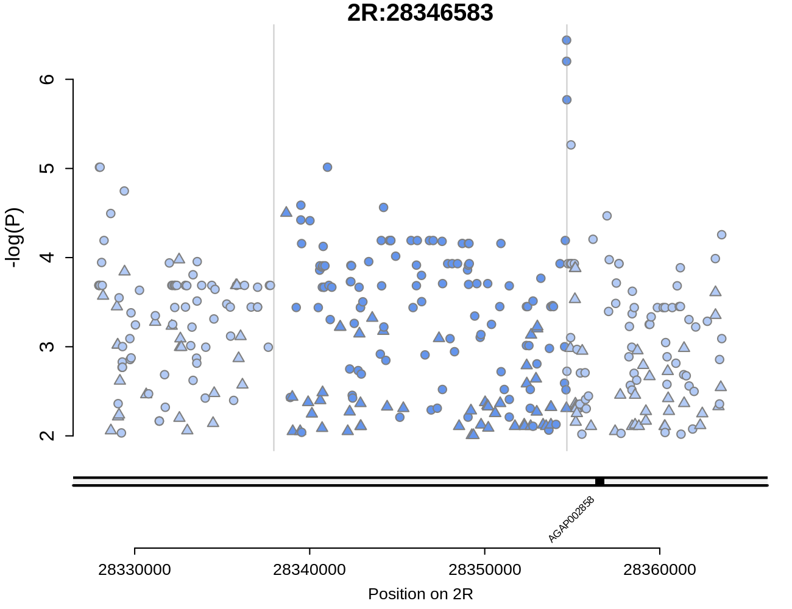

&nbsp;

&nbsp;

&nbsp;

#### Contingency table for cluster_1:

| &nbsp;&nbsp;&nbsp;  phenotype  &nbsp;&nbsp;&nbsp; |  &nbsp;&nbsp;&nbsp;  wt  &nbsp;&nbsp;&nbsp;  |  &nbsp;&nbsp;&nbsp;  het  &nbsp;&nbsp;&nbsp;  |  &nbsp;&nbsp;&nbsp;  hom  &nbsp;&nbsp;&nbsp;  |
| :---:     | :---: | :---: | :---: |
|  alive    | 9 | 14 | 4 |
|  dead     | 36 | 15 | 0 |

&nbsp;

#### Contingency table for cluster_2:

| &nbsp;&nbsp;&nbsp;  phenotype  &nbsp;&nbsp;&nbsp; |  &nbsp;&nbsp;&nbsp;  wt  &nbsp;&nbsp;&nbsp;  |  &nbsp;&nbsp;&nbsp;  het  &nbsp;&nbsp;&nbsp;  |  &nbsp;&nbsp;&nbsp;  hom  &nbsp;&nbsp;&nbsp;  |
| :---:     | :---: | :---: | :---: |
|  alive    | 24 | 3 | 0 |
|  dead     | 33 | 17 | 1 |

&nbsp;

#### Contingency table for cluster_3:

| &nbsp;&nbsp;&nbsp;  phenotype  &nbsp;&nbsp;&nbsp; |  &nbsp;&nbsp;&nbsp;  wt  &nbsp;&nbsp;&nbsp;  |  &nbsp;&nbsp;&nbsp;  het  &nbsp;&nbsp;&nbsp;  |  &nbsp;&nbsp;&nbsp;  hom  &nbsp;&nbsp;&nbsp;  |
| :---:     | :---: | :---: | :---: |
|  alive    | 22 | 5 | 0 |
|  dead     | 36 | 14 | 1 |

&nbsp;

### Obuasi_gambiae_Delta_2R_28354692-28369784

&nbsp;

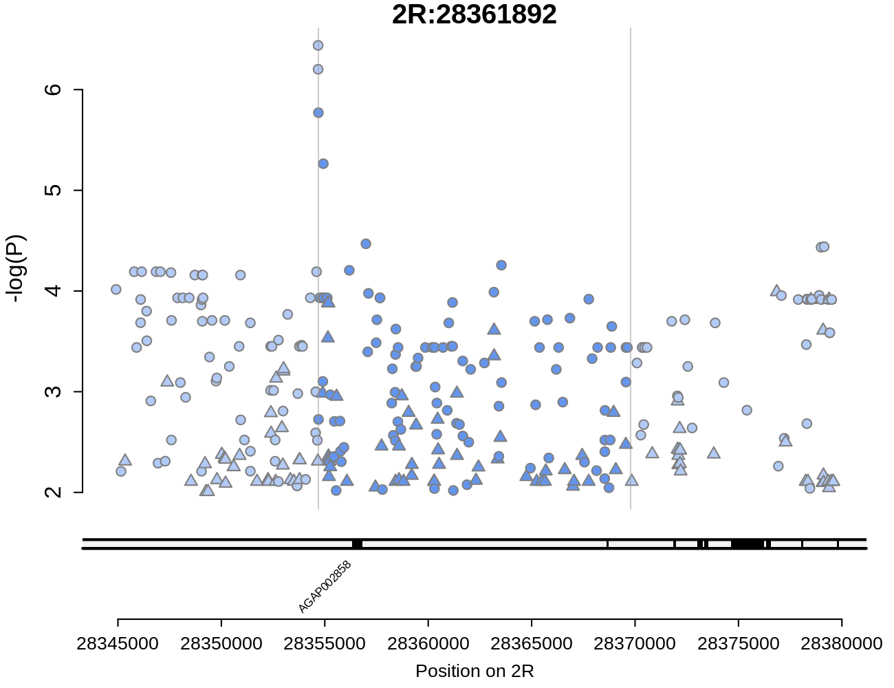

&nbsp;

&nbsp;

&nbsp;

#### Contingency table for cluster_1:

| &nbsp;&nbsp;&nbsp;  phenotype  &nbsp;&nbsp;&nbsp; |  &nbsp;&nbsp;&nbsp;  wt  &nbsp;&nbsp;&nbsp;  |  &nbsp;&nbsp;&nbsp;  het  &nbsp;&nbsp;&nbsp;  |  &nbsp;&nbsp;&nbsp;  hom  &nbsp;&nbsp;&nbsp;  |
| :---:     | :---: | :---: | :---: |
|  alive    | 8 | 15 | 4 |
|  dead     | 35 | 16 | 0 |

&nbsp;

#### Contingency table for cluster_2:

| &nbsp;&nbsp;&nbsp;  phenotype  &nbsp;&nbsp;&nbsp; |  &nbsp;&nbsp;&nbsp;  wt  &nbsp;&nbsp;&nbsp;  |  &nbsp;&nbsp;&nbsp;  het  &nbsp;&nbsp;&nbsp;  |  &nbsp;&nbsp;&nbsp;  hom  &nbsp;&nbsp;&nbsp;  |
| :---:     | :---: | :---: | :---: |
|  alive    | 24 | 3 | 0 |
|  dead     | 32 | 17 | 2 |

&nbsp;

#### Contingency table for cluster_3:

| &nbsp;&nbsp;&nbsp;  phenotype  &nbsp;&nbsp;&nbsp; |  &nbsp;&nbsp;&nbsp;  wt  &nbsp;&nbsp;&nbsp;  |  &nbsp;&nbsp;&nbsp;  het  &nbsp;&nbsp;&nbsp;  |  &nbsp;&nbsp;&nbsp;  hom  &nbsp;&nbsp;&nbsp;  |
| :---:     | :---: | :---: | :---: |
|  alive    | 21 | 6 | 0 |
|  dead     | 36 | 14 | 1 |

&nbsp;

### Obuasi_gambiae_Delta_2R_28369784-28391434

&nbsp;

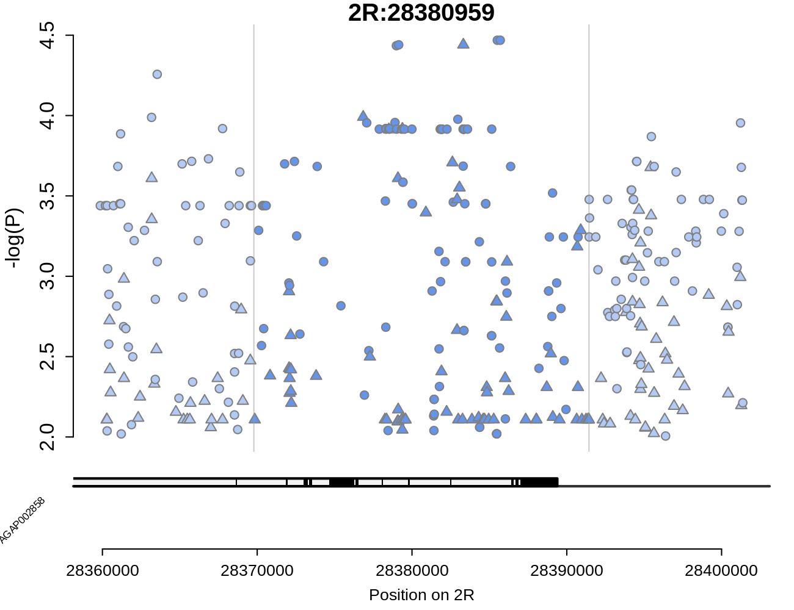

&nbsp;

&nbsp;

&nbsp;

#### Contingency table for cluster_1:

| &nbsp;&nbsp;&nbsp;  phenotype  &nbsp;&nbsp;&nbsp; |  &nbsp;&nbsp;&nbsp;  wt  &nbsp;&nbsp;&nbsp;  |  &nbsp;&nbsp;&nbsp;  het  &nbsp;&nbsp;&nbsp;  |  &nbsp;&nbsp;&nbsp;  hom  &nbsp;&nbsp;&nbsp;  |
| :---:     | :---: | :---: | :---: |
|  alive    | 8 | 15 | 4 |
|  dead     | 35 | 15 | 1 |

&nbsp;

#### Contingency table for cluster_2:

| &nbsp;&nbsp;&nbsp;  phenotype  &nbsp;&nbsp;&nbsp; |  &nbsp;&nbsp;&nbsp;  wt  &nbsp;&nbsp;&nbsp;  |  &nbsp;&nbsp;&nbsp;  het  &nbsp;&nbsp;&nbsp;  |  &nbsp;&nbsp;&nbsp;  hom  &nbsp;&nbsp;&nbsp;  |
| :---:     | :---: | :---: | :---: |
|  alive    | 24 | 3 | 0 |
|  dead     | 32 | 17 | 2 |

&nbsp;

#### Contingency table for cluster_3:

| &nbsp;&nbsp;&nbsp;  phenotype  &nbsp;&nbsp;&nbsp; |  &nbsp;&nbsp;&nbsp;  wt  &nbsp;&nbsp;&nbsp;  |  &nbsp;&nbsp;&nbsp;  het  &nbsp;&nbsp;&nbsp;  |  &nbsp;&nbsp;&nbsp;  hom  &nbsp;&nbsp;&nbsp;  |
| :---:     | :---: | :---: | :---: |
|  alive    | 21 | 6 | 0 |
|  dead     | 35 | 15 | 1 |

&nbsp;

### Obuasi_gambiae_Delta_2R_28391433-28405240

&nbsp;

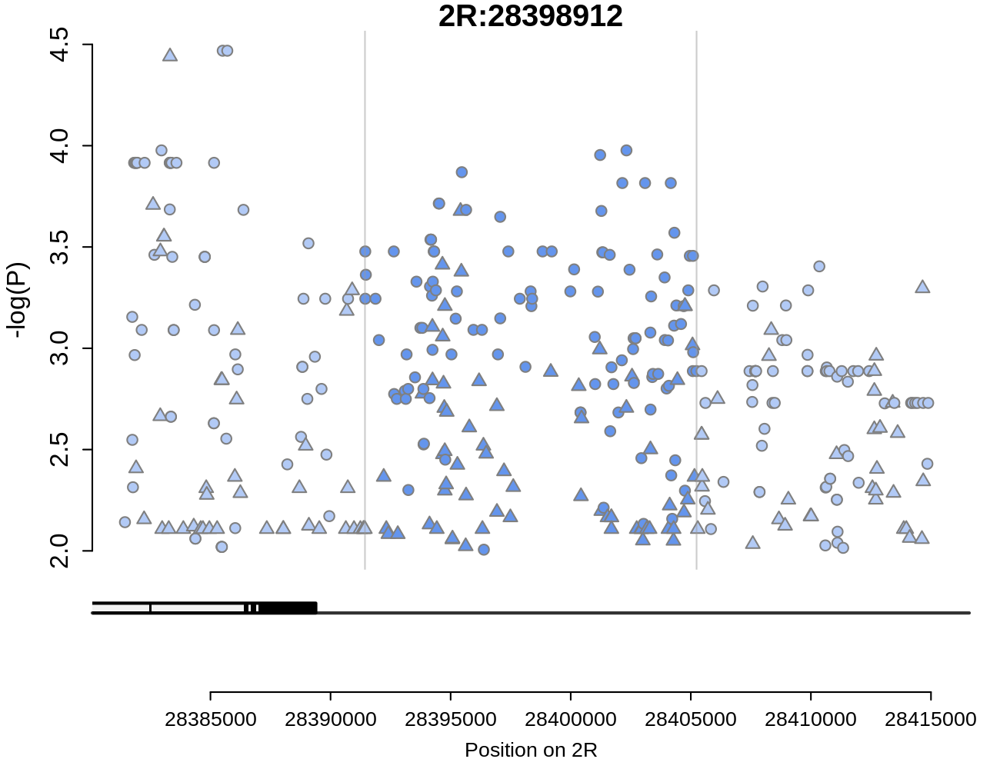

&nbsp;

&nbsp;

&nbsp;

#### Contingency table for cluster_1:

| &nbsp;&nbsp;&nbsp;  phenotype  &nbsp;&nbsp;&nbsp; |  &nbsp;&nbsp;&nbsp;  wt  &nbsp;&nbsp;&nbsp;  |  &nbsp;&nbsp;&nbsp;  het  &nbsp;&nbsp;&nbsp;  |  &nbsp;&nbsp;&nbsp;  hom  &nbsp;&nbsp;&nbsp;  |
| :---:     | :---: | :---: | :---: |
|  alive    | 7 | 16 | 4 |
|  dead     | 34 | 15 | 2 |

&nbsp;

#### Contingency table for cluster_2:

| &nbsp;&nbsp;&nbsp;  phenotype  &nbsp;&nbsp;&nbsp; |  &nbsp;&nbsp;&nbsp;  wt  &nbsp;&nbsp;&nbsp;  |  &nbsp;&nbsp;&nbsp;  het  &nbsp;&nbsp;&nbsp;  |  &nbsp;&nbsp;&nbsp;  hom  &nbsp;&nbsp;&nbsp;  |
| :---:     | :---: | :---: | :---: |
|  alive    | 24 | 3 | 0 |
|  dead     | 32 | 17 | 2 |

&nbsp;

#### Contingency table for cluster_3:

| &nbsp;&nbsp;&nbsp;  phenotype  &nbsp;&nbsp;&nbsp; |  &nbsp;&nbsp;&nbsp;  wt  &nbsp;&nbsp;&nbsp;  |  &nbsp;&nbsp;&nbsp;  het  &nbsp;&nbsp;&nbsp;  |  &nbsp;&nbsp;&nbsp;  hom  &nbsp;&nbsp;&nbsp;  |
| :---:     | :---: | :---: | :---: |
|  alive    | 21 | 6 | 0 |
|  dead     | 35 | 15 | 1 |

&nbsp;

### Obuasi_gambiae_Delta_2R_28405239-28421116

&nbsp;

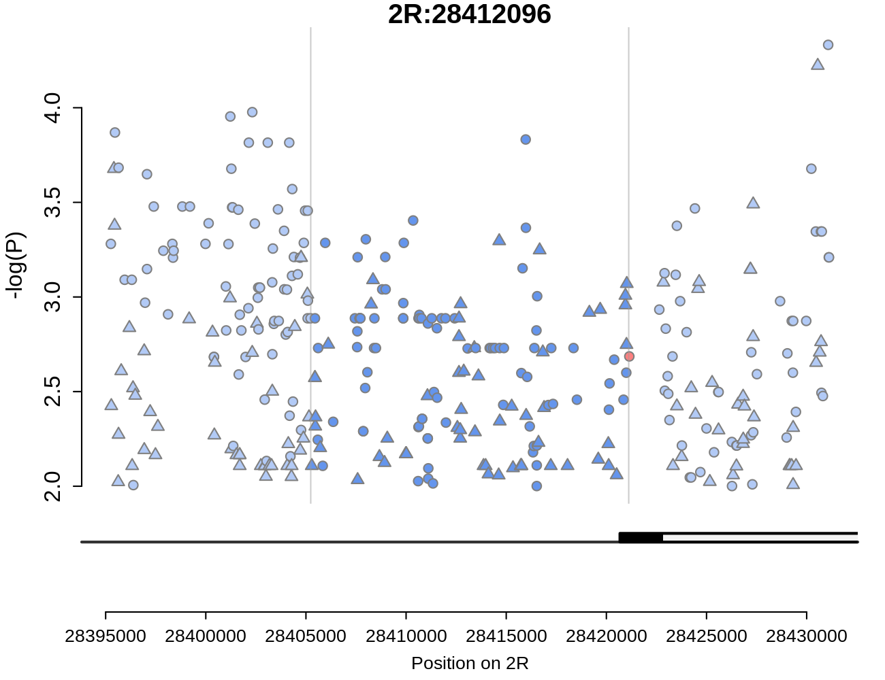

&nbsp;

&nbsp;

&nbsp;

#### Contingency table for cluster_1:

| &nbsp;&nbsp;&nbsp;  phenotype  &nbsp;&nbsp;&nbsp; |  &nbsp;&nbsp;&nbsp;  wt  &nbsp;&nbsp;&nbsp;  |  &nbsp;&nbsp;&nbsp;  het  &nbsp;&nbsp;&nbsp;  |  &nbsp;&nbsp;&nbsp;  hom  &nbsp;&nbsp;&nbsp;  |
| :---:     | :---: | :---: | :---: |
|  alive    | 9 | 11 | 7 |
|  dead     | 32 | 17 | 2 |

&nbsp;

#### Contingency table for cluster_2:

| &nbsp;&nbsp;&nbsp;  phenotype  &nbsp;&nbsp;&nbsp; |  &nbsp;&nbsp;&nbsp;  wt  &nbsp;&nbsp;&nbsp;  |  &nbsp;&nbsp;&nbsp;  het  &nbsp;&nbsp;&nbsp;  |  &nbsp;&nbsp;&nbsp;  hom  &nbsp;&nbsp;&nbsp;  |
| :---:     | :---: | :---: | :---: |
|  alive    | 21 | 6 | 0 |
|  dead     | 35 | 15 | 1 |

&nbsp;

#### Contingency table for cluster_3:

| &nbsp;&nbsp;&nbsp;  phenotype  &nbsp;&nbsp;&nbsp; |  &nbsp;&nbsp;&nbsp;  wt  &nbsp;&nbsp;&nbsp;  |  &nbsp;&nbsp;&nbsp;  het  &nbsp;&nbsp;&nbsp;  |  &nbsp;&nbsp;&nbsp;  hom  &nbsp;&nbsp;&nbsp;  |
| :---:     | :---: | :---: | :---: |
|  alive    | 24 | 3 | 0 |
|  dead     | 33 | 16 | 2 |

&nbsp;

### Obuasi_gambiae_Delta_2R_28421116-28439220

&nbsp;

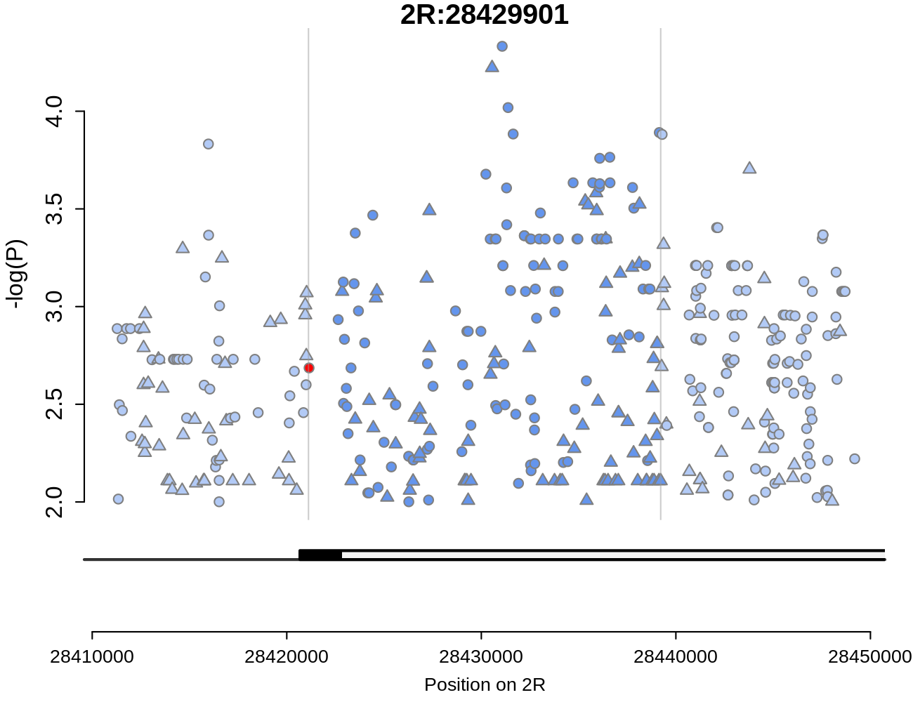

&nbsp;

&nbsp;

&nbsp;

#### Contingency table for cluster_1:

| &nbsp;&nbsp;&nbsp;  phenotype  &nbsp;&nbsp;&nbsp; |  &nbsp;&nbsp;&nbsp;  wt  &nbsp;&nbsp;&nbsp;  |  &nbsp;&nbsp;&nbsp;  het  &nbsp;&nbsp;&nbsp;  |  &nbsp;&nbsp;&nbsp;  hom  &nbsp;&nbsp;&nbsp;  |
| :---:     | :---: | :---: | :---: |
|  alive    | 7 | 13 | 7 |
|  dead     | 29 | 18 | 4 |

&nbsp;

#### Contingency table for cluster_2:

| &nbsp;&nbsp;&nbsp;  phenotype  &nbsp;&nbsp;&nbsp; |  &nbsp;&nbsp;&nbsp;  wt  &nbsp;&nbsp;&nbsp;  |  &nbsp;&nbsp;&nbsp;  het  &nbsp;&nbsp;&nbsp;  |  &nbsp;&nbsp;&nbsp;  hom  &nbsp;&nbsp;&nbsp;  |
| :---:     | :---: | :---: | :---: |
|  alive    | 24 | 3 | 0 |
|  dead     | 33 | 16 | 2 |

&nbsp;

#### Contingency table for cluster_3:

| &nbsp;&nbsp;&nbsp;  phenotype  &nbsp;&nbsp;&nbsp; |  &nbsp;&nbsp;&nbsp;  wt  &nbsp;&nbsp;&nbsp;  |  &nbsp;&nbsp;&nbsp;  het  &nbsp;&nbsp;&nbsp;  |  &nbsp;&nbsp;&nbsp;  hom  &nbsp;&nbsp;&nbsp;  |
| :---:     | :---: | :---: | :---: |
|  alive    | 21 | 6 | 0 |
|  dead     | 36 | 14 | 1 |

&nbsp;

### Obuasi_gambiae_Delta_2R_28439219-28456407

&nbsp;

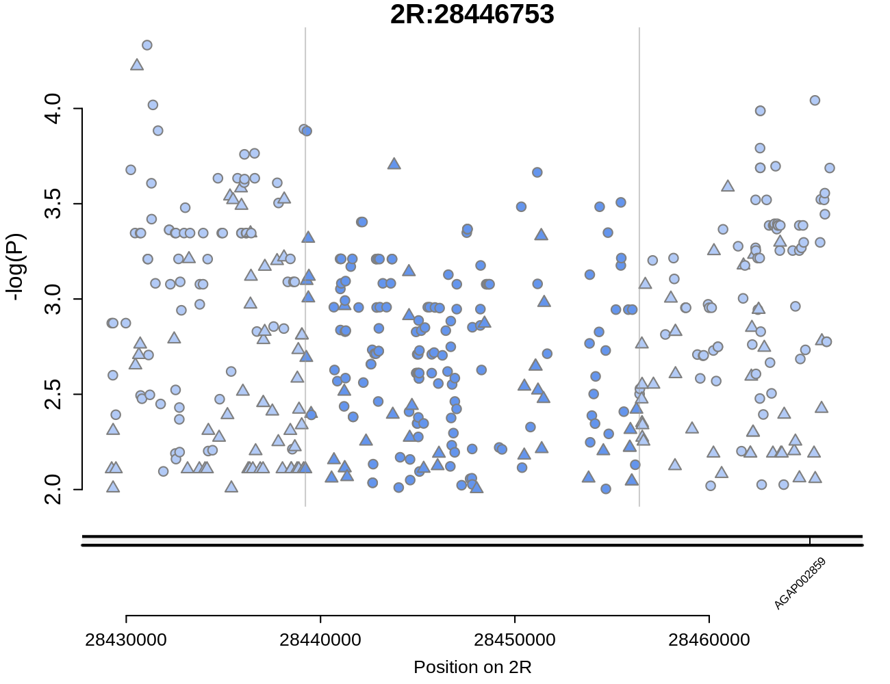

&nbsp;

&nbsp;

&nbsp;

#### Contingency table for cluster_1:

| &nbsp;&nbsp;&nbsp;  phenotype  &nbsp;&nbsp;&nbsp; |  &nbsp;&nbsp;&nbsp;  wt  &nbsp;&nbsp;&nbsp;  |  &nbsp;&nbsp;&nbsp;  het  &nbsp;&nbsp;&nbsp;  |  &nbsp;&nbsp;&nbsp;  hom  &nbsp;&nbsp;&nbsp;  |
| :---:     | :---: | :---: | :---: |
|  alive    | 4 | 14 | 9 |
|  dead     | 27 | 17 | 7 |

&nbsp;

#### Contingency table for cluster_2:

| &nbsp;&nbsp;&nbsp;  phenotype  &nbsp;&nbsp;&nbsp; |  &nbsp;&nbsp;&nbsp;  wt  &nbsp;&nbsp;&nbsp;  |  &nbsp;&nbsp;&nbsp;  het  &nbsp;&nbsp;&nbsp;  |  &nbsp;&nbsp;&nbsp;  hom  &nbsp;&nbsp;&nbsp;  |
| :---:     | :---: | :---: | :---: |
|  alive    | 23 | 4 | 0 |
|  dead     | 32 | 17 | 2 |

&nbsp;

#### Contingency table for cluster_3:

| &nbsp;&nbsp;&nbsp;  phenotype  &nbsp;&nbsp;&nbsp; |  &nbsp;&nbsp;&nbsp;  wt  &nbsp;&nbsp;&nbsp;  |  &nbsp;&nbsp;&nbsp;  het  &nbsp;&nbsp;&nbsp;  |  &nbsp;&nbsp;&nbsp;  hom  &nbsp;&nbsp;&nbsp;  |
| :---:     | :---: | :---: | :---: |
|  alive    | 20 | 7 | 0 |
|  dead     | 36 | 14 | 1 |

&nbsp;

### Obuasi_gambiae_Delta_2R_28456407-28475225

&nbsp;

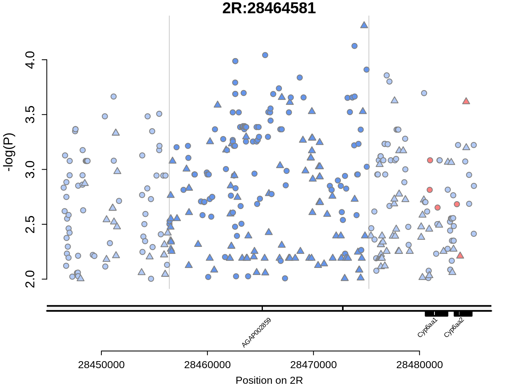

&nbsp;

&nbsp;

&nbsp;

#### Contingency table for cluster_1:

| &nbsp;&nbsp;&nbsp;  phenotype  &nbsp;&nbsp;&nbsp; |  &nbsp;&nbsp;&nbsp;  wt  &nbsp;&nbsp;&nbsp;  |  &nbsp;&nbsp;&nbsp;  het  &nbsp;&nbsp;&nbsp;  |  &nbsp;&nbsp;&nbsp;  hom  &nbsp;&nbsp;&nbsp;  |
| :---:     | :---: | :---: | :---: |
|  alive    | 3 | 15 | 9 |
|  dead     | 25 | 19 | 7 |

&nbsp;

#### Contingency table for cluster_2:

| &nbsp;&nbsp;&nbsp;  phenotype  &nbsp;&nbsp;&nbsp; |  &nbsp;&nbsp;&nbsp;  wt  &nbsp;&nbsp;&nbsp;  |  &nbsp;&nbsp;&nbsp;  het  &nbsp;&nbsp;&nbsp;  |  &nbsp;&nbsp;&nbsp;  hom  &nbsp;&nbsp;&nbsp;  |
| :---:     | :---: | :---: | :---: |
|  alive    | 23 | 4 | 0 |
|  dead     | 32 | 17 | 2 |

&nbsp;

#### Contingency table for cluster_3:

| &nbsp;&nbsp;&nbsp;  phenotype  &nbsp;&nbsp;&nbsp; |  &nbsp;&nbsp;&nbsp;  wt  &nbsp;&nbsp;&nbsp;  |  &nbsp;&nbsp;&nbsp;  het  &nbsp;&nbsp;&nbsp;  |  &nbsp;&nbsp;&nbsp;  hom  &nbsp;&nbsp;&nbsp;  |
| :---:     | :---: | :---: | :---: |
|  alive    | 20 | 7 | 0 |
|  dead     | 38 | 12 | 1 |

&nbsp;

### Obuasi_gambiae_Delta_2R_28475225-28496115

&nbsp;

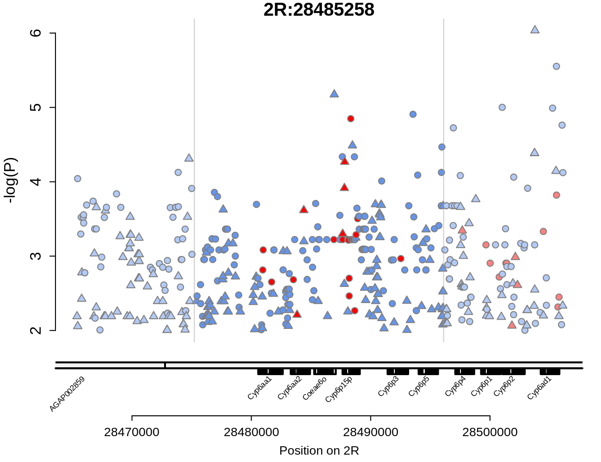

&nbsp;

&nbsp;

&nbsp;

#### Contingency table for cluster_1:

| &nbsp;&nbsp;&nbsp;  phenotype  &nbsp;&nbsp;&nbsp; |  &nbsp;&nbsp;&nbsp;  wt  &nbsp;&nbsp;&nbsp;  |  &nbsp;&nbsp;&nbsp;  het  &nbsp;&nbsp;&nbsp;  |  &nbsp;&nbsp;&nbsp;  hom  &nbsp;&nbsp;&nbsp;  |
| :---:     | :---: | :---: | :---: |
|  alive    | 7 | 12 | 8 |
|  dead     | 28 | 18 | 5 |

&nbsp;

#### Contingency table for cluster_2:

| &nbsp;&nbsp;&nbsp;  phenotype  &nbsp;&nbsp;&nbsp; |  &nbsp;&nbsp;&nbsp;  wt  &nbsp;&nbsp;&nbsp;  |  &nbsp;&nbsp;&nbsp;  het  &nbsp;&nbsp;&nbsp;  |  &nbsp;&nbsp;&nbsp;  hom  &nbsp;&nbsp;&nbsp;  |
| :---:     | :---: | :---: | :---: |
|  alive    | 19 | 8 | 0 |
|  dead     | 39 | 11 | 1 |

&nbsp;

### Obuasi_gambiae_Delta_2R_28496114-28515482

&nbsp;

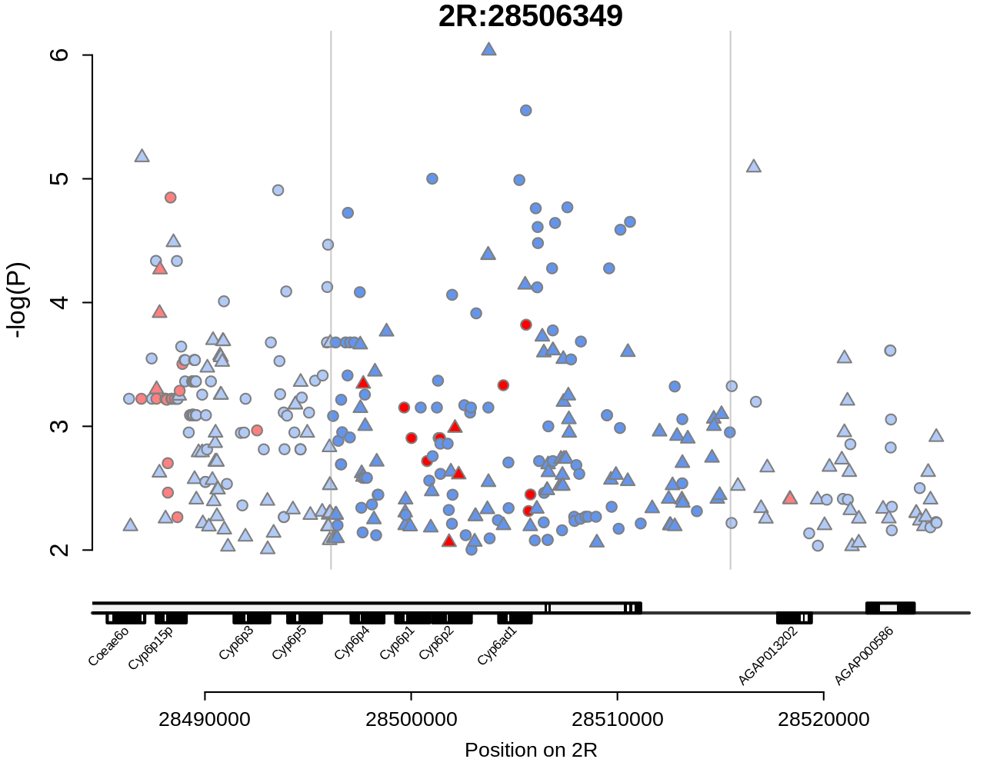

&nbsp;

&nbsp;

&nbsp;

#### Contingency table for cluster_1:

| &nbsp;&nbsp;&nbsp;  phenotype  &nbsp;&nbsp;&nbsp; |  &nbsp;&nbsp;&nbsp;  wt  &nbsp;&nbsp;&nbsp;  |  &nbsp;&nbsp;&nbsp;  het  &nbsp;&nbsp;&nbsp;  |  &nbsp;&nbsp;&nbsp;  hom  &nbsp;&nbsp;&nbsp;  |
| :---:     | :---: | :---: | :---: |
|  alive    | 11 | 9 | 7 |
|  dead     | 30 | 16 | 5 |

&nbsp;

#### Contingency table for cluster_2:

| &nbsp;&nbsp;&nbsp;  phenotype  &nbsp;&nbsp;&nbsp; |  &nbsp;&nbsp;&nbsp;  wt  &nbsp;&nbsp;&nbsp;  |  &nbsp;&nbsp;&nbsp;  het  &nbsp;&nbsp;&nbsp;  |  &nbsp;&nbsp;&nbsp;  hom  &nbsp;&nbsp;&nbsp;  |
| :---:     | :---: | :---: | :---: |
|  alive    | 17 | 10 | 0 |
|  dead     | 38 | 12 | 1 |

&nbsp;

### Obuasi_gambiae_Delta_2R_28515481-28531112

&nbsp;

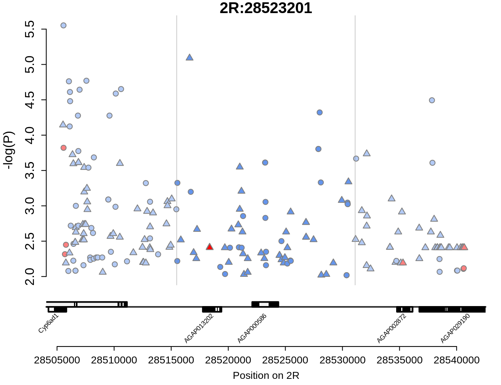

&nbsp;

&nbsp;

&nbsp;

#### Contingency table for cluster_1:

| &nbsp;&nbsp;&nbsp;  phenotype  &nbsp;&nbsp;&nbsp; |  &nbsp;&nbsp;&nbsp;  wt  &nbsp;&nbsp;&nbsp;  |  &nbsp;&nbsp;&nbsp;  het  &nbsp;&nbsp;&nbsp;  |  &nbsp;&nbsp;&nbsp;  hom  &nbsp;&nbsp;&nbsp;  |
| :---:     | :---: | :---: | :---: |
|  alive    | 13 | 11 | 3 |
|  dead     | 35 | 12 | 4 |

&nbsp;

#### Contingency table for cluster_2:

| &nbsp;&nbsp;&nbsp;  phenotype  &nbsp;&nbsp;&nbsp; |  &nbsp;&nbsp;&nbsp;  wt  &nbsp;&nbsp;&nbsp;  |  &nbsp;&nbsp;&nbsp;  het  &nbsp;&nbsp;&nbsp;  |  &nbsp;&nbsp;&nbsp;  hom  &nbsp;&nbsp;&nbsp;  |
| :---:     | :---: | :---: | :---: |
|  alive    | 14 | 12 | 1 |
|  dead     | 38 | 12 | 1 |

&nbsp;

___

## Baguida\_*gambiae*\_PM

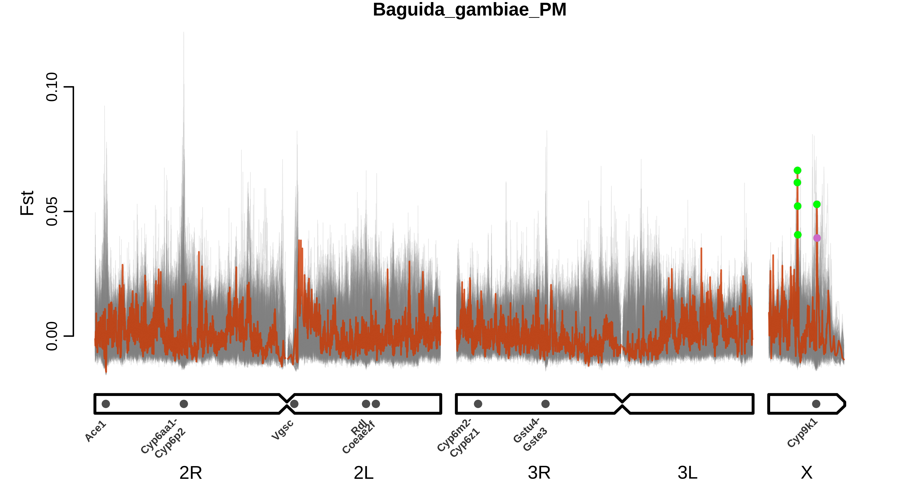

&nbsp;

[Baguida_gambiae_PM_X:15411876-15495650](#baguida_gambiae_pm_x_15411876-15495650)  
[Baguida_gambiae_PM_X:9165646-9222299](#baguida_gambiae_pm_x_9165646-9222299)  
[Baguida_gambiae_PM_X:9222298-9273975](#baguida_gambiae_pm_x_9222298-9273975)  
[Baguida_gambiae_PM_X:9273975-9317640](#baguida_gambiae_pm_x_9273975-9317640)  
[Baguida_gambiae_PM_X:9317639-9346605](#baguida_gambiae_pm_x_9317639-9346605)  

### Baguida_gambiae_PM_X_15411876-15495650

&nbsp;

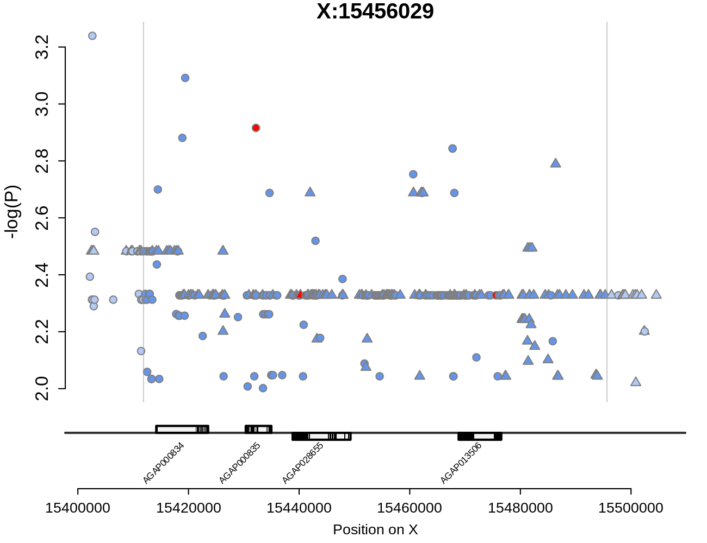

&nbsp;

&nbsp;

&nbsp;

#### Contingency table for cluster_1:

| &nbsp;&nbsp;&nbsp;  phenotype  &nbsp;&nbsp;&nbsp; |  &nbsp;&nbsp;&nbsp;  wt  &nbsp;&nbsp;&nbsp;  |  &nbsp;&nbsp;&nbsp;  het  &nbsp;&nbsp;&nbsp;  |  &nbsp;&nbsp;&nbsp;  hom  &nbsp;&nbsp;&nbsp;  |
| :---:     | :---: | :---: | :---: |
|  alive    | 17 | 14 | 4 |
|  dead     | 13 | 12 | 5 |

&nbsp;

#### Contingency table for cluster_2:

| &nbsp;&nbsp;&nbsp;  phenotype  &nbsp;&nbsp;&nbsp; |  &nbsp;&nbsp;&nbsp;  wt  &nbsp;&nbsp;&nbsp;  |  &nbsp;&nbsp;&nbsp;  het  &nbsp;&nbsp;&nbsp;  |  &nbsp;&nbsp;&nbsp;  hom  &nbsp;&nbsp;&nbsp;  |
| :---:     | :---: | :---: | :---: |
|  alive    | 24 | 11 | 0 |
|  dead     | 12 | 16 | 2 |

&nbsp;

#### Contingency table for cluster_3:

| &nbsp;&nbsp;&nbsp;  phenotype  &nbsp;&nbsp;&nbsp; |  &nbsp;&nbsp;&nbsp;  wt  &nbsp;&nbsp;&nbsp;  |  &nbsp;&nbsp;&nbsp;  het  &nbsp;&nbsp;&nbsp;  |  &nbsp;&nbsp;&nbsp;  hom  &nbsp;&nbsp;&nbsp;  |
| :---:     | :---: | :---: | :---: |
|  alive    | 20 | 11 | 4 |
|  dead     | 24 | 5 | 1 |

&nbsp;

### Baguida_gambiae_PM_X_9165646-9222299

&nbsp;

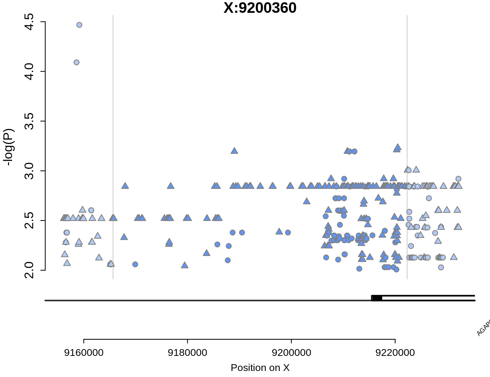

&nbsp;

&nbsp;

&nbsp;

#### Contingency table for cluster_1:

| &nbsp;&nbsp;&nbsp;  phenotype  &nbsp;&nbsp;&nbsp; |  &nbsp;&nbsp;&nbsp;  wt  &nbsp;&nbsp;&nbsp;  |  &nbsp;&nbsp;&nbsp;  het  &nbsp;&nbsp;&nbsp;  |  &nbsp;&nbsp;&nbsp;  hom  &nbsp;&nbsp;&nbsp;  |
| :---:     | :---: | :---: | :---: |
|  alive    | 6 | 13 | 16 |
|  dead     | 9 | 13 | 8 |

&nbsp;

#### Contingency table for cluster_2:

| &nbsp;&nbsp;&nbsp;  phenotype  &nbsp;&nbsp;&nbsp; |  &nbsp;&nbsp;&nbsp;  wt  &nbsp;&nbsp;&nbsp;  |  &nbsp;&nbsp;&nbsp;  het  &nbsp;&nbsp;&nbsp;  |  &nbsp;&nbsp;&nbsp;  hom  &nbsp;&nbsp;&nbsp;  |
| :---:     | :---: | :---: | :---: |
|  alive    | 24 | 10 | 1 |
|  dead     | 10 | 14 | 6 |

&nbsp;

### Baguida_gambiae_PM_X_9222298-9273975

&nbsp;

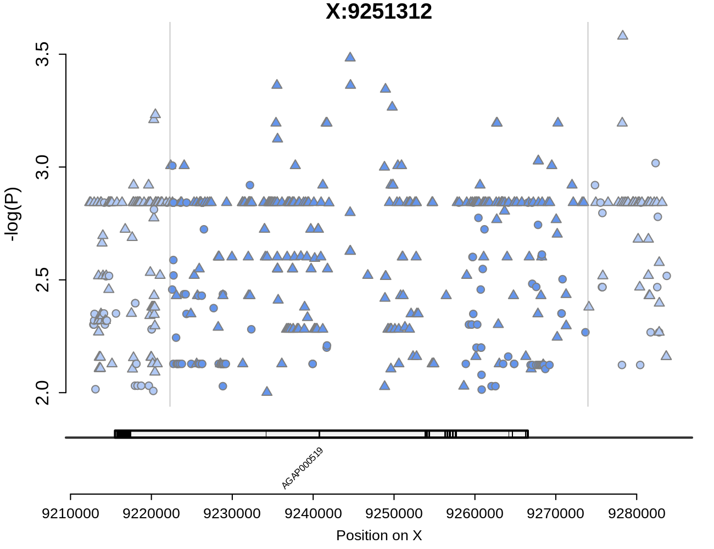

&nbsp;

&nbsp;

&nbsp;

#### Contingency table for cluster_1:

| &nbsp;&nbsp;&nbsp;  phenotype  &nbsp;&nbsp;&nbsp; |  &nbsp;&nbsp;&nbsp;  wt  &nbsp;&nbsp;&nbsp;  |  &nbsp;&nbsp;&nbsp;  het  &nbsp;&nbsp;&nbsp;  |  &nbsp;&nbsp;&nbsp;  hom  &nbsp;&nbsp;&nbsp;  |
| :---:     | :---: | :---: | :---: |
|  alive    | 16 | 13 | 6 |
|  dead     | 13 | 15 | 2 |

&nbsp;

#### Contingency table for cluster_2:

| &nbsp;&nbsp;&nbsp;  phenotype  &nbsp;&nbsp;&nbsp; |  &nbsp;&nbsp;&nbsp;  wt  &nbsp;&nbsp;&nbsp;  |  &nbsp;&nbsp;&nbsp;  het  &nbsp;&nbsp;&nbsp;  |  &nbsp;&nbsp;&nbsp;  hom  &nbsp;&nbsp;&nbsp;  |
| :---:     | :---: | :---: | :---: |
|  alive    | 24 | 10 | 1 |
|  dead     | 10 | 14 | 6 |

&nbsp;

### Baguida_gambiae_PM_X_9273975-9317640

&nbsp;

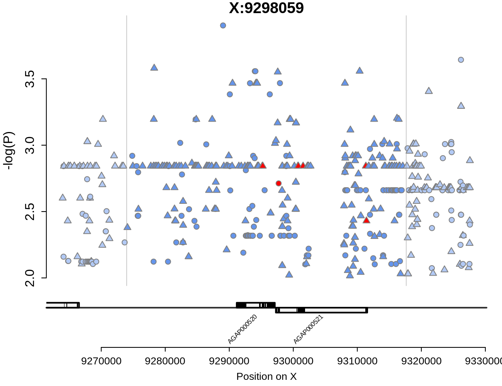

&nbsp;

&nbsp;

&nbsp;

#### Contingency table for cluster_1:

| &nbsp;&nbsp;&nbsp;  phenotype  &nbsp;&nbsp;&nbsp; |  &nbsp;&nbsp;&nbsp;  wt  &nbsp;&nbsp;&nbsp;  |  &nbsp;&nbsp;&nbsp;  het  &nbsp;&nbsp;&nbsp;  |  &nbsp;&nbsp;&nbsp;  hom  &nbsp;&nbsp;&nbsp;  |
| :---:     | :---: | :---: | :---: |
|  alive    | 24 | 10 | 1 |
|  dead     | 10 | 14 | 6 |

&nbsp;

#### Contingency table for cluster_2:

| &nbsp;&nbsp;&nbsp;  phenotype  &nbsp;&nbsp;&nbsp; |  &nbsp;&nbsp;&nbsp;  wt  &nbsp;&nbsp;&nbsp;  |  &nbsp;&nbsp;&nbsp;  het  &nbsp;&nbsp;&nbsp;  |  &nbsp;&nbsp;&nbsp;  hom  &nbsp;&nbsp;&nbsp;  |
| :---:     | :---: | :---: | :---: |
|  alive    | 20 | 11 | 4 |
|  dead     | 19 | 11 | 0 |

&nbsp;

### Baguida_gambiae_PM_X_9317639-9346605

&nbsp;

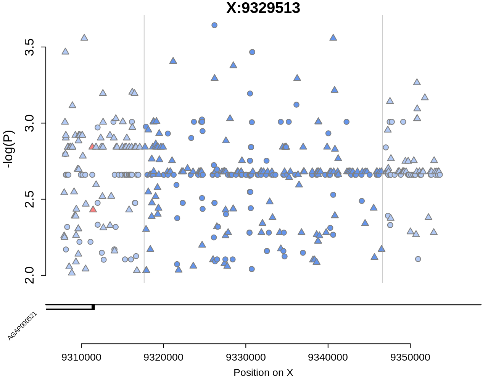

&nbsp;

&nbsp;

&nbsp;

#### Contingency table for cluster_1:

| &nbsp;&nbsp;&nbsp;  phenotype  &nbsp;&nbsp;&nbsp; |  &nbsp;&nbsp;&nbsp;  wt  &nbsp;&nbsp;&nbsp;  |  &nbsp;&nbsp;&nbsp;  het  &nbsp;&nbsp;&nbsp;  |  &nbsp;&nbsp;&nbsp;  hom  &nbsp;&nbsp;&nbsp;  |
| :---:     | :---: | :---: | :---: |
|  alive    | 24 | 10 | 1 |
|  dead     | 11 | 14 | 5 |

&nbsp;

#### Contingency table for cluster_2:

| &nbsp;&nbsp;&nbsp;  phenotype  &nbsp;&nbsp;&nbsp; |  &nbsp;&nbsp;&nbsp;  wt  &nbsp;&nbsp;&nbsp;  |  &nbsp;&nbsp;&nbsp;  het  &nbsp;&nbsp;&nbsp;  |  &nbsp;&nbsp;&nbsp;  hom  &nbsp;&nbsp;&nbsp;  |
| :---:     | :---: | :---: | :---: |
|  alive    | 19 | 14 | 2 |
|  dead     | 22 | 8 | 0 |

&nbsp;

___

## Korle-Bu\_*coluzzii*\_PM

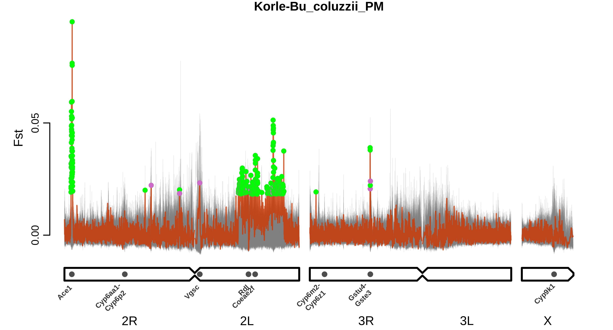

&nbsp;

[Korle-Bu_coluzzii_PM_2R:38097626-38111826](#korle-bu_coluzzii_pm_2r_38097626-38111826)  
[Korle-Bu_coluzzii_PM_2R:54371673-54397846](#korle-bu_coluzzii_pm_2r_54371673-54397846)  
[Korle-Bu_coluzzii_PM_3R:28482794-28505651](#korle-bu_coluzzii_pm_3r_28482794-28505651)  
[Korle-Bu_coluzzii_PM_3R:28505651-28533744](#korle-bu_coluzzii_pm_3r_28505651-28533744)  
[Korle-Bu_coluzzii_PM_3R:28563392-28595112](#korle-bu_coluzzii_pm_3r_28563392-28595112)  
[Korle-Bu_coluzzii_PM_3R:2929236-2946500](#korle-bu_coluzzii_pm_3r_2929236-2946500)  

### Korle-Bu_coluzzii_PM_2R_38097626-38111826

&nbsp;

&nbsp;

&nbsp;

&nbsp;

### Korle-Bu_coluzzii_PM_2R_54371673-54397846

&nbsp;

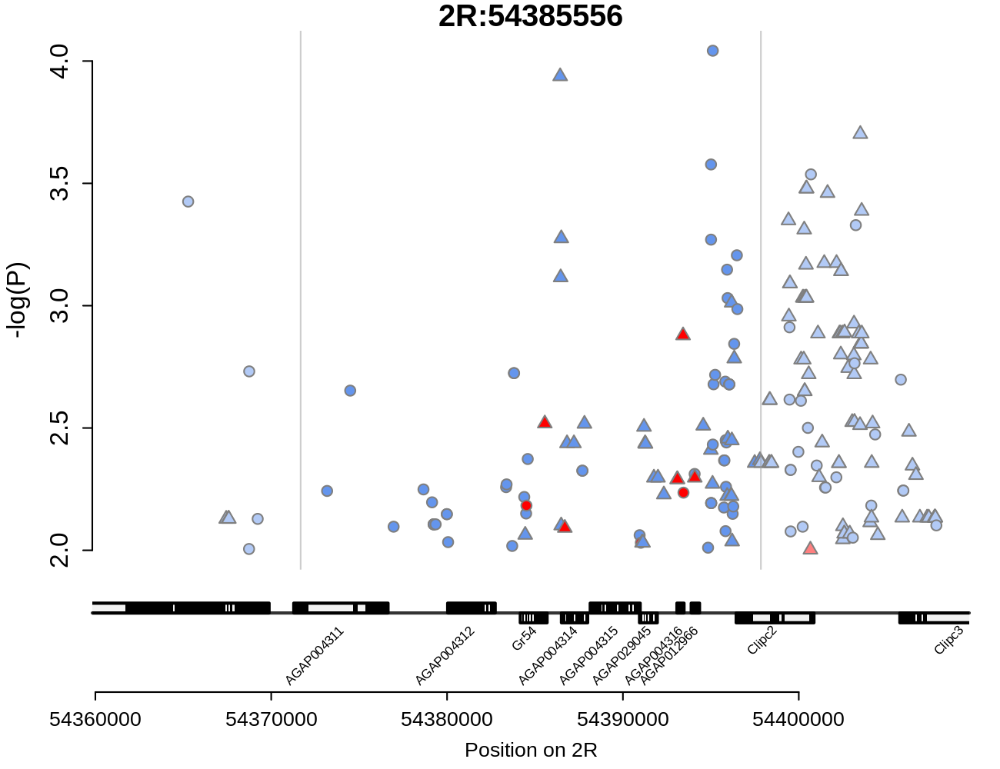

&nbsp;

&nbsp;

&nbsp;

#### Contingency table for cluster_1:

| &nbsp;&nbsp;&nbsp;  phenotype  &nbsp;&nbsp;&nbsp; |  &nbsp;&nbsp;&nbsp;  wt  &nbsp;&nbsp;&nbsp;  |  &nbsp;&nbsp;&nbsp;  het  &nbsp;&nbsp;&nbsp;  |  &nbsp;&nbsp;&nbsp;  hom  &nbsp;&nbsp;&nbsp;  |
| :---:     | :---: | :---: | :---: |
|  alive    | 30 | 22 | 5 |
|  dead     | 34 | 9 | 5 |

&nbsp;

### Korle-Bu_coluzzii_PM_3R_28482794-28505651

&nbsp;

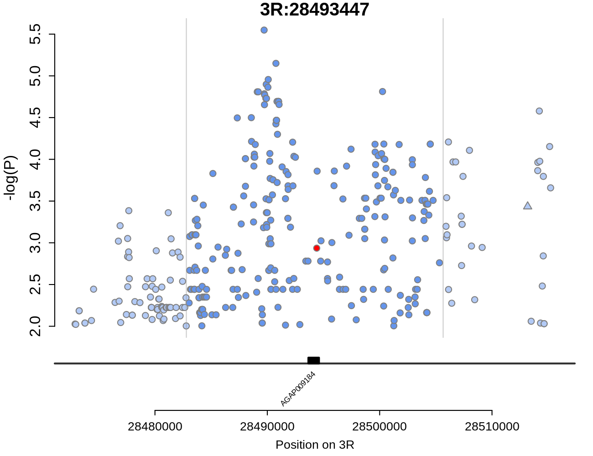

&nbsp;

&nbsp;

&nbsp;

#### Contingency table for cluster_1:

| &nbsp;&nbsp;&nbsp;  phenotype  &nbsp;&nbsp;&nbsp; |  &nbsp;&nbsp;&nbsp;  wt  &nbsp;&nbsp;&nbsp;  |  &nbsp;&nbsp;&nbsp;  het  &nbsp;&nbsp;&nbsp;  |  &nbsp;&nbsp;&nbsp;  hom  &nbsp;&nbsp;&nbsp;  |
| :---:     | :---: | :---: | :---: |
|  alive    | 34 | 20 | 3 |
|  dead     | 14 | 28 | 6 |

&nbsp;

#### Contingency table for cluster_2:

| &nbsp;&nbsp;&nbsp;  phenotype  &nbsp;&nbsp;&nbsp; |  &nbsp;&nbsp;&nbsp;  wt  &nbsp;&nbsp;&nbsp;  |  &nbsp;&nbsp;&nbsp;  het  &nbsp;&nbsp;&nbsp;  |  &nbsp;&nbsp;&nbsp;  hom  &nbsp;&nbsp;&nbsp;  |
| :---:     | :---: | :---: | :---: |
|  alive    | 34 | 19 | 4 |
|  dead     | 40 | 8 | 0 |

&nbsp;

#### Contingency table for cluster_3:

| &nbsp;&nbsp;&nbsp;  phenotype  &nbsp;&nbsp;&nbsp; |  &nbsp;&nbsp;&nbsp;  wt  &nbsp;&nbsp;&nbsp;  |  &nbsp;&nbsp;&nbsp;  het  &nbsp;&nbsp;&nbsp;  |  &nbsp;&nbsp;&nbsp;  hom  &nbsp;&nbsp;&nbsp;  |
| :---:     | :---: | :---: | :---: |
|  alive    | 39 | 17 | 1 |
|  dead     | 41 | 6 | 1 |

&nbsp;

### Korle-Bu_coluzzii_PM_3R_28505651-28533744

&nbsp;

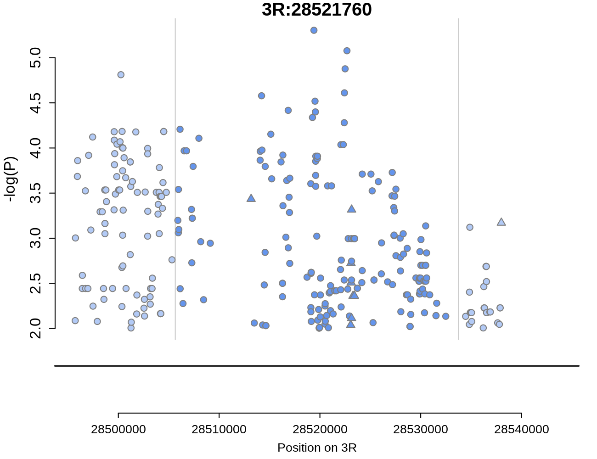

&nbsp;

&nbsp;

&nbsp;

#### Contingency table for cluster_1:

| &nbsp;&nbsp;&nbsp;  phenotype  &nbsp;&nbsp;&nbsp; |  &nbsp;&nbsp;&nbsp;  wt  &nbsp;&nbsp;&nbsp;  |  &nbsp;&nbsp;&nbsp;  het  &nbsp;&nbsp;&nbsp;  |  &nbsp;&nbsp;&nbsp;  hom  &nbsp;&nbsp;&nbsp;  |
| :---:     | :---: | :---: | :---: |
|  alive    | 37 | 17 | 3 |
|  dead     | 15 | 29 | 4 |

&nbsp;

#### Contingency table for cluster_2:

| &nbsp;&nbsp;&nbsp;  phenotype  &nbsp;&nbsp;&nbsp; |  &nbsp;&nbsp;&nbsp;  wt  &nbsp;&nbsp;&nbsp;  |  &nbsp;&nbsp;&nbsp;  het  &nbsp;&nbsp;&nbsp;  |  &nbsp;&nbsp;&nbsp;  hom  &nbsp;&nbsp;&nbsp;  |
| :---:     | :---: | :---: | :---: |
|  alive    | 26 | 24 | 7 |
|  dead     | 31 | 16 | 1 |

&nbsp;

#### Contingency table for cluster_3:

| &nbsp;&nbsp;&nbsp;  phenotype  &nbsp;&nbsp;&nbsp; |  &nbsp;&nbsp;&nbsp;  wt  &nbsp;&nbsp;&nbsp;  |  &nbsp;&nbsp;&nbsp;  het  &nbsp;&nbsp;&nbsp;  |  &nbsp;&nbsp;&nbsp;  hom  &nbsp;&nbsp;&nbsp;  |
| :---:     | :---: | :---: | :---: |
|  alive    | 39 | 15 | 3 |
|  dead     | 40 | 7 | 1 |

&nbsp;

### Korle-Bu_coluzzii_PM_3R_28563392-28595112

&nbsp;

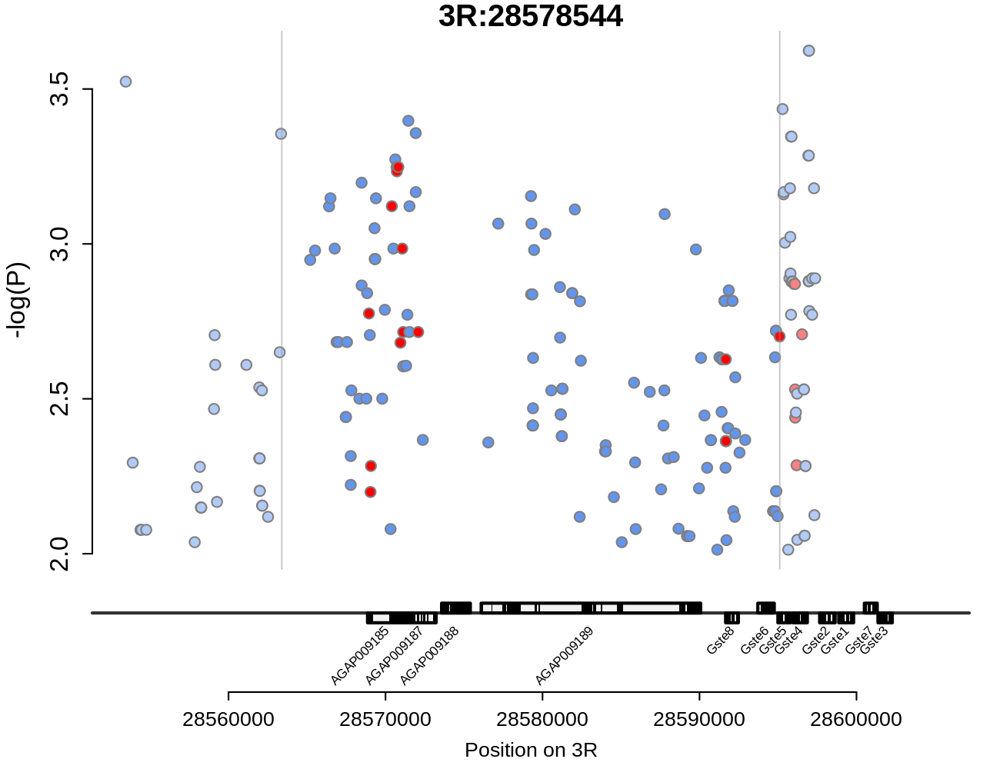

&nbsp;

&nbsp;

&nbsp;

#### Contingency table for cluster_1:

| &nbsp;&nbsp;&nbsp;  phenotype  &nbsp;&nbsp;&nbsp; |  &nbsp;&nbsp;&nbsp;  wt  &nbsp;&nbsp;&nbsp;  |  &nbsp;&nbsp;&nbsp;  het  &nbsp;&nbsp;&nbsp;  |  &nbsp;&nbsp;&nbsp;  hom  &nbsp;&nbsp;&nbsp;  |
| :---:     | :---: | :---: | :---: |
|  alive    | 20 | 27 | 10 |
|  dead     | 20 | 25 | 3 |

&nbsp;

#### Contingency table for cluster_2:

| &nbsp;&nbsp;&nbsp;  phenotype  &nbsp;&nbsp;&nbsp; |  &nbsp;&nbsp;&nbsp;  wt  &nbsp;&nbsp;&nbsp;  |  &nbsp;&nbsp;&nbsp;  het  &nbsp;&nbsp;&nbsp;  |  &nbsp;&nbsp;&nbsp;  hom  &nbsp;&nbsp;&nbsp;  |
| :---:     | :---: | :---: | :---: |
|  alive    | 38 | 17 | 2 |
|  dead     | 18 | 25 | 5 |

&nbsp;

#### Contingency table for cluster_3:

| &nbsp;&nbsp;&nbsp;  phenotype  &nbsp;&nbsp;&nbsp; |  &nbsp;&nbsp;&nbsp;  wt  &nbsp;&nbsp;&nbsp;  |  &nbsp;&nbsp;&nbsp;  het  &nbsp;&nbsp;&nbsp;  |  &nbsp;&nbsp;&nbsp;  hom  &nbsp;&nbsp;&nbsp;  |
| :---:     | :---: | :---: | :---: |
|  alive    | 38 | 16 | 3 |
|  dead     | 41 | 6 | 1 |

&nbsp;

### Korle-Bu_coluzzii_PM_3R_2929236-2946500

&nbsp;

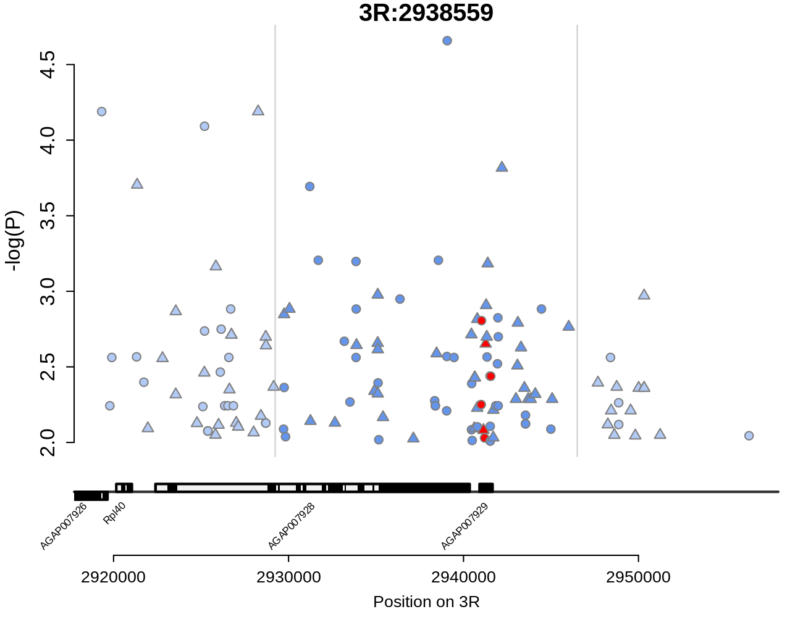

&nbsp;

&nbsp;

&nbsp;

#### Contingency table for cluster_1:

| &nbsp;&nbsp;&nbsp;  phenotype  &nbsp;&nbsp;&nbsp; |  &nbsp;&nbsp;&nbsp;  wt  &nbsp;&nbsp;&nbsp;  |  &nbsp;&nbsp;&nbsp;  het  &nbsp;&nbsp;&nbsp;  |  &nbsp;&nbsp;&nbsp;  hom  &nbsp;&nbsp;&nbsp;  |
| :---:     | :---: | :---: | :---: |
|  alive    | 24 | 26 | 7 |
|  dead     | 7 | 27 | 14 |

&nbsp;

___

## Madina\_*gambiae*\_PM

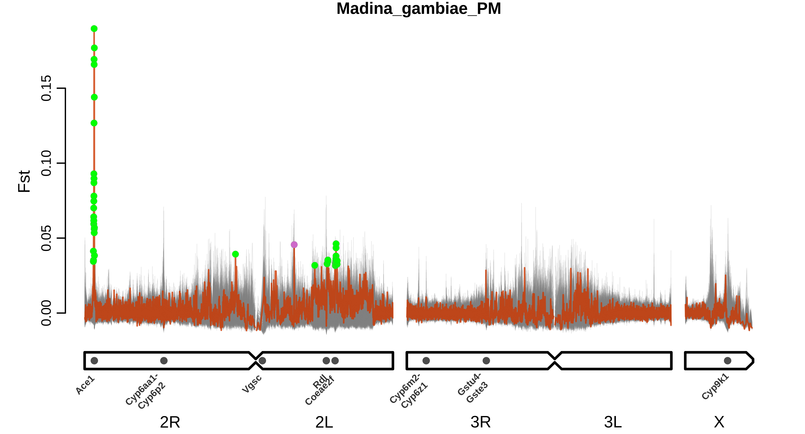

&nbsp;

[Madina_gambiae_PM_2R:54255612-54278008](#madina_gambiae_pm_2r_54255612-54278008)  

### Madina_gambiae_PM_2R_54255612-54278008

&nbsp;

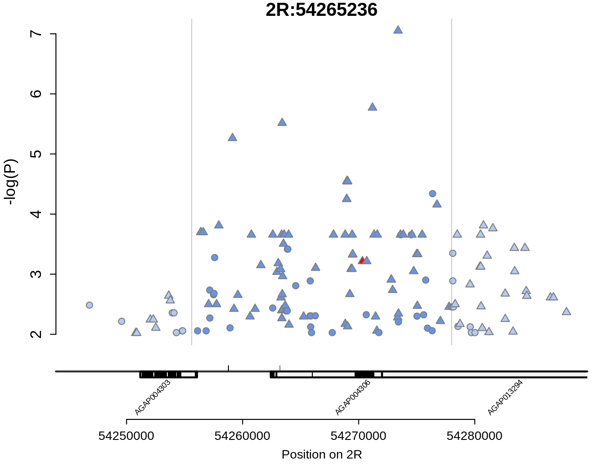

&nbsp;

&nbsp;

&nbsp;

#### Contingency table for cluster_1:

| &nbsp;&nbsp;&nbsp;  phenotype  &nbsp;&nbsp;&nbsp; |  &nbsp;&nbsp;&nbsp;  wt  &nbsp;&nbsp;&nbsp;  |  &nbsp;&nbsp;&nbsp;  het  &nbsp;&nbsp;&nbsp;  |  &nbsp;&nbsp;&nbsp;  hom  &nbsp;&nbsp;&nbsp;  |
| :---:     | :---: | :---: | :---: |
|  alive    | 31 | 7 | 0 |
|  dead     | 14 | 12 | 1 |

&nbsp;

___

## Obuasi\_*gambiae*\_PM

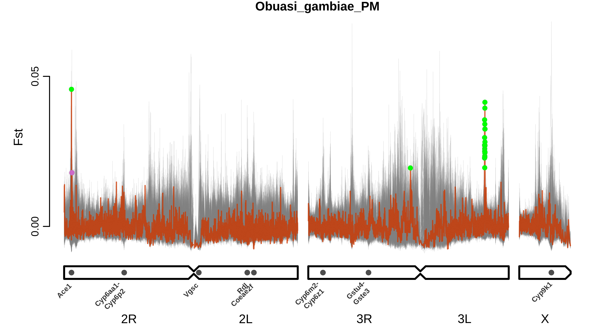

&nbsp;

[Obuasi_gambiae_PM_2R:3474360-3509400](#obuasi_gambiae_pm_2r_3474360-3509400)  
[Obuasi_gambiae_PM_3L:30477135-30487616](#obuasi_gambiae_pm_3l_30477135-30487616)  
[Obuasi_gambiae_PM_3L:30487615-30497759](#obuasi_gambiae_pm_3l_30487615-30497759)  
[Obuasi_gambiae_PM_3L:30497758-30506894](#obuasi_gambiae_pm_3l_30497758-30506894)  
[Obuasi_gambiae_PM_3L:30506893-30516797](#obuasi_gambiae_pm_3l_30506893-30516797)  
[Obuasi_gambiae_PM_3L:30534828-30545854](#obuasi_gambiae_pm_3l_30534828-30545854)  
[Obuasi_gambiae_PM_3L:30554459-30562573](#obuasi_gambiae_pm_3l_30554459-30562573)  
[Obuasi_gambiae_PM_3L:30562572-30578511](#obuasi_gambiae_pm_3l_30562572-30578511)  
[Obuasi_gambiae_PM_3L:30578511-30587941](#obuasi_gambiae_pm_3l_30578511-30587941)  
[Obuasi_gambiae_PM_3L:30587941-30597762](#obuasi_gambiae_pm_3l_30587941-30597762)  
[Obuasi_gambiae_PM_3L:30597761-30607138](#obuasi_gambiae_pm_3l_30597761-30607138)  
[Obuasi_gambiae_PM_3L:30607137-30617085](#obuasi_gambiae_pm_3l_30607137-30617085)  
[Obuasi_gambiae_PM_3L:30617085-30624950](#obuasi_gambiae_pm_3l_30617085-30624950)  
[Obuasi_gambiae_PM_3L:30624949-30635698](#obuasi_gambiae_pm_3l_30624949-30635698)  
[Obuasi_gambiae_PM_3L:30635698-30646602](#obuasi_gambiae_pm_3l_30635698-30646602)  
[Obuasi_gambiae_PM_3L:30646601-30657763](#obuasi_gambiae_pm_3l_30646601-30657763)  
[Obuasi_gambiae_PM_3L:30657762-30667355](#obuasi_gambiae_pm_3l_30657762-30667355)  
[Obuasi_gambiae_PM_3L:30667355-30678119](#obuasi_gambiae_pm_3l_30667355-30678119)  
[Obuasi_gambiae_PM_3L:30678119-30687769](#obuasi_gambiae_pm_3l_30678119-30687769)  
[Obuasi_gambiae_PM_3L:30687769-30697180](#obuasi_gambiae_pm_3l_30687769-30697180)  
[Obuasi_gambiae_PM_3R:48454456-48494640](#obuasi_gambiae_pm_3r_48454456-48494640)  

### Obuasi_gambiae_PM_2R_3474360-3509400

&nbsp;

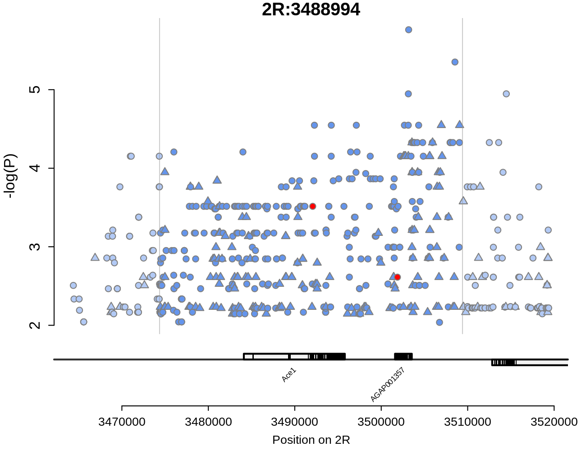

&nbsp;

&nbsp;

&nbsp;

#### Contingency table for cluster_1:

| &nbsp;&nbsp;&nbsp;  phenotype  &nbsp;&nbsp;&nbsp; |  &nbsp;&nbsp;&nbsp;  wt  &nbsp;&nbsp;&nbsp;  |  &nbsp;&nbsp;&nbsp;  het  &nbsp;&nbsp;&nbsp;  |  &nbsp;&nbsp;&nbsp;  hom  &nbsp;&nbsp;&nbsp;  |
| :---:     | :---: | :---: | :---: |
|  alive    | 1 | 2 | 51 |
|  dead     | 1 | 16 | 33 |

&nbsp;

### Obuasi_gambiae_PM_3L_30477135-30487616

&nbsp;

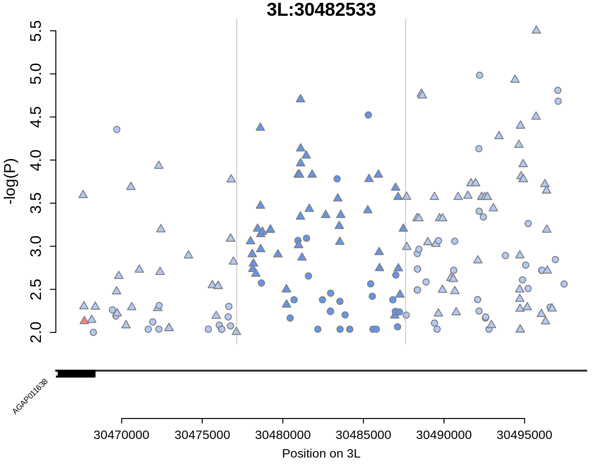

&nbsp;

&nbsp;

&nbsp;

#### Contingency table for cluster_1:

| &nbsp;&nbsp;&nbsp;  phenotype  &nbsp;&nbsp;&nbsp; |  &nbsp;&nbsp;&nbsp;  wt  &nbsp;&nbsp;&nbsp;  |  &nbsp;&nbsp;&nbsp;  het  &nbsp;&nbsp;&nbsp;  |  &nbsp;&nbsp;&nbsp;  hom  &nbsp;&nbsp;&nbsp;  |
| :---:     | :---: | :---: | :---: |
|  alive    | 37 | 16 | 1 |
|  dead     | 17 | 28 | 5 |

&nbsp;

### Obuasi_gambiae_PM_3L_30487615-30497759

&nbsp;

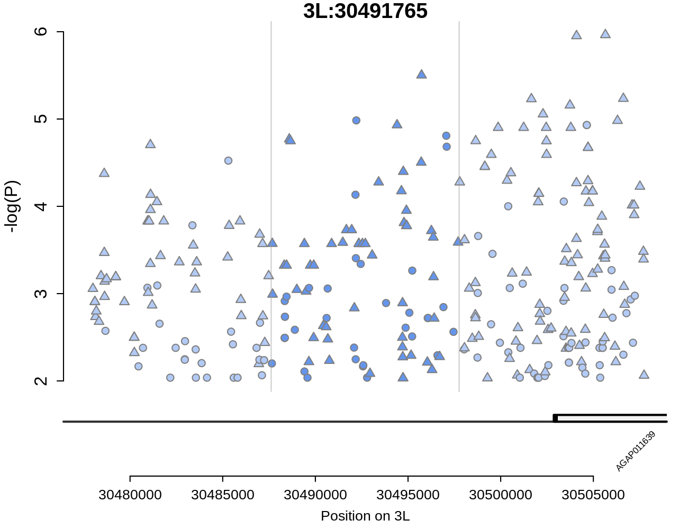

&nbsp;

&nbsp;

&nbsp;

#### Contingency table for cluster_1:

| &nbsp;&nbsp;&nbsp;  phenotype  &nbsp;&nbsp;&nbsp; |  &nbsp;&nbsp;&nbsp;  wt  &nbsp;&nbsp;&nbsp;  |  &nbsp;&nbsp;&nbsp;  het  &nbsp;&nbsp;&nbsp;  |  &nbsp;&nbsp;&nbsp;  hom  &nbsp;&nbsp;&nbsp;  |
| :---:     | :---: | :---: | :---: |
|  alive    | 33 | 20 | 1 |
|  dead     | 14 | 29 | 7 |

&nbsp;

### Obuasi_gambiae_PM_3L_30497758-30506894

&nbsp;

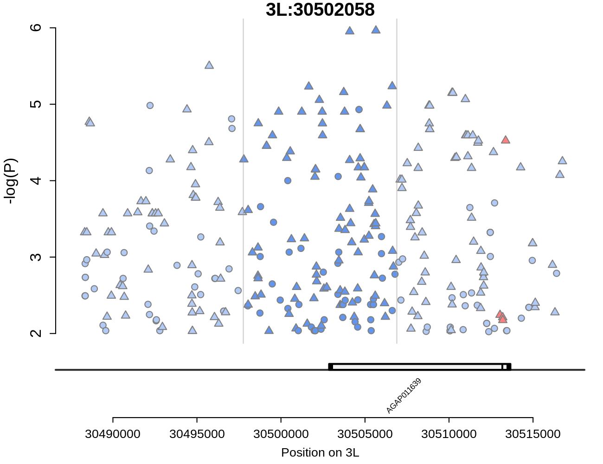

&nbsp;

&nbsp;

&nbsp;

#### Contingency table for cluster_1:

| &nbsp;&nbsp;&nbsp;  phenotype  &nbsp;&nbsp;&nbsp; |  &nbsp;&nbsp;&nbsp;  wt  &nbsp;&nbsp;&nbsp;  |  &nbsp;&nbsp;&nbsp;  het  &nbsp;&nbsp;&nbsp;  |  &nbsp;&nbsp;&nbsp;  hom  &nbsp;&nbsp;&nbsp;  |
| :---:     | :---: | :---: | :---: |
|  alive    | 36 | 17 | 1 |
|  dead     | 13 | 31 | 6 |

&nbsp;

### Obuasi_gambiae_PM_3L_30506893-30516797

&nbsp;

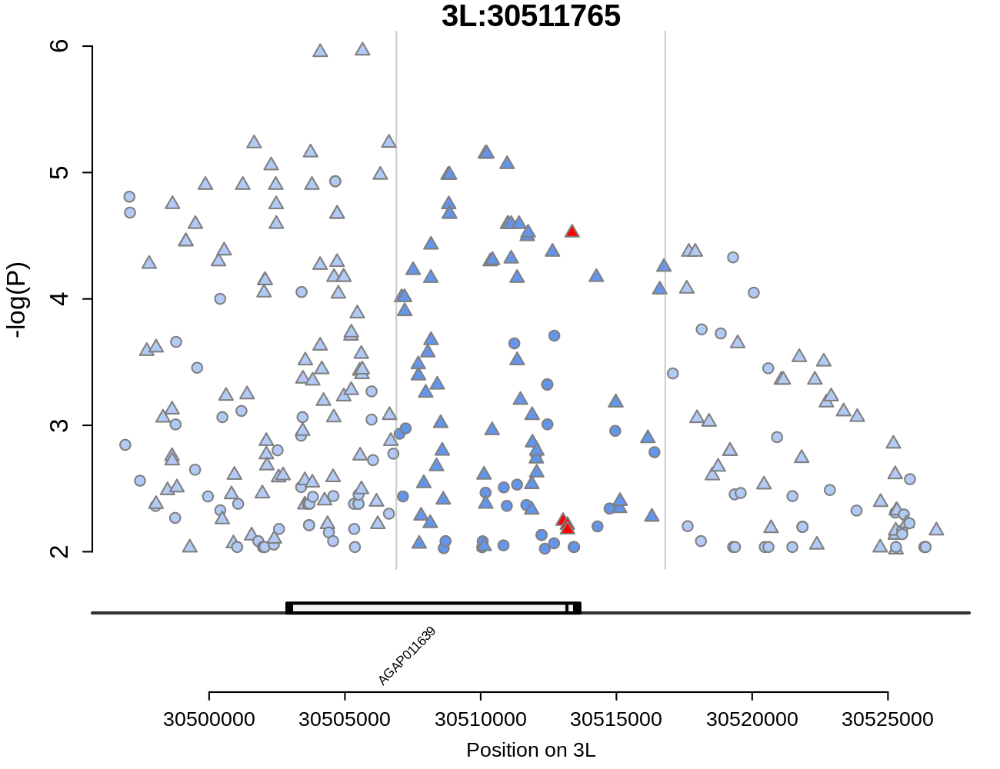

&nbsp;

&nbsp;

&nbsp;

#### Contingency table for cluster_1:

| &nbsp;&nbsp;&nbsp;  phenotype  &nbsp;&nbsp;&nbsp; |  &nbsp;&nbsp;&nbsp;  wt  &nbsp;&nbsp;&nbsp;  |  &nbsp;&nbsp;&nbsp;  het  &nbsp;&nbsp;&nbsp;  |  &nbsp;&nbsp;&nbsp;  hom  &nbsp;&nbsp;&nbsp;  |
| :---:     | :---: | :---: | :---: |
|  alive    | 35 | 19 | 0 |
|  dead     | 15 | 29 | 6 |

&nbsp;

### Obuasi_gambiae_PM_3L_30534828-30545854

&nbsp;

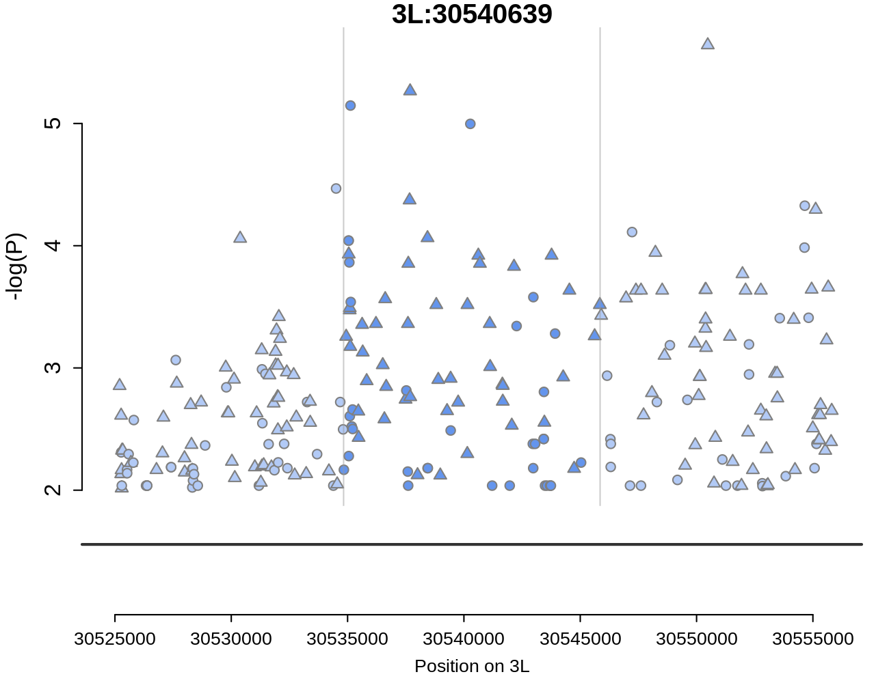

&nbsp;

&nbsp;

&nbsp;

#### Contingency table for cluster_1:

| &nbsp;&nbsp;&nbsp;  phenotype  &nbsp;&nbsp;&nbsp; |  &nbsp;&nbsp;&nbsp;  wt  &nbsp;&nbsp;&nbsp;  |  &nbsp;&nbsp;&nbsp;  het  &nbsp;&nbsp;&nbsp;  |  &nbsp;&nbsp;&nbsp;  hom  &nbsp;&nbsp;&nbsp;  |
| :---:     | :---: | :---: | :---: |
|  alive    | 35 | 18 | 1 |
|  dead     | 15 | 31 | 4 |

&nbsp;

### Obuasi_gambiae_PM_3L_30554459-30562573

&nbsp;

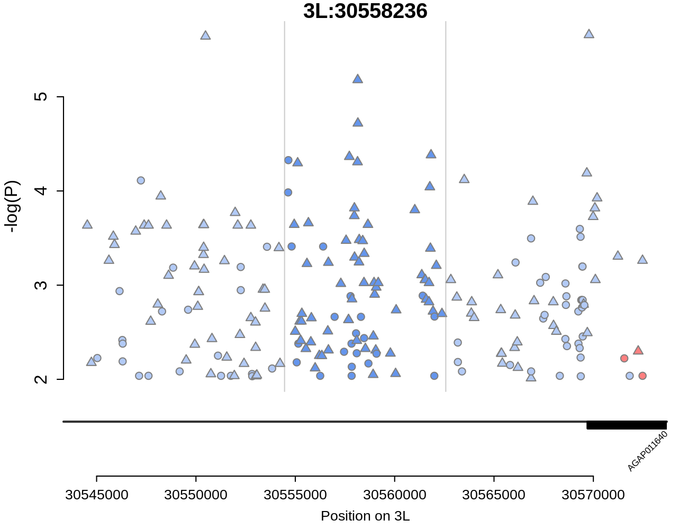

&nbsp;

&nbsp;

&nbsp;

#### Contingency table for cluster_1:

| &nbsp;&nbsp;&nbsp;  phenotype  &nbsp;&nbsp;&nbsp; |  &nbsp;&nbsp;&nbsp;  wt  &nbsp;&nbsp;&nbsp;  |  &nbsp;&nbsp;&nbsp;  het  &nbsp;&nbsp;&nbsp;  |  &nbsp;&nbsp;&nbsp;  hom  &nbsp;&nbsp;&nbsp;  |
| :---:     | :---: | :---: | :---: |
|  alive    | 36 | 17 | 1 |
|  dead     | 16 | 29 | 5 |

&nbsp;

### Obuasi_gambiae_PM_3L_30562572-30578511

&nbsp;

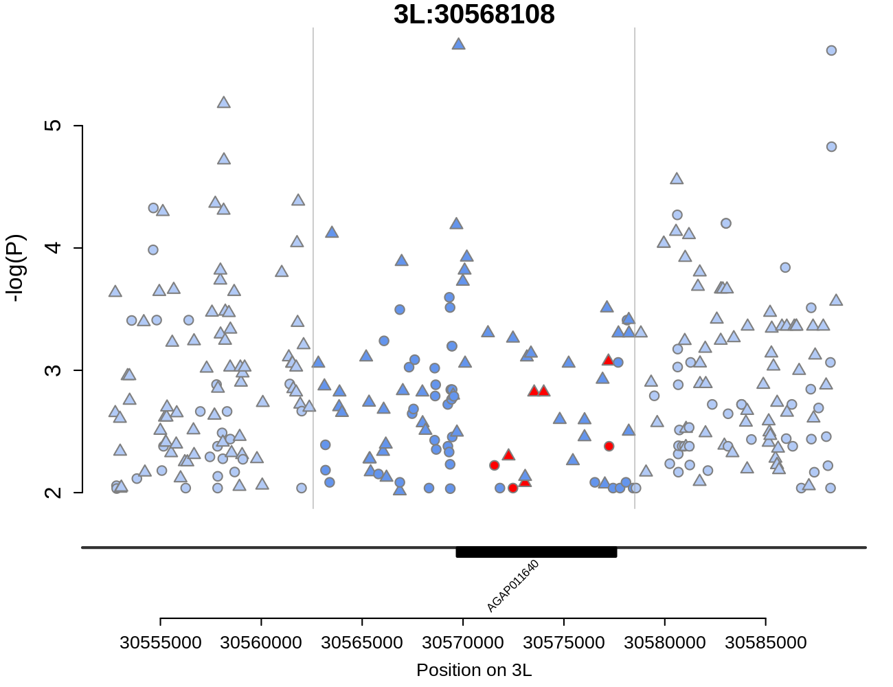

&nbsp;

&nbsp;

&nbsp;

#### Contingency table for cluster_1:

| &nbsp;&nbsp;&nbsp;  phenotype  &nbsp;&nbsp;&nbsp; |  &nbsp;&nbsp;&nbsp;  wt  &nbsp;&nbsp;&nbsp;  |  &nbsp;&nbsp;&nbsp;  het  &nbsp;&nbsp;&nbsp;  |  &nbsp;&nbsp;&nbsp;  hom  &nbsp;&nbsp;&nbsp;  |
| :---:     | :---: | :---: | :---: |
|  alive    | 36 | 16 | 2 |
|  dead     | 16 | 29 | 5 |

&nbsp;

### Obuasi_gambiae_PM_3L_30578511-30587941

&nbsp;

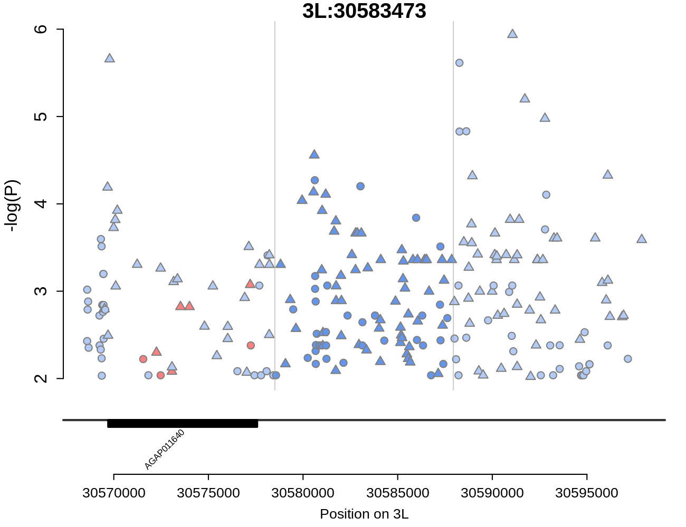

&nbsp;

&nbsp;

&nbsp;

#### Contingency table for cluster_1:

| &nbsp;&nbsp;&nbsp;  phenotype  &nbsp;&nbsp;&nbsp; |  &nbsp;&nbsp;&nbsp;  wt  &nbsp;&nbsp;&nbsp;  |  &nbsp;&nbsp;&nbsp;  het  &nbsp;&nbsp;&nbsp;  |  &nbsp;&nbsp;&nbsp;  hom  &nbsp;&nbsp;&nbsp;  |
| :---:     | :---: | :---: | :---: |
|  alive    | 35 | 17 | 2 |
|  dead     | 15 | 28 | 7 |

&nbsp;

### Obuasi_gambiae_PM_3L_30587941-30597762

&nbsp;

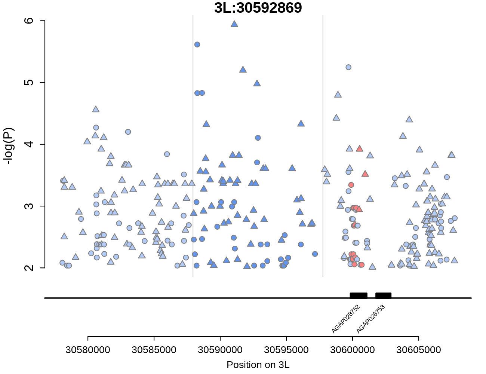

&nbsp;

&nbsp;

&nbsp;

#### Contingency table for cluster_1:

| &nbsp;&nbsp;&nbsp;  phenotype  &nbsp;&nbsp;&nbsp; |  &nbsp;&nbsp;&nbsp;  wt  &nbsp;&nbsp;&nbsp;  |  &nbsp;&nbsp;&nbsp;  het  &nbsp;&nbsp;&nbsp;  |  &nbsp;&nbsp;&nbsp;  hom  &nbsp;&nbsp;&nbsp;  |
| :---:     | :---: | :---: | :---: |
|  alive    | 35 | 17 | 2 |
|  dead     | 15 | 28 | 7 |

&nbsp;

### Obuasi_gambiae_PM_3L_30597761-30607138

&nbsp;

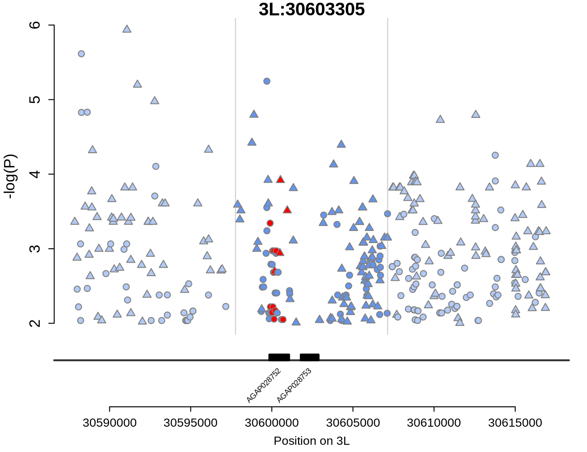

&nbsp;

&nbsp;

&nbsp;

#### Contingency table for cluster_1:

| &nbsp;&nbsp;&nbsp;  phenotype  &nbsp;&nbsp;&nbsp; |  &nbsp;&nbsp;&nbsp;  wt  &nbsp;&nbsp;&nbsp;  |  &nbsp;&nbsp;&nbsp;  het  &nbsp;&nbsp;&nbsp;  |  &nbsp;&nbsp;&nbsp;  hom  &nbsp;&nbsp;&nbsp;  |
| :---:     | :---: | :---: | :---: |
|  alive    | 35 | 17 | 2 |
|  dead     | 15 | 28 | 7 |

&nbsp;

### Obuasi_gambiae_PM_3L_30607137-30617085

&nbsp;

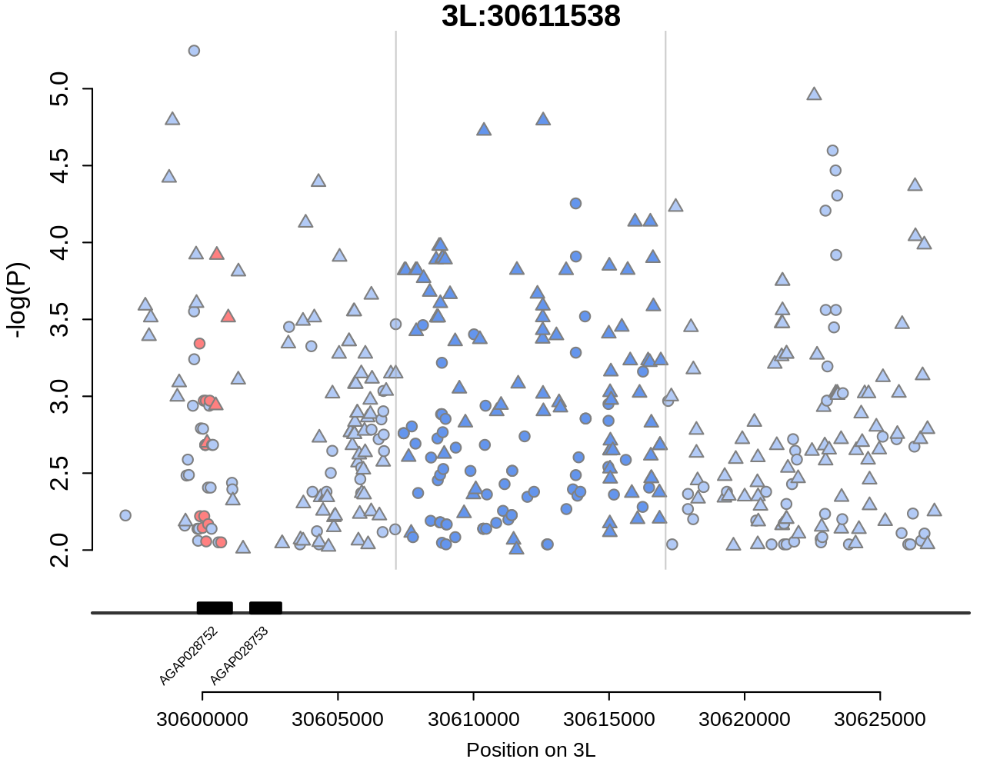

&nbsp;

&nbsp;

&nbsp;

#### Contingency table for cluster_1:

| &nbsp;&nbsp;&nbsp;  phenotype  &nbsp;&nbsp;&nbsp; |  &nbsp;&nbsp;&nbsp;  wt  &nbsp;&nbsp;&nbsp;  |  &nbsp;&nbsp;&nbsp;  het  &nbsp;&nbsp;&nbsp;  |  &nbsp;&nbsp;&nbsp;  hom  &nbsp;&nbsp;&nbsp;  |
| :---:     | :---: | :---: | :---: |
|  alive    | 34 | 18 | 2 |
|  dead     | 15 | 27 | 8 |

&nbsp;

### Obuasi_gambiae_PM_3L_30617085-30624950

&nbsp;

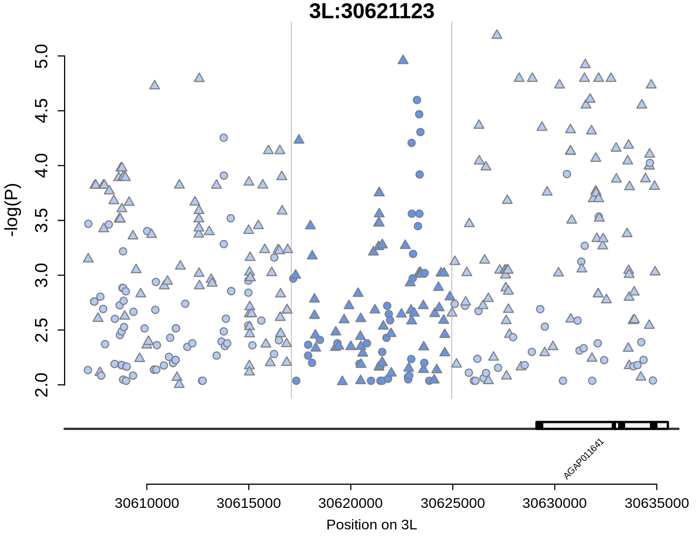

&nbsp;

&nbsp;

&nbsp;

#### Contingency table for cluster_1:

| &nbsp;&nbsp;&nbsp;  phenotype  &nbsp;&nbsp;&nbsp; |  &nbsp;&nbsp;&nbsp;  wt  &nbsp;&nbsp;&nbsp;  |  &nbsp;&nbsp;&nbsp;  het  &nbsp;&nbsp;&nbsp;  |  &nbsp;&nbsp;&nbsp;  hom  &nbsp;&nbsp;&nbsp;  |
| :---:     | :---: | :---: | :---: |
|  alive    | 33 | 18 | 3 |
|  dead     | 15 | 25 | 10 |

&nbsp;

### Obuasi_gambiae_PM_3L_30624949-30635698

&nbsp;

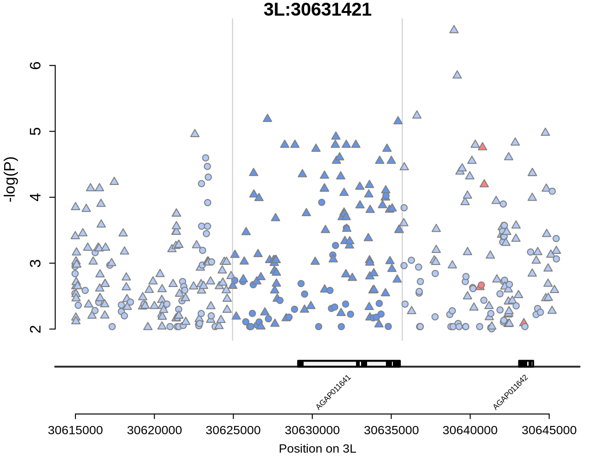

&nbsp;

&nbsp;

&nbsp;

#### Contingency table for cluster_1:

| &nbsp;&nbsp;&nbsp;  phenotype  &nbsp;&nbsp;&nbsp; |  &nbsp;&nbsp;&nbsp;  wt  &nbsp;&nbsp;&nbsp;  |  &nbsp;&nbsp;&nbsp;  het  &nbsp;&nbsp;&nbsp;  |  &nbsp;&nbsp;&nbsp;  hom  &nbsp;&nbsp;&nbsp;  |
| :---:     | :---: | :---: | :---: |
|  alive    | 30 | 21 | 3 |
|  dead     | 10 | 28 | 12 |

&nbsp;

### Obuasi_gambiae_PM_3L_30635698-30646602

&nbsp;

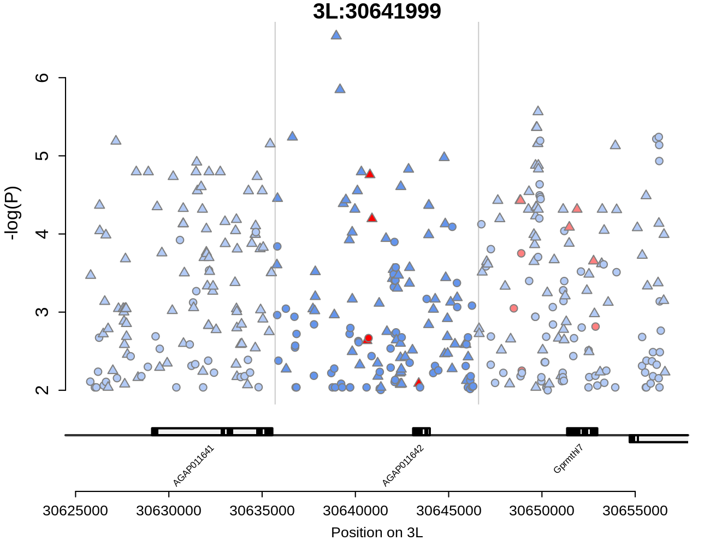

&nbsp;

&nbsp;

&nbsp;

#### Contingency table for cluster_1:

| &nbsp;&nbsp;&nbsp;  phenotype  &nbsp;&nbsp;&nbsp; |  &nbsp;&nbsp;&nbsp;  wt  &nbsp;&nbsp;&nbsp;  |  &nbsp;&nbsp;&nbsp;  het  &nbsp;&nbsp;&nbsp;  |  &nbsp;&nbsp;&nbsp;  hom  &nbsp;&nbsp;&nbsp;  |
| :---:     | :---: | :---: | :---: |
|  alive    | 30 | 21 | 3 |
|  dead     | 10 | 28 | 12 |

&nbsp;

### Obuasi_gambiae_PM_3L_30646601-30657763

&nbsp;

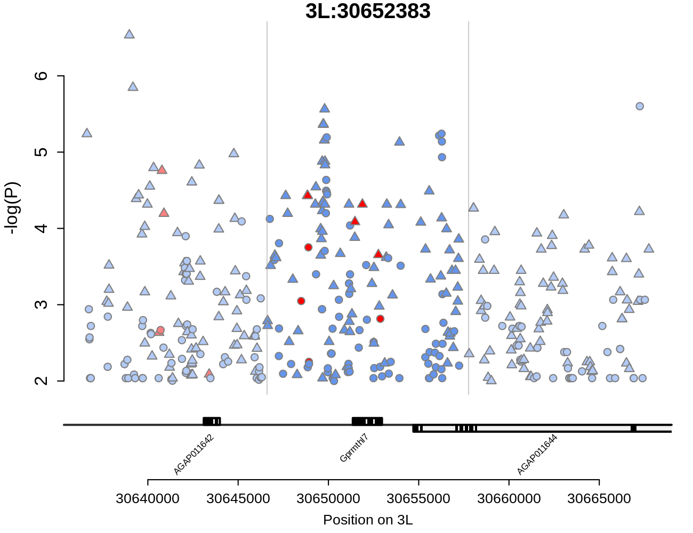

&nbsp;

&nbsp;

&nbsp;

#### Contingency table for cluster_1:

| &nbsp;&nbsp;&nbsp;  phenotype  &nbsp;&nbsp;&nbsp; |  &nbsp;&nbsp;&nbsp;  wt  &nbsp;&nbsp;&nbsp;  |  &nbsp;&nbsp;&nbsp;  het  &nbsp;&nbsp;&nbsp;  |  &nbsp;&nbsp;&nbsp;  hom  &nbsp;&nbsp;&nbsp;  |
| :---:     | :---: | :---: | :---: |
|  alive    | 28 | 24 | 2 |
|  dead     | 11 | 29 | 10 |

&nbsp;

### Obuasi_gambiae_PM_3L_30657762-30667355

&nbsp;

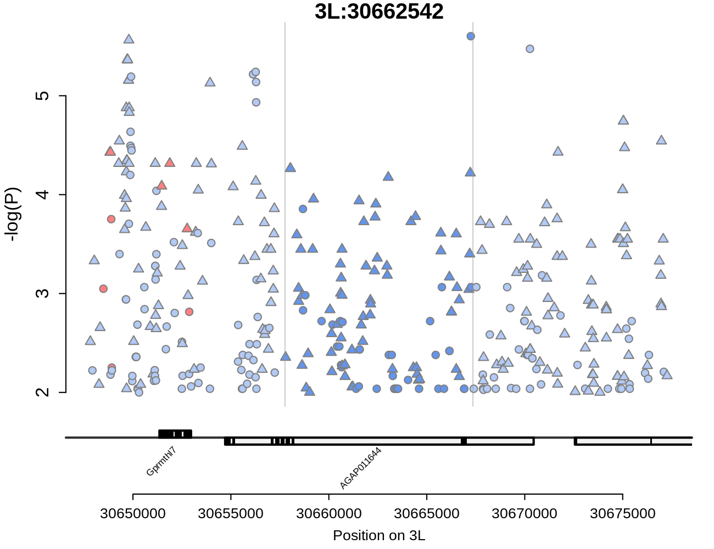

&nbsp;

&nbsp;

&nbsp;

#### Contingency table for cluster_1:

| &nbsp;&nbsp;&nbsp;  phenotype  &nbsp;&nbsp;&nbsp; |  &nbsp;&nbsp;&nbsp;  wt  &nbsp;&nbsp;&nbsp;  |  &nbsp;&nbsp;&nbsp;  het  &nbsp;&nbsp;&nbsp;  |  &nbsp;&nbsp;&nbsp;  hom  &nbsp;&nbsp;&nbsp;  |
| :---:     | :---: | :---: | :---: |
|  alive    | 28 | 24 | 2 |
|  dead     | 11 | 30 | 9 |

&nbsp;

### Obuasi_gambiae_PM_3L_30667355-30678119

&nbsp;

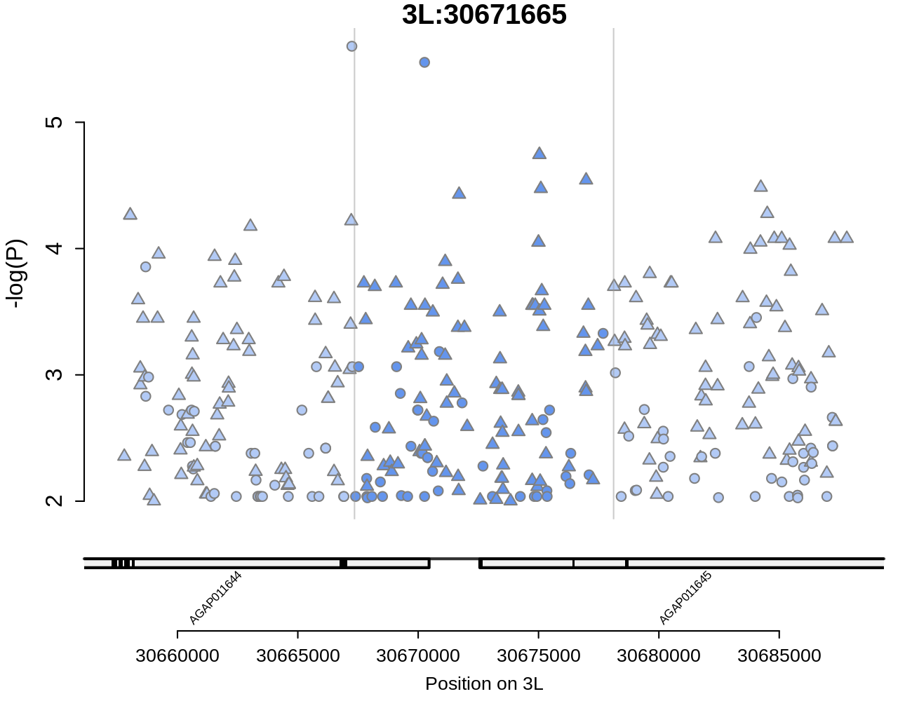

&nbsp;

&nbsp;

&nbsp;

#### Contingency table for cluster_1:

| &nbsp;&nbsp;&nbsp;  phenotype  &nbsp;&nbsp;&nbsp; |  &nbsp;&nbsp;&nbsp;  wt  &nbsp;&nbsp;&nbsp;  |  &nbsp;&nbsp;&nbsp;  het  &nbsp;&nbsp;&nbsp;  |  &nbsp;&nbsp;&nbsp;  hom  &nbsp;&nbsp;&nbsp;  |
| :---:     | :---: | :---: | :---: |
|  alive    | 27 | 25 | 2 |
|  dead     | 10 | 31 | 9 |

&nbsp;

### Obuasi_gambiae_PM_3L_30678119-30687769

&nbsp;

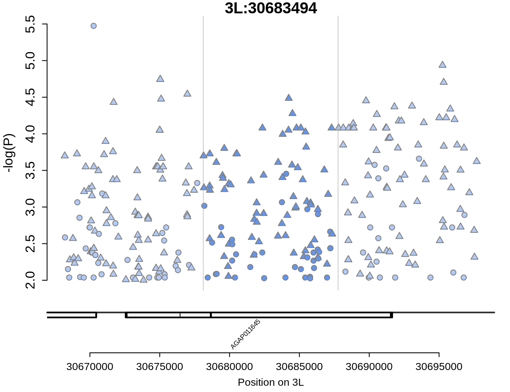

&nbsp;

&nbsp;

&nbsp;

#### Contingency table for cluster_1:

| &nbsp;&nbsp;&nbsp;  phenotype  &nbsp;&nbsp;&nbsp; |  &nbsp;&nbsp;&nbsp;  wt  &nbsp;&nbsp;&nbsp;  |  &nbsp;&nbsp;&nbsp;  het  &nbsp;&nbsp;&nbsp;  |  &nbsp;&nbsp;&nbsp;  hom  &nbsp;&nbsp;&nbsp;  |
| :---:     | :---: | :---: | :---: |
|  alive    | 26 | 26 | 2 |
|  dead     | 11 | 29 | 10 |

&nbsp;

### Obuasi_gambiae_PM_3L_30687769-30697180

&nbsp;

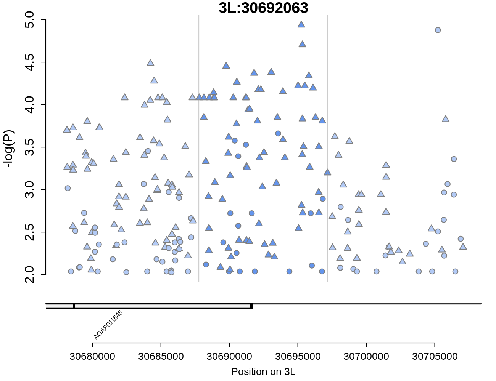

&nbsp;

&nbsp;

&nbsp;

#### Contingency table for cluster_1:

| &nbsp;&nbsp;&nbsp;  phenotype  &nbsp;&nbsp;&nbsp; |  &nbsp;&nbsp;&nbsp;  wt  &nbsp;&nbsp;&nbsp;  |  &nbsp;&nbsp;&nbsp;  het  &nbsp;&nbsp;&nbsp;  |  &nbsp;&nbsp;&nbsp;  hom  &nbsp;&nbsp;&nbsp;  |
| :---:     | :---: | :---: | :---: |
|  alive    | 26 | 26 | 2 |
|  dead     | 9 | 30 | 11 |

&nbsp;

### Obuasi_gambiae_PM_3R_48454456-48494640

&nbsp;

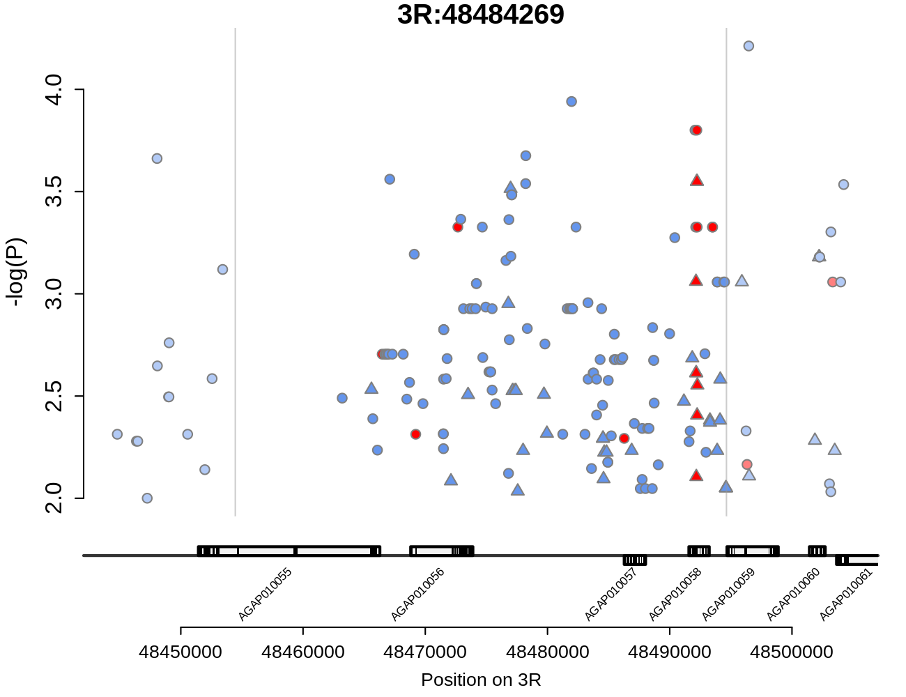

&nbsp;

&nbsp;

&nbsp;

#### Contingency table for cluster_1:

| &nbsp;&nbsp;&nbsp;  phenotype  &nbsp;&nbsp;&nbsp; |  &nbsp;&nbsp;&nbsp;  wt  &nbsp;&nbsp;&nbsp;  |  &nbsp;&nbsp;&nbsp;  het  &nbsp;&nbsp;&nbsp;  |  &nbsp;&nbsp;&nbsp;  hom  &nbsp;&nbsp;&nbsp;  |
| :---:     | :---: | :---: | :---: |
|  alive    | 24 | 24 | 6 |
|  dead     | 39 | 9 | 2 |

&nbsp;

#### Contingency table for cluster_2:

| &nbsp;&nbsp;&nbsp;  phenotype  &nbsp;&nbsp;&nbsp; |  &nbsp;&nbsp;&nbsp;  wt  &nbsp;&nbsp;&nbsp;  |  &nbsp;&nbsp;&nbsp;  het  &nbsp;&nbsp;&nbsp;  |  &nbsp;&nbsp;&nbsp;  hom  &nbsp;&nbsp;&nbsp;  |
| :---:     | :---: | :---: | :---: |
|  alive    | 43 | 10 | 1 |
|  dead     | 38 | 9 | 3 |

&nbsp;

#### Contingency table for cluster_3:

| &nbsp;&nbsp;&nbsp;  phenotype  &nbsp;&nbsp;&nbsp; |  &nbsp;&nbsp;&nbsp;  wt  &nbsp;&nbsp;&nbsp;  |  &nbsp;&nbsp;&nbsp;  het  &nbsp;&nbsp;&nbsp;  |  &nbsp;&nbsp;&nbsp;  hom  &nbsp;&nbsp;&nbsp;  |
| :---:     | :---: | :---: | :---: |
|  alive    | 44 | 10 | 0 |
|  dead     | 39 | 10 | 1 |

&nbsp;

___

