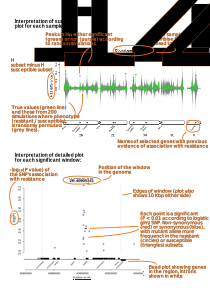
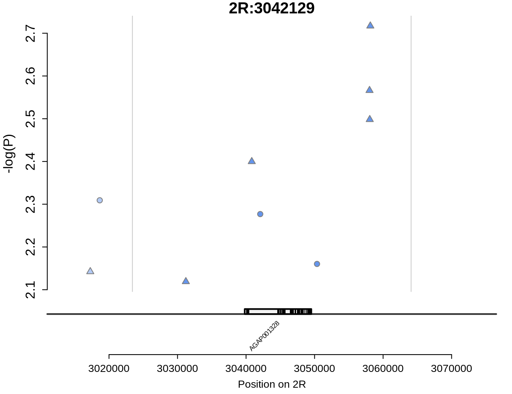
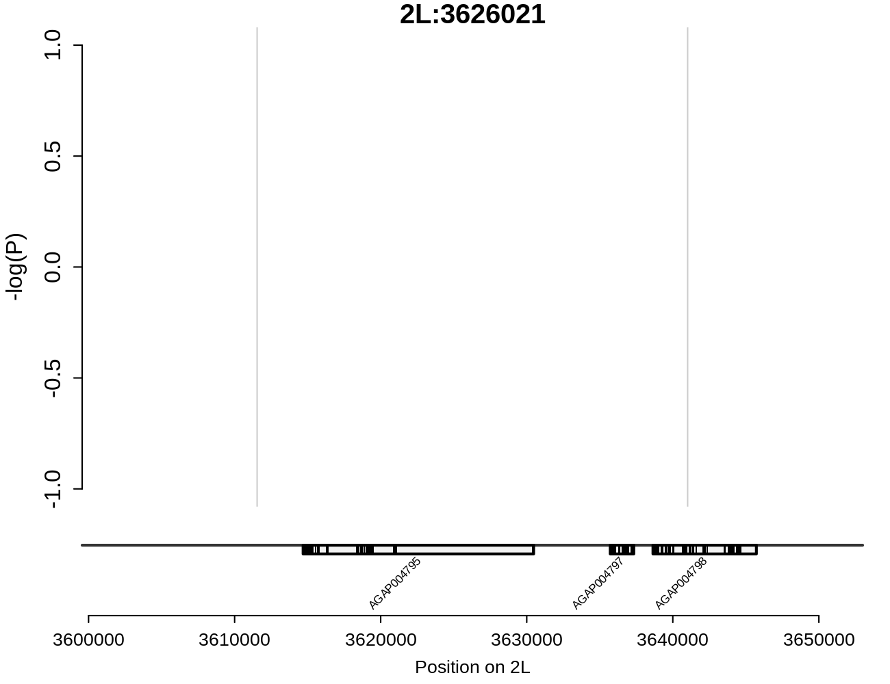
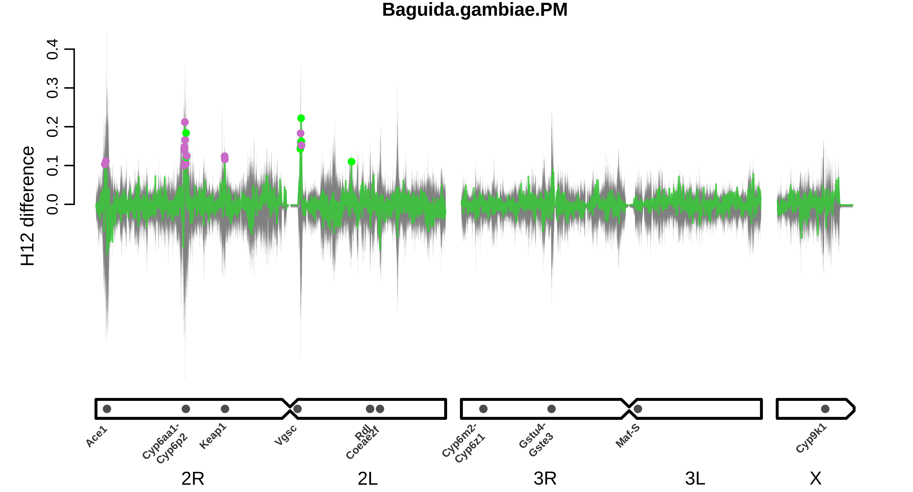
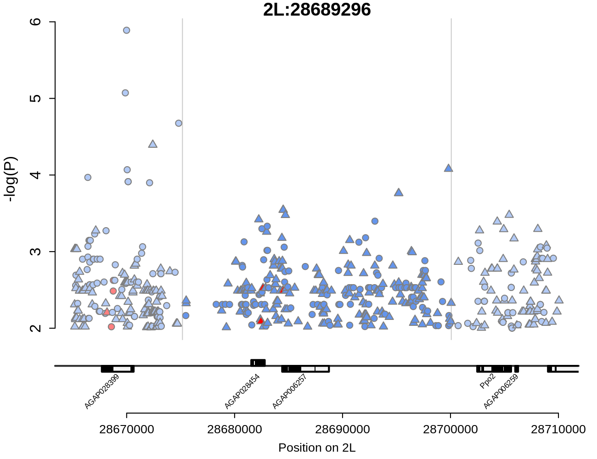
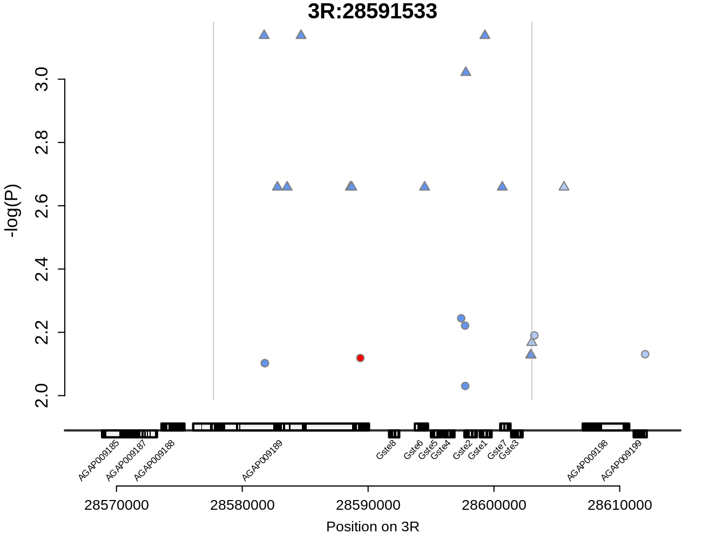

# H12 windows of interest

For each sample set, we first provide a summary plot of $\Delta$H12 (H12 in susceptible samples subtracted from that in resistant samples)  across the genome, with $\Delta$H12 shown in green and the results of the 200 randomisations shown behind in grey. Windows identified as peaks are highlighted by points, colour-coded by whether they are significantly higher than expected based on the simulations (green) or not (purple). For each significant  window (green points), we then provide its own plot showing the significant (*P* < 0.01) SNPs found in the region of that window, and their -log10(Pvalue) of association with phenotype. Red points indicate non-synonymous SNPs, blue points indicate all other SNPs. Point shape indicates whether the mutant allele at that SNP is associated with increased (circle) or decreased (triangle) resistance. Dark points in the centre of the plot show SNPs within the significant window, light points on the sides show SNPs in the region 10,000 bp either side of the window. 

[Legend](#Plot_legend)  
[Avrankou\_*coluzzii*\_Delta](#avrankou_coluzzii_delta)  
[Baguida\_*gambiae*\_Delta](#baguida_gambiae_delta)  
[Korle-Bu\_*coluzzii*\_Delta](#korle-bu_coluzzii_delta)  
[Madina\_*gambiae*\_Delta](#madina_gambiae_delta)  
[Obuasi\_*gambiae*\_Delta](#obuasi_gambiae_delta)  
[Baguida\_*gambiae*\_PM](#baguida_gambiae_pm)  
[Korle-Bu\_*coluzzii*\_PM](#korle-bu_coluzzii_pm)  
[Madina\_*gambiae*\_PM](#madina_gambiae_pm)  
[Obuasi\_*gambiae*\_PM](#obuasi_gambiae_pm)  

___

## Plot legend

<a id="Plot_legend">

___

## Avrankou\_*coluzzii*\_Delta

&nbsp;

[Avrankou_coluzzii_Delta_2L:3627850](#avrankou_coluzzii_delta_2l_3627850)  
[Avrankou_coluzzii_Delta_2L:39336219](#avrankou_coluzzii_delta_2l_39336219)  
[Avrankou_coluzzii_Delta_2L:40020139](#avrankou_coluzzii_delta_2l_40020139)  
[Avrankou_coluzzii_Delta_2R:55812794](#avrankou_coluzzii_delta_2r_55812794)  
[Avrankou_coluzzii_Delta_3R:46530542](#avrankou_coluzzii_delta_3r_46530542)  
[Avrankou_coluzzii_Delta_3R:46606399](#avrankou_coluzzii_delta_3r_46606399)  
[Avrankou_coluzzii_Delta_3R:46697535](#avrankou_coluzzii_delta_3r_46697535)  
[Avrankou_coluzzii_Delta_3R:46784988](#avrankou_coluzzii_delta_3r_46784988)  
[Avrankou_coluzzii_Delta_3R:46831369](#avrankou_coluzzii_delta_3r_46831369)  
[Avrankou_coluzzii_Delta_3R:46856221](#avrankou_coluzzii_delta_3r_46856221)  
[Avrankou_coluzzii_Delta_3R:48501462](#avrankou_coluzzii_delta_3r_48501462)  

### Avrankou_coluzzii_Delta_2L_3627850

&nbsp;

&nbsp;

### Avrankou_coluzzii_Delta_2L_39336219

&nbsp;

&nbsp;

### Avrankou_coluzzii_Delta_2L_40020139

&nbsp;

&nbsp;

### Avrankou_coluzzii_Delta_2R_55812794

&nbsp;

&nbsp;

### Avrankou_coluzzii_Delta_3R_46530542

&nbsp;

&nbsp;

### Avrankou_coluzzii_Delta_3R_46606399

&nbsp;

&nbsp;

### Avrankou_coluzzii_Delta_3R_46697535

&nbsp;

&nbsp;

### Avrankou_coluzzii_Delta_3R_46784988

&nbsp;

&nbsp;

### Avrankou_coluzzii_Delta_3R_46831369

&nbsp;

&nbsp;

### Avrankou_coluzzii_Delta_3R_46856221

&nbsp;

&nbsp;

### Avrankou_coluzzii_Delta_3R_48501462

&nbsp;

&nbsp;

___

## Baguida\_*gambiae*\_Delta

&nbsp;

[Baguida_gambiae_Delta_2L:20037401](#baguida_gambiae_delta_2l_20037401)  
[Baguida_gambiae_Delta_2R:3042129](#baguida_gambiae_delta_2r_3042129)  
[Baguida_gambiae_Delta_2R:3519707](#baguida_gambiae_delta_2r_3519707)  

### Baguida_gambiae_Delta_2L_20037401

&nbsp;

&nbsp;

### Baguida_gambiae_Delta_2R_3042129

&nbsp;

&nbsp;

### Baguida_gambiae_Delta_2R_3519707

&nbsp;

&nbsp;

___

## Korle-Bu\_*coluzzii*\_Delta

&nbsp;

[Korle-Bu_coluzzii_Delta_2R:28546290](#korle-bu_coluzzii_delta_2r_28546290)  
[Korle-Bu_coluzzii_Delta_2R:54064272](#korle-bu_coluzzii_delta_2r_54064272)  
[Korle-Bu_coluzzii_Delta_3R:4030785](#korle-bu_coluzzii_delta_3r_4030785)  
[Korle-Bu_coluzzii_Delta_X:15661082](#korle-bu_coluzzii_delta_x_15661082)  

### Korle-Bu_coluzzii_Delta_2R_28546290

&nbsp;

&nbsp;

### Korle-Bu_coluzzii_Delta_2R_54064272

&nbsp;

&nbsp;

### Korle-Bu_coluzzii_Delta_3R_4030785

&nbsp;

&nbsp;

### Korle-Bu_coluzzii_Delta_X_15661082

&nbsp;

&nbsp;

___

## Madina\_*gambiae*\_Delta

&nbsp;

[Madina_gambiae_Delta_2L:14217696](#madina_gambiae_delta_2l_14217696)  
[Madina_gambiae_Delta_2L:14284997](#madina_gambiae_delta_2l_14284997)  
[Madina_gambiae_Delta_2L:27986348](#madina_gambiae_delta_2l_27986348)  
[Madina_gambiae_Delta_2L:28023911](#madina_gambiae_delta_2l_28023911)  
[Madina_gambiae_Delta_2L:28093738](#madina_gambiae_delta_2l_28093738)  
[Madina_gambiae_Delta_2L:28110739](#madina_gambiae_delta_2l_28110739)  
[Madina_gambiae_Delta_2L:28130562](#madina_gambiae_delta_2l_28130562)  
[Madina_gambiae_Delta_2L:28174232](#madina_gambiae_delta_2l_28174232)  
[Madina_gambiae_Delta_2L:31419497](#madina_gambiae_delta_2l_31419497)  
[Madina_gambiae_Delta_2L:3246748](#madina_gambiae_delta_2l_3246748)  
[Madina_gambiae_Delta_2L:3287434](#madina_gambiae_delta_2l_3287434)  
[Madina_gambiae_Delta_2L:3626021](#madina_gambiae_delta_2l_3626021)  
[Madina_gambiae_Delta_X:14215545](#madina_gambiae_delta_x_14215545)  

### Madina_gambiae_Delta_2L_14217696

&nbsp;

&nbsp;

### Madina_gambiae_Delta_2L_14284997

&nbsp;

&nbsp;

### Madina_gambiae_Delta_2L_27986348

&nbsp;

&nbsp;

### Madina_gambiae_Delta_2L_28023911

&nbsp;

&nbsp;

### Madina_gambiae_Delta_2L_28093738

&nbsp;

&nbsp;

### Madina_gambiae_Delta_2L_28110739

&nbsp;

&nbsp;

### Madina_gambiae_Delta_2L_28130562

&nbsp;

&nbsp;

### Madina_gambiae_Delta_2L_28174232

&nbsp;

&nbsp;

### Madina_gambiae_Delta_2L_31419497

&nbsp;

&nbsp;

### Madina_gambiae_Delta_2L_3246748

&nbsp;

&nbsp;

### Madina_gambiae_Delta_2L_3287434

&nbsp;

&nbsp;

### Madina_gambiae_Delta_2L_3626021

&nbsp;

&nbsp;

### Madina_gambiae_Delta_X_14215545

&nbsp;

&nbsp;

___

## Obuasi\_*gambiae*\_Delta

&nbsp;

[Obuasi_gambiae_Delta_2L:25666039](#obuasi_gambiae_delta_2l_25666039)  
[Obuasi_gambiae_Delta_2L:47246666](#obuasi_gambiae_delta_2l_47246666)  
[Obuasi_gambiae_Delta_2R:3175305](#obuasi_gambiae_delta_2r_3175305)  
[Obuasi_gambiae_Delta_2R:40905141](#obuasi_gambiae_delta_2r_40905141)  
[Obuasi_gambiae_Delta_3R:10633692](#obuasi_gambiae_delta_3r_10633692)  
[Obuasi_gambiae_Delta_X:15939854](#obuasi_gambiae_delta_x_15939854)  

### Obuasi_gambiae_Delta_2L_25666039

&nbsp;

&nbsp;

### Obuasi_gambiae_Delta_2L_47246666

&nbsp;

&nbsp;

### Obuasi_gambiae_Delta_2R_3175305

&nbsp;

&nbsp;

### Obuasi_gambiae_Delta_2R_40905141

&nbsp;

&nbsp;

### Obuasi_gambiae_Delta_3R_10633692

&nbsp;

&nbsp;

### Obuasi_gambiae_Delta_X_15939854

&nbsp;

&nbsp;

___

## Baguida\_*gambiae*\_PM

&nbsp;

[Baguida_gambiae_PM_2L:19523767](#baguida_gambiae_pm_2l_19523767)  
[Baguida_gambiae_PM_2L:3266679](#baguida_gambiae_pm_2l_3266679)  
[Baguida_gambiae_PM_2L:3471571](#baguida_gambiae_pm_2l_3471571)  
[Baguida_gambiae_PM_2L:3517468](#baguida_gambiae_pm_2l_3517468)  
[Baguida_gambiae_PM_2L:3578649](#baguida_gambiae_pm_2l_3578649)  
[Baguida_gambiae_PM_2R:28578188](#baguida_gambiae_pm_2r_28578188)  
[Baguida_gambiae_PM_2R:28622655](#baguida_gambiae_pm_2r_28622655)  

### Baguida_gambiae_PM_2L_19523767

&nbsp;

&nbsp;

### Baguida_gambiae_PM_2L_3266679

&nbsp;

&nbsp;

### Baguida_gambiae_PM_2L_3471571

&nbsp;

&nbsp;

### Baguida_gambiae_PM_2L_3517468

&nbsp;

&nbsp;

### Baguida_gambiae_PM_2L_3578649

&nbsp;

&nbsp;

### Baguida_gambiae_PM_2R_28578188

&nbsp;

&nbsp;

### Baguida_gambiae_PM_2R_28622655

&nbsp;

&nbsp;

___

## Korle-Bu\_*coluzzii*\_PM

&nbsp;

[Korle-Bu_coluzzii_PM_2L:22237788](#korle-bu_coluzzii_pm_2l_22237788)  
[Korle-Bu_coluzzii_PM_2L:23989307](#korle-bu_coluzzii_pm_2l_23989307)  
[Korle-Bu_coluzzii_PM_2L:28414771](#korle-bu_coluzzii_pm_2l_28414771)  
[Korle-Bu_coluzzii_PM_2L:28438932](#korle-bu_coluzzii_pm_2l_28438932)  
[Korle-Bu_coluzzii_PM_2L:28561906](#korle-bu_coluzzii_pm_2l_28561906)  
[Korle-Bu_coluzzii_PM_2L:28615047](#korle-bu_coluzzii_pm_2l_28615047)  
[Korle-Bu_coluzzii_PM_2L:28641468](#korle-bu_coluzzii_pm_2l_28641468)  
[Korle-Bu_coluzzii_PM_2L:28664089](#korle-bu_coluzzii_pm_2l_28664089)  
[Korle-Bu_coluzzii_PM_2L:28689296](#korle-bu_coluzzii_pm_2l_28689296)  
[Korle-Bu_coluzzii_PM_2L:36913180](#korle-bu_coluzzii_pm_2l_36913180)  
[Korle-Bu_coluzzii_PM_2L:36939137](#korle-bu_coluzzii_pm_2l_36939137)  
[Korle-Bu_coluzzii_PM_2L:36963255](#korle-bu_coluzzii_pm_2l_36963255)  
[Korle-Bu_coluzzii_PM_2L:37011181](#korle-bu_coluzzii_pm_2l_37011181)  
[Korle-Bu_coluzzii_PM_2L:37103650](#korle-bu_coluzzii_pm_2l_37103650)  
[Korle-Bu_coluzzii_PM_2L:37142451](#korle-bu_coluzzii_pm_2l_37142451)  
[Korle-Bu_coluzzii_PM_2L:37176411](#korle-bu_coluzzii_pm_2l_37176411)  
[Korle-Bu_coluzzii_PM_2L:37570900](#korle-bu_coluzzii_pm_2l_37570900)  
[Korle-Bu_coluzzii_PM_2L:3821991](#korle-bu_coluzzii_pm_2l_3821991)  
[Korle-Bu_coluzzii_PM_3R:4253878](#korle-bu_coluzzii_pm_3r_4253878)  
[Korle-Bu_coluzzii_PM_X:15614925](#korle-bu_coluzzii_pm_x_15614925)  

### Korle-Bu_coluzzii_PM_2L_22237788

&nbsp;

&nbsp;

### Korle-Bu_coluzzii_PM_2L_23989307

&nbsp;

&nbsp;

### Korle-Bu_coluzzii_PM_2L_28414771

&nbsp;

&nbsp;

### Korle-Bu_coluzzii_PM_2L_28438932

&nbsp;

&nbsp;

### Korle-Bu_coluzzii_PM_2L_28561906

&nbsp;

&nbsp;

### Korle-Bu_coluzzii_PM_2L_28615047

&nbsp;

&nbsp;

### Korle-Bu_coluzzii_PM_2L_28641468

&nbsp;

&nbsp;

### Korle-Bu_coluzzii_PM_2L_28664089

&nbsp;

&nbsp;

### Korle-Bu_coluzzii_PM_2L_28689296

&nbsp;

&nbsp;

### Korle-Bu_coluzzii_PM_2L_36913180

&nbsp;

&nbsp;

### Korle-Bu_coluzzii_PM_2L_36939137

&nbsp;

&nbsp;

### Korle-Bu_coluzzii_PM_2L_36963255

&nbsp;

&nbsp;

### Korle-Bu_coluzzii_PM_2L_37011181

&nbsp;

&nbsp;

### Korle-Bu_coluzzii_PM_2L_37103650

&nbsp;

&nbsp;

### Korle-Bu_coluzzii_PM_2L_37142451

&nbsp;

&nbsp;

### Korle-Bu_coluzzii_PM_2L_37176411

&nbsp;

&nbsp;

### Korle-Bu_coluzzii_PM_2L_37570900

&nbsp;

&nbsp;

### Korle-Bu_coluzzii_PM_2L_3821991

&nbsp;

&nbsp;

### Korle-Bu_coluzzii_PM_3R_4253878

&nbsp;

&nbsp;

### Korle-Bu_coluzzii_PM_X_15614925

&nbsp;

&nbsp;

___

## Madina\_*gambiae*\_PM

&nbsp;

[Madina_gambiae_PM_2L:31835378](#madina_gambiae_pm_2l_31835378)  
[Madina_gambiae_PM_2L:32812183](#madina_gambiae_pm_2l_32812183)  
[Madina_gambiae_PM_2L:39511138](#madina_gambiae_pm_2l_39511138)  
[Madina_gambiae_PM_2L:41724046](#madina_gambiae_pm_2l_41724046)  
[Madina_gambiae_PM_2R:3004025](#madina_gambiae_pm_2r_3004025)  
[Madina_gambiae_PM_2R:3037081](#madina_gambiae_pm_2r_3037081)  
[Madina_gambiae_PM_3R:28433993](#madina_gambiae_pm_3r_28433993)  
[Madina_gambiae_PM_3R:28591533](#madina_gambiae_pm_3r_28591533)  

### Madina_gambiae_PM_2L_31835378

&nbsp;

&nbsp;

### Madina_gambiae_PM_2L_32812183

&nbsp;

&nbsp;

### Madina_gambiae_PM_2L_39511138

&nbsp;

&nbsp;

### Madina_gambiae_PM_2L_41724046

&nbsp;

&nbsp;

### Madina_gambiae_PM_2R_3004025

&nbsp;

&nbsp;

### Madina_gambiae_PM_2R_3037081

&nbsp;

&nbsp;

### Madina_gambiae_PM_3R_28433993

&nbsp;

&nbsp;

### Madina_gambiae_PM_3R_28591533

&nbsp;

&nbsp;

___

## Obuasi\_*gambiae*\_PM

&nbsp;

[Obuasi_gambiae_PM_2R:3979039](#obuasi_gambiae_pm_2r_3979039)  
[Obuasi_gambiae_PM_3L:11361643](#obuasi_gambiae_pm_3l_11361643)  
[Obuasi_gambiae_PM_3L:11384773](#obuasi_gambiae_pm_3l_11384773)  
[Obuasi_gambiae_PM_X:13850824](#obuasi_gambiae_pm_x_13850824)  
[Obuasi_gambiae_PM_X:14004692](#obuasi_gambiae_pm_x_14004692)  

### Obuasi_gambiae_PM_2R_3979039

&nbsp;

&nbsp;

### Obuasi_gambiae_PM_3L_11361643

&nbsp;

&nbsp;

### Obuasi_gambiae_PM_3L_11384773

&nbsp;

&nbsp;

### Obuasi_gambiae_PM_X_13850824

&nbsp;

&nbsp;

### Obuasi_gambiae_PM_X_14004692

&nbsp;

&nbsp;

___

